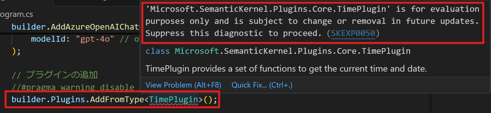

# 組み込みのプラグインを調べる

https://learn.microsoft.com/ja-jp/training/modules/create-plugins-semantic-kernel/2-explore-built-in-plugins


## プラグインとは？

https://learn.microsoft.com/ja-JP/semantic-kernel/concepts/plugins/?pivots=programming-language-csharp

プラグインは、カーネルが大規模言語モデル (LLM) とやり取りする際に、カーネルが実行するタスクを定義する。

プラグインは、ネイティブ コードと LLM に対するプロンプトで構成できる。 

## 組み込みプラグインとは？

Semantic Kernel SDK には、アプリケーション内ですぐに使用できる一般的なタスク用の組み込みプラグインもいくつか用意されている。

## `TimePlugin` の利用例

https://learn.microsoft.com/en-us/dotnet/api/microsoft.semantickernel.plugins.core.timeplugin?view=semantic-kernel-dotnet

`InvokeAsync` にプラグイン名、メソッド名を指定。

```c#
builder.Plugins.AddFromType<TimePlugin>();
var kernel = builder.Build();
var currentDay = await kernel.InvokeAsync("TimePlugin", "DayOfWeek");
Console.WriteLine(currentDay);
```

## `ConversationSummaryPlugin` の利用例

https://learn.microsoft.com/en-us/dotnet/api/microsoft.semantickernel.plugins.core.conversationsummaryplugin?view=semantic-kernel-dotnet

`InvokeAsync` にプラグイン名、メソッド名、引数を指定。

```c#
builder.Plugins.AddFromType<ConversationSummaryPlugin>();
var kernel = builder.Build();

string input = @"I'm a vegan in search of new recipes. I love spicy food! 
Can you give me a list of breakfast recipes that are vegan friendly?";

var result = await kernel.InvokeAsync(
    "ConversationSummaryPlugin", 
    "GetConversationActionItems", 
    new() {{ "input", input }});

Console.WriteLine(result);
```

## その他の組み込みプラグイン

`HttpPlugin` https://learn.microsoft.com/en-us/dotnet/api/microsoft.semantickernel.plugins.core.httpplugin?view=semantic-kernel-dotnet

`FileIOPlugin` https://learn.microsoft.com/en-us/dotnet/api/microsoft.semantickernel.plugins.core.fileioplugin?view=semantic-kernel-dotnet

`MathPlugin` https://learn.microsoft.com/en-us/dotnet/api/microsoft.semantickernel.plugins.core.mathplugin?view=semantic-kernel-dotnet

`TextPlugin` https://learn.microsoft.com/en-us/dotnet/api/microsoft.semantickernel.plugins.core.textplugin?view=semantic-kernel-dotnet

`MsGraph` https://learn.microsoft.com/en-us/dotnet/api/microsoft.semantickernel.plugins.msgraph?view=semantic-kernel-dotnet

## プラグインのパッケージ

Plugin一覧（検索）
https://www.nuget.org/packages?q=Microsoft.SemanticKernel.Plugins

Pluginの例（Core）
https://www.nuget.org/packages/Microsoft.SemanticKernel.Plugins.Core/


## 組み込みプラグイン使用について




この警告が出ている場合、ビルドができないため、明示的に `#pragma warning disable SKEXP0050` のような行を前に追加しなければならない。

`SKEXP0050` については、以下のページで `Out-of-the-box plugins` と説明されている。

https://github.com/microsoft/semantic-kernel/blob/main/dotnet/docs/EXPERIMENTS.md

`out of the box` は「独創的な」といった意味。
https://eow.alc.co.jp/search?q=out-of-the-box

`Plugins/Plugins.Core/AssemblyInfo.cs` で、アセンブリに対して experimental であることが指定されている。

https://github.com/microsoft/semantic-kernel/blob/main/dotnet/src/Plugins/Plugins.Core/AssemblyInfo.cs

なお `Experimental` 属性は C# 12 （.NET 8）で追加されたもの。

https://henriquesd.medium.com/net-8-and-c-12-experimental-attribute-c895d66bba4e

https://learn.microsoft.com/ja-jp/dotnet/csharp/whats-new/csharp-12#experimental-attribute

https://learn.microsoft.com/ja-jp/dotnet/csharp/language-reference/proposals/csharp-12.0/experimental-attribute

以下のコミットで追加された。「.NET SDKのSemantic Kernelにおいて、バージョン1.0.0までに準備が整わないパッケージやクラスにexperimental属性を追加する。」

https://github.com/microsoft/semantic-kernel/pull/3709

