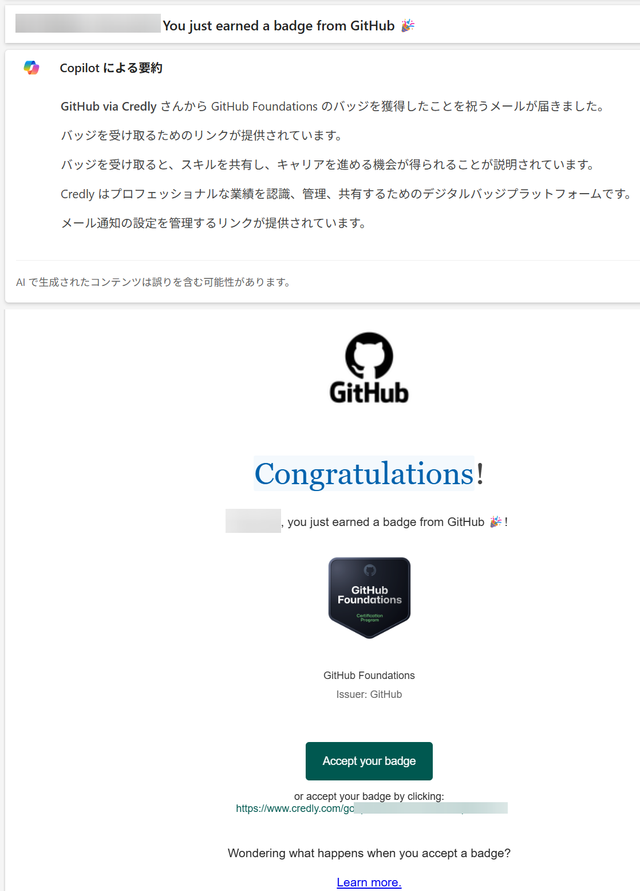

# GitHub Copilot 認定試験のご案内

- マイクロソフトからはGitHub関連の[認定試験](https://learn.microsoft.com/ja-jp/credentials/certifications/certification-process-overview)や[Applied Skills](https://learn.microsoft.com/ja-jp/credentials/support/appliedskills-process-overview)は提供されていない
- GitHub社が提供する認定試験が利用できる

## 基本情報

- [認定サイトトップ（試験の申し込みボタンあり）](https://examregistration.github.com/)
- [認定FAQ](https://examregistration.github.com/faq)
- [認定ハンドブック](https://examregistration.github.com/handbook)
  - オンライン受験に使用するPCの要件など

## GitHubの認定試験

現在 GitHub は5種類の認定試験を提供している。

https://resources.github.com/ja/learn/certifications/

- GitHub Foundations
- GitHub Actions
- GitHub Advanced Security
- GitHub Administration
- GitHub Copilot

有償（99 USD、GitHub Foundationsは49 USD）。オンラインで受験可能（試験監督あり。GitHub Foundationsは試験監督なし）

## Study Guide（学習ガイド、英語のみ）

出題範囲の詳細など。

- GitHub Foundations
  - https://assets.ctfassets.net/wfutmusr1t3h/1kmMx7AwI4qH8yIZgOmQlP/79e6ff1dfdee589d84a24dd763b1eef7/github-foundations-exam-study-guide__1_.pdf
- GitHub Copilot
  - https://assets.ctfassets.net/wfutmusr1t3h/3i7ISEUsTLBgOGrWrML07y/dd586e2b2b607988e2679ed8cce36a76/github-copilot-exam-preparation-study-guide.pdf
- GitHub Actions
  - https://assets.ctfassets.net/wfutmusr1t3h/2mMJ6nECbUAdiQMTObbPw6/4b66f25661e8aadcb4db984a95071682/github-actions-exam-preparation-study-guide.pdf
- GitHub Advanced Security
  - https://assets.ctfassets.net/wfutmusr1t3h/4WQrNeENScZlISZKdknVbK/4c5d4a2174291da207efb57aa814899d/github-advanced-security-exam-preparation-study-guide__3_.pdf
- GitHub Administration
  - https://assets.ctfassets.net/wfutmusr1t3h/5zTfUfFWQknwoUVA1SAw0o/5e1498f30d64825d94e01cec7dac90fe/github-administration-exam-preparation-study-guide.pdf

## 試験準備のための教材（日本語）

Microsoft Learnで教材が公開されており、無料で利用できる。

https://learn.microsoft.com/ja-jp/training/paths/copilot/

※Microsoft Learnのすべてのリンクは https://examregistration.github.com/faq の中の「Where can I find study materials for the exams?」から辿れる

## 練習問題（英語、無料）

5種類の認定試験の練習問題が提供されている。

https://ghcertified.com/practice_tests/

上記サイトのGitHubリポジトリ https://github.com/FidelusAleksander/ghcertified

## LinkedIn Learning（有料、2990円/月）

LinkedIn LearningでGitHub認定のコースが公開されている。
（「学習ガイド」の中にリンクがある）

- GitHub Foundations
  - https://www.linkedin.com/learning/paths/prepare-for-the-github-foundations-certification?u=3322
  - https://www.linkedin.com/learning/github-foundations-cert-prep-by-microsoft-press/github-foundations-intro?u=3322
- GitHub Copilot
  - https://www.linkedin.com/learning/github-copilot-cert-prep-by-microsoft-press/github-copilot-cert-prep-introduction?u=3322
- GitHub Administration
  - https://www.linkedin.com/learning/paths/prepare-for-the-github-administration-certification?u=3322
- GitHub Advanced Security
  - https://www.linkedin.com/learning/github-advanced-security-cert-prep-by-microsoft-press/introduction?u=3322
- GitHub Actions
  - https://www.linkedin.com/learning/cert-prep-github-actions-by-microsoft-press/introduction?u=3322

## 試験の申し込み

以下のページから申し込む。

https://examregistration.github.com/overview

## 試験に合格すると？

- GitHub Copilotの認定試験に合格したことを示すデジタルバッジが発行される。
- デジタルバッジはLinkedInなどに投稿して資格をアピールすることができる。

