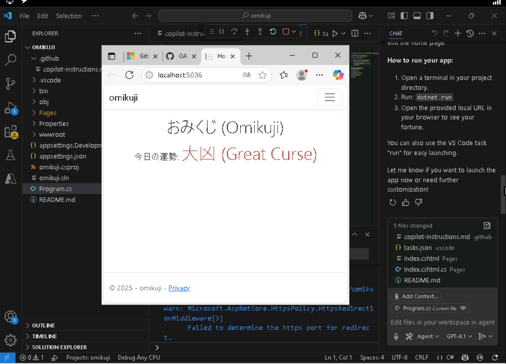

# GitHub Copilot 演習

ここでは、GitHub Copilotを使用して、簡単な「おみくじ」アプリを作成します。

## 「Microsoft アカウント」を作成（ない場合）
  - https://signup.live.com/signup

## ラボを起動
  - https://esi.learnondemand.net/ にアクセス
  - 「Sign in」をクリック
  - 「Microsoft Account」をクリックして、サインイン
  - トレーニングキーを入力
    - トレーニングキーは講師よりチャットでお知らせしています
  - ラボを起動

## ラボ環境のWindowsにサインイン
  - 画面右上「リソース」をクリック
  - 「リソース」の右下「Virtual Machine」のところに表示されたパスワードを使用してサインイン
  - 以降この中で操作を実施してください

## GitHubにサインイン
  - Edge ブラウザを開く
  - https://github.com/enterprises/Microsoft-APL/sso を開く
  - 「Single sign-on to Microsoft GHE」→「Continue」
  - 「リソース」の右上に表示されたユーザー名（User1-12345678@LODSPRODMCA.microsoft.com といったもの）とパスワードでサインイン
  - 「サインイン状態を維持しますか？」→「はい」
  - 「パスワードを保存しますか？」→「OK」
  - https://github.com/enterprises/Microsoft-APL/ が表示されればOK。
    - ここでもし「Single sign-on to Microsoft GHE」→「Continue」が繰り返し表示されたり「What!?」というエラー画面が表示された場合は、いったんEdgeブラウザを閉じ、1～2分待ってから再度実行してください。

## Visual Studio Codeの最新版のインストール
  - Edge ブラウザのアドレス欄で「VSCode」と入力して検索
  - VSCodeのダウンロード画面へ移動
  - Windows用のVSCodeインストーラー（User Installer）をダウンロード
  - 保存
  - ダウンロードしたインストーラーを開く
  - I accept ... をクリック、「Next」をクリック
  - 「Next」をクリック
  - 「Install」をクリック
  - しばらく待って「Finish」をクリック

## VSCodeでGitHub Copilotを使用できるようにサインインする
  - 画面左下のユーザーアイコン（Accounts）をクリック
  - 「Sign in with GitHub to use Copilot...」
  - 「Sign in」をクリック。Edgeブラウザが開く
  - 「Select user to authorize...」→ユーザー名（User1-12345678_MSFTGHE といったもの）の横の「Continue」をクリック
  - 「Authorize Visual-Studio-Code」（緑のボタン）をクリック
  - 「このサイトはVisual Studio Codeを開こうとしています」→「開く」

## Visual Studio Codeで「フォルダ」を開く
  - 「Open Folder」をクリック（またはメニューの「File」→「Open Folder...」）
  - 「デスクトップ」へ移動
  - 「新しいフォルダー」をクリックして「omikuji」と入力
  - 「omikuji」フォルダーをクリックして「フォルダーの選択」ボタンをクリック
  - 「Do you trust the author of the files in this folder?」→「Yes, I trust the authors」

## GitHub Copilot チャットを開く
  - 画面上部のCopilotアイコンをクリック
    - Agentモードに切り替え
  - チャット下部の「Ask」をクリック
  - 「Agent」をクリック

## omikuji（おみくじ）Webアプリを作成

※ここでのエージェントの細かい動作は実行の都度異なる場合があります。実際のチャットに表示される表示に従って進めてください。
  - チャットで以下のプロンプトを入力
  - `create a .NET C# web app that shows a random omikuji fortune in Japanese` 
  - エンター（または送信ボタンをクリック）
  - 「Continue」をクリック
  - Webアプリを作成する「dotnet new webapp」コマンドが提案される。Continueをクリックして実行
  - Webアプリの作成が行われる。また index.cshtml / index.cshtml.cs がランダムなおみくじを表示するように書き換えが行われる。
  - 「Keep」をクリック
  - dotnet build が提案される。「Continue」をクリックして実行

## Webアプリを実行
  - Program.csを開く
  - 画面右上「Run」ボタン（右向き三角）をクリック
  - Edge ブラウザが開き、おみくじ（ランダムな今日の運勢。「大吉」など）が表示される

## ※もしおみくじがうまく表示されない場合
  -  VSCodeの中で「□」ボタンをクリックして実行中のアプリを停止させる
  - チャットに以下のプロンプトを入力
  - `omikuji not shown`
  - エンター（または送信ボタンをクリック）
  - 修正が実行される。「Keep」をクリック
  - Program.csを開く
  - 画面右上「Run」ボタン（右向き三角）をクリック
  - Edge ブラウザが開き、おみくじ（ランダムな今日の運勢。「大吉」など）が表示される

## ※どうしてもうまくいかない場合

『Visual Studio Codeで「フォルダ」を開く』の手順に戻り、「omikuji2」といった新しいフォルダを作ってやり直してみてください。
