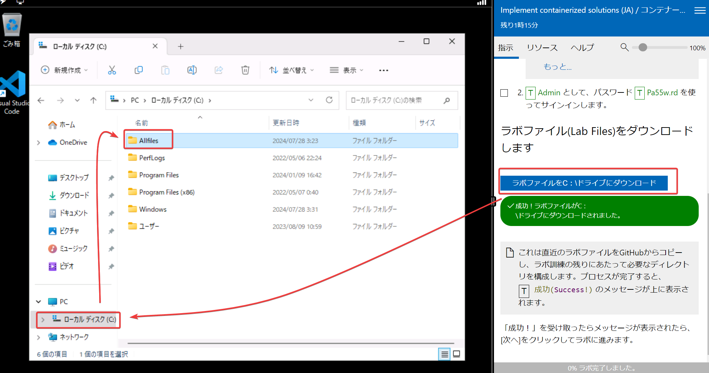

# AZ-204 Developing Solutions for Microsoft Azure

- Azure開発者向けのコースです。
- 開発でよく使われるサービスや、C#などのプログラムからのAzureサービスの利用方法の解説に重点が置かれています。
- 5日間

## テキスト

- 基本的に以下のテキストの内容に沿って解説します。
    - Microsoft Learn 「Developing Solutions for Microsoft Azure」
    - https://learn.microsoft.com/ja-jp/training/courses/az-204t00
- わかりやすくなるように、講義では一部順番を並び替えて解説します。

## 講義

■ご案内

- 講義資料はいつでもご覧いただけます。特に期限はございません。

■1日目

- 講師自己紹介
- [開始時のご案内](../opening.md)
- [Azure App Service Web Apps を実装する](../AZ-204/mod01.md)
- [Azure Functions を実装する](../AZ-204/mod02.md)
  - 備考: [IDベース接続](id-based-connection.txt)
- コンテナー化されたソリューションを実装する
  - [ACI (Azure Container Instance), AKS (Azure Kubernetes Service)](../AZ-104-2023/pdf/コンテナーのサービス.pdf)
  - [ACA (Azure Cointainer Apps)](../AZ-305/container-apps.md)
- ラボ（オプション）

■2日目

- [BLOB ストレージを使用するソリューションを開発する](../AZ-204/mod03-01-blob.md)
- [Azure Cosmos DB を使用するソリューションを開発する](../AZ-204/mod04-01-cosmosdb.md)
- ラボ（オプション）

■3日目
- ユーザー認証と承認を実装する
- セキュリティで保護された Azure ソリューションを実装する
- ラボ（オプション）

■4日目

- API Management の実装
- イベントベースのソリューションの開発
- メッセージ ベースのソリューションを開発する
- ラボ（オプション）

■5日目
- Application Insights を使用したソリューションのトラブルシューティング
- ソリューションのキャッシュを実装する
- 試験対策
- [終了時のご案内](../closing-cloudslice.md)
- 受講者アンケート
- ラボ（オプション）

## ラボ(演習) / 講師デモ

■ご案内

- ラボ(演習)の実施はオプションです。 
- ラボ環境にアクセスするにはMicrosoftアカウントが必要です。
  - [ラボ環境 ( https://esi.learnondemand.net/ )](https://esi.learnondemand.net/)
  - [Microsoftアカウントの作成](https://account.microsoft.com/account?lang=ja-jp)
- ラボ環境にアクセスしたらトレーニングキーを入力します。
  - トレーニングキーは講師よりお知らせします。
  - トレーニングキーには有効期限があり、最終日までに入力する必要があります。
  - 新しいトレーニングキーの再発行はいたしかねます。あらかじめご了承ください。
- トレーニングキー入力後、ラボはご受講後半年後まで利用できます。
  - ラボの利用可能期間の延長はいたしかねます。あらかじめご了承ください。
- ラボの利用方法について詳細は以下をご覧ください。
  - [ラボ環境の利用方法 解説PDF](../ラボ環境の利用方法.pdf)

■ラボのファイル

ラボを起動し、「ラボのファイルをC:/ドライブにダウンロード」をクリックすると、C:ドライブにAllFilesフォルダーが作成されます。その中にラボで使用するサンプルコード類が配置されます。

■1日目

- ラボ1: Creating Azure Apps Service Web Apps (JA) / サービス内容として Azure プラットフォームで Web アプリケーションをビルドする
- ラボ2: Implement Azure Functions (JA) / Azure Functions を使用してタスク処理ロジックを実装する
- ラボ14: Implement containerized solutions (JA) / コンテナー化されたソリューションを実装する
  - Azure Container Instance と Azure Container Appsのラボです。
  
■2日目

- ラボ3: Develop solutions that use blob storage (JA) / Azure Storage SDK for .NET を使用して Azure Storage リソースとメタデータを取得する
- ラボ4: Develop solutions that use Cosmos DB storage (JA) / ポリグロットなデータ ソリューションを構築する
- ~~ラボ5: Implement laaS solutions (JA) / イメージとコンテナーを使用してコンピューティング ワークロードをデプロイする~~
  - ※ラボ5はこのコースでは利用しません。

■3日目

- ラボ6: Implement user authentication and authorization (JA) / OpenID Connect、MSAL、および .NET SDK を使用した認証
- ラボ7: Implement secure cloud solutions (JA) / サービス間でリソース シークレットにより安全にアクセスする

■4日目

- ラボ8: Implement API Management (JA) / Azure サービスを使用して多層ソリューションを作成する
- ラボ9: Develop event-based solutions (JA) / Event Grid イベントの発行とサブスクライブ
- ラボ10: Develop message-based solutions (JA) / Azure Service Bus キューを利用してメッセージを非同期に処理する

■5日目

- ラボ11: Monitor and optimize Azure solutions (JA) / Azure にデプロイされたサービスを監視する
- ラボ12: Integrate caching and context delivery within solutions (JA) / Azure Content Delivery Network を使用した Web アプリケーションの強化

■発展的なラボ:

- ラボ13: Create and configure an Azure web app (JA) / Azure Web アプリを作成して構成する
  - GitHubアカウントが必要です。
  - Application Insights, Azure Load Testing, Azure CDNなどを使用します
