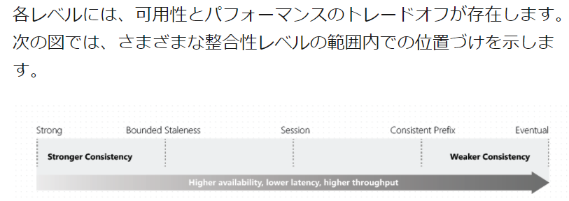

知識チェックの解説

# App Service ラーニングパス1-モジュール1

https://docs.microsoft.com/ja-jp/learn/modules/introduction-to-azure-app-service/8-knowledge-check

## 1. 次の App Service プランのうち、関数アプリのみをサポートしているのはどれですか?

App Service の「Webアプリ」や、Azure Functionの「関数アプリ」は、「プラン」の上で動きます。ただし、「プラン」にもいろいろな種類があり、組み合わせて使うことができるものとそうでないものがあります。

```
App Service(Webアプリ)用のプラン:
├Free, Shared: 「共有コンピューティング」とも。
├Basic, Standard, Premium: 「専用コンピューティング」とも。
└Isolated: 「分離」とも。
```
詳細: https://docs.microsoft.com/ja-jp/azure/app-service/overview-hosting-plans

```
Azure Functions(関数アプリ)用のプラン:
├従量課金プラン: 「使用量」や「消費」とも。関数が実行された分だけお支払い。
├Premium プラン: App ServiceのPremiumプランとは別もの。
└App Service プラン: 上記のApp Serviceプラン(Basic以上)の上で、関数アプリを実行
```
詳細: https://docs.microsoft.com/ja-jp/azure/azure-functions/functions-scale


したがって、選択肢の中で「関数アプリのみサポートしているもの」は、「従量課金プラン」となります。

## 2. 次の App Service のネットワーク機能のうち、送信 ネットワーク トラフィックを制御するために使用できるのはどれですか?

- アプリに割り当てられたIPアドレス
- ハイブリッド接続
- サービス エンドポイント

```
受信に使える機能（一部）
├アプリに割り当てられたIPアドレス: 「IPベースSSL」を有効化すると、アプリ用の新規IPアドレスが割り当てられる。
└サービスエンドポイント: Webアプリへのアクセスを、明示的な許可したVNet/サブネットからのアクセスに制限する。
```

```
送信に使える機能（一部）
└ハイブリッド接続: Webアプリから、オンプレミスのサーバー等に、VPNや専用線なしで、接続するための機能。
```

```
App Service Webアプリ
↓ハイブリッド接続
オンプレミス（のサーバ）
```

詳細: App Serviceのネットワーク機能
https://docs.microsoft.com/ja-jp/azure/app-service/networking-features

詳細: サービスエンドポイント
https://docs.microsoft.com/ja-jp/azure/app-service/networking-features#access-restriction-rules-based-on-service-endpoints

詳細: アプリに割り当てられたIPアドレス（IPベースSSL）
- https://docs.microsoft.com/ja-jp/azure/app-service/networking-features#app-assigned-address
- https://docs.microsoft.com/ja-jp/azure/app-service/configure-ssl-bindings#remap-records-for-ip-ssl
- https://tech-lab.sios.jp/archives/23123

詳細: ハイブリッド接続
https://docs.microsoft.com/ja-jp/azure/app-service/networking-features#hybrid-connections

# Azure Functions ラーニングパス2-モジュール1

https://docs.microsoft.com/ja-jp/learn/modules/explore-azure-functions/5-knowledge-check

## 1. 予測的なスケーリングとコストが必要な場合、次の Azure Functions ホスティング プランのうちどれが最適ですか?


- Functions Premium プラン
- App Service プラン
- 従量課金プラン


解説: 

- スケーリングが「予測的である」とは、「スケーリングがどの程度になるかが事前にわかる」「スケーリングの規模をユーザーが指定できる」という意味。App Serviceプランであれば、インスタンスの台数を1～5の範囲といった形で指定することができるので「予測的である」。
- コストが「予測的である」とは、「（利用量がどのように変化しようとも）コストの範囲が事前にわかる）」という意味。App Serviceプランであれば、プランとスケーリング（インスタンス数）を指定することで、下限～上限のコスト範囲がその時点で明確にわかるので「予測的」である。
- 「FunctionのPremiumプラン」「従量課金プラン」は、処理量によりインスタンス数が動的に変化するため、予測が難しい。

詳細: https://docs.microsoft.com/ja-jp/azure/azure-functions/functions-scale

※App Serviceプランは上記のページで「専用プラン」と表示されている。

## 2. ある組織が、ビジネス上の問題を解決するためにサーバーレス ワークフローを導入しようとしています。 要件の 1 つは、デザイナー第一 (宣言型) 開発モデルを使用するソリューションにする必要があることです。 次の選択肢のうち、どれがこの要件を満たしていますか?

- Azure Functions
- Azure Logic Apps
- WebJobs

解説:

Logic Appsは、コードを書かず、GUIでロジック（ワークフロー）を開発することができるので、「コード第一」ではなく「デザイナー第一」である。

# Blob Storage - ラーニングパス3、モジュール1

https://docs.microsoft.com/ja-jp/learn/modules/explore-azure-blob-storage/7-knowledge-check


## 1. 仮想ハード ドライブ ファイルの格納に使用される BLOB の種類はどれですか?

- ブロック blob
- 追加 BLOB
- ページ blob

解説: ページBlobは、VHD（Virtual Hard Disk）形式の格納に利用される。

## 2. Azure Storage を使用するほとんどのシナリオで推奨されるストレージ アカウントの種類はどれですか?

- 汎用 v2
- 汎用 v1
- FileStorage

解説: ストレージアカウントとして汎用 v2が推奨される。Blob, Files, Table, Queueをサポート、復数のレプリケーションオプション(LRS, GRS, ZRS, GZRS, RA-GRS, RA-GZRS)をサポートする。

# Blob Storage - ラーニングパス3, モジュール3

https://docs.microsoft.com/ja-jp/learn/modules/work-azure-blob-storage/6-knowledge-check

## 1. 次の標準 HTTP ヘッダーのうち、REST を使用してプロパティを設定するときに、コンテナーと BLOB の両方でサポートされているものはどれですか。

- 更新日時 (Last-Modified)
- Content-Length
- 出発地 (Origin)

解説: 

Last-Modified は、リソースが最後に変更された日時。

https://developer.mozilla.org/ja/docs/Web/HTTP/Headers/Last-Modified

Last-Modifed は、BLOBコンテナーと、BLOBの両方でサポートされている。

## 2. 次に示す .NET 用 Azure Storage クライアント ライブラリのクラスのうち、Azure Storage コンテナーとその BLOB の両方で操作できるものはどれですか。

- BlobClient
- BlobContainerClient
- BlobUriBuilder

解説: 

```
ストレージアカウント  .... BlobServiceClient
└Blobコンテナー ......... BlobContainerClient
 └Blob  ................. BlobClient
```

BlobContainerClientは、Blobコンテナーレベルの操作と、そのコンテナー内のBlobの一覧取得といった一部のBlobレベルの操作をサポートする。

# Cosmos DB - ラーニングパス4

https://docs.microsoft.com/ja-jp/learn/modules/explore-azure-cosmos-db/9-knowledge-check

## 1. Azure Cosmos DB を設定する場合は、3 つのアカウントの種類のオプションがあります。 アプリケーションの RU 数を秒単位で指定するために使用されるのは、以下のアカウントの種類のオプションのうちどれですか?

- プロビジョニング スループット
- サーバーレス
- 自動スケール

解説: Cosmos DBアカウント作成時に、「プロビジョニングスループット」または「サーバーレス」を選択する。「プロビジョニングスループット」では、データベースまたはコンテナーで、RUを指定できる。「サーバーレス」の場合はRU指定が不要。

「自動スケール」は、「プロビジョニングスループット」の中のオプション。こちらは「RUの最大値」を指定する。

## 2. 最高のスループットが提供されるのは、次の整合性レベルのうちどれですか?

- Strong
- Session
- 最終的

解説: 最も「弱い」整合性である「最終的」(Eventual Consistency)を選択することで、最もスループットが高くなる。



https://docs.microsoft.com/ja-jp/azure/cosmos-db/consistency-levels

# Azure VM - ラーニングパス5-モジュール1

## 1. 次の Azure 仮想マシンの種類のうち、テストと開発に最適なものはどれですか?

- コンピューティング最適化
- General Purpose
- ストレージ最適化

解説: 開発・テストには、CPUコアとメモリがバランス良く配置された「General Purpose」（汎用）が適している。具体的にはDシリーズ等。

## 2. 冗長性と可用性を実現するためのアプリケーションの構築方法を Azure で理解できるようにする VM の論理的なグループ化を表しているのは次のうちのどれですか?

- Load Balancer
- 可用性ゾーン
- 可用性セット

解説: VMをグループ化する仕組みは「可用性セット」。「可用性セット」のリソースを作り、VMを作成する際に「可用性セット」を指定することで、そのグループに含めることができる。VMは復数のFD・UDに分散し、可用性が向上する。(99.9% → 99.95%)

# Microsoft ID Platform ラーニングパス6-モジュール1

https://docs.microsoft.com/ja-jp/learn/modules/explore-microsoft-identity-platform/6-knowledge-check

## 1. サインインしているユーザーが存在するアプリで、Microsoft ID プラットフォームによってサポートされるアクセス許可の中でどの種類が使用されますか?

- デリゲート(委任)されたアクセス許可
- アプリケーションのアクセス許可
- 委任されたアクセス許可とアプリケーションのアクセス許可の両方

解説:

「デリゲート(委任)されたアクセス許可」が正しい。

- 「委任されたアクセス許可」
  - ユーザーがサインインして利用するタイプのアプリで使用する許可
  - 各ユーザーまたは管理者が同意する。
- 「アプリケーションのアクセス許可」
  - ユーザーがサインインせず利用するタイプのアプリ（サービス、デーモン等）で使用する許可。
  - 管理者が同意する。

## 2. 条件付きアクセス チャレンジを処理するコードが必要なアプリ シナリオは次の中のうちどれですか?

- デバイスコード フローを実行するアプリ
- On-Behalf-Of フローを実行するアプリ
- 統合 Windows 認証フローを実行するアプリ

解説:

「条件付きアクセス」は、Azure ADの機能の一種。たとえば、特定のアプリケーションへのアクセス時に、多要素認証（MFA）を要求する、といった条件を追加できる。

OAuth 2.0 の On-Behalf-Of (OBO) フローは、アプリケーションがサービス/Web API を呼び出し、それがさらに別のサービス/Web API を呼び出す必要のあるユース ケース。

On-Behalf-Of フローを実行するアプリでは、条件付きアクセスを処理するために、コード（の変更）が必要となる。

https://docs.microsoft.com/ja-jp/azure/active-directory/develop/v2-oauth2-on-behalf-of-flow

https://docs.microsoft.com/ja-jp/azure/active-directory/develop/v2-conditional-access-dev-guide#scenario-app-performing-the-on-behalf-of-flow


# Azure Key Vault ラーニングパス7-モジュール1

https://docs.microsoft.com/ja-jp/learn/modules/implement-azure-key-vault/6-knowledge-check

## 1. ほとんどのシナリオで推奨される Azure Key Vault への認証方法は次のうちどれですか?

- サービス プリンシパルと証明書
- サービス プリンシパルとシークレット
- マネージド ID

正解: マネージドID。

解説: マネージドIDは、サービスプリンシパルの一種であるが、パスワードを利用者が扱う必要がないのでより安全である。サービス プリンシパルは、利用者が、明示的にIDとパスワード（またはIDと証明書）を発行し、安全に保管する必要があり、また定期的にローテーションする必要があるので、運用により手間がかかる。VM、App Service, Functions, ACI, AKSなど、多くのAzureのコンピューティングサービスで、マネージドIDを使用することができる。

## 2. Azure Key Vault は、Azure Key Vault とクライアント間を移動するときにデータを保護します。 暗号化にはどのようなプロトコルが使用されますか?

- セキュア ソケット レイヤー (Secure Sockets Layer, SSL)
- トランスポート層セキュリティ (Transport Layer Security, TLS)
- プレゼンテーション層

解説: [Key Vault自身は、転送中のデータの暗号化にTLSを使用している](https://docs.microsoft.com/ja-jp/azure/key-vault/general/basic-concepts#encryption-of-data-in-transit)。一般的に、ネットワークで情報を送受信する際に、SSLまたはTLSを使用して暗号化を行う場合がある。[TLSはSSLの後継のプロトコルである](https://www.infraexpert.com/study/security7.html)。

なお、Key Vault内に記録される「[証明書](https://docs.microsoft.com/ja-jp/azure/key-vault/certificates/about-certificates)」としては、TLS/SSLの証明書を扱うことができる。

# API Management ラーニングパス8 - モジュール1

https://docs.microsoft.com/ja-jp/learn/modules/explore-api-management/9-knowledge-check

## 1. アカウントを作成して API キーを取得するためにサブスクライブする必要がある場合、管理者は、API Management サービスの次のどのコンポーネントを使用しますか?

- API ゲートウェイ
- Azure portal
- 開発者ポータル

解説: APIの利用者に対し、「開発者ポータル」で、サブスクリプションやAPIキーを発行することができる。

## 2. 条件に基づいて API Management ポリシーを適用する場合は、次のどのポリシーを使用しますか?

- forward-request
- choose
- return-response

解説: choose ポリシーは、プログラミング言語の if-then-else や switch 構造のように、式の評価結果に基づいて、含まれているポリシー ステートメントを適用する。

https://docs.microsoft.com/ja-jp/azure/api-management/api-management-advanced-policies#control-flow

# Azure Event Grid ラーニングパス9-モジュール1

## 1. 値が必要なイベント スキーマ プロパティは、次のうちどれですか?

- トピック
- データ
- サブジェクト

解説: イベントはJSONで送信される。JSONのフォーマット（形式）は「スキーマ」と呼ばれる。スキーマの形式の1つとして「[Azure Event Grid イベント スキーマ](https://docs.microsoft.com/ja-jp/azure/event-grid/event-schema)」がある。このスキーマの「subject」（イベントの対象のパス）は、必須のプロパティとなっており、イベントの発行元側で、必ず値を指定しなればならない。たとえば、Blobがアップロードされたというイベントの場合、その「subject」の値として、Blobのパスが指定される。

## 2. Event Grid リソースの管理に適している Event Grid 組み込みロールは、次のうちどれですか?

- Event Grid の共同作成者
- Event Grid サブスクリプションの共同作成者
- Event Grid データ送信者

解説: 

Event Grid リソース（＝トピック）を管理するユーザーには、「Event Gridの共同作成者」ロールを割り当てる。

```
イベント
↓ イベントの送信 ← Event Grid データ送信者
Event Grid トピック の管理 ← Event Gridの共同作成者
└サブスクリプション の管理 ← サブスクリプション共同作成者
```

# メッセージベースのソリューション - ラーニングパス 10 - モジュール1

https://docs.microsoft.com/ja-jp/learn/modules/discover-azure-message-queue/9-knowledge-check

## 1. 先入れ先出し (FIFO) 保証を作成するのは、Azure Service Bus の次の高度な機能のうちどれですか。

- トランザクション
- スケジュールされた配信
- メッセージ セッション

解説: FIFOを利用するにはAzure Service Busの「メッセージセッション」を利用する。

https://docs.microsoft.com/ja-jp/azure/service-bus-messaging/message-sessions

## 2. Azure Service Bus ではメッセージは永続的に格納されるため、負荷を平準化することができます。 使用中のアプリケーションのパフォーマンスと比較して、負荷平準化の利点を適切に示しているのは次のどれですか。

- ピーク時の負荷に対処するために必要なパフォーマンス
- 平均的な負荷に対処するために必要なパフォーマンス
- 低い負荷に対処するために必要なパフォーマンス

解説: キューを使用すると「負荷を平準化」（ロードレベリング）することができる。この場合、メッセージの処理側は「平均的な負荷」に対応すればよい。

https://docs.microsoft.com/ja-jp/azure/architecture/patterns/queue-based-load-leveling

> ピーク時の負荷ではなく、平均負荷に対応するのに十分な数のサービス インスタンスをデプロイするだけでよいため、コスト管理に役立ちます。

# アプリのパフォーマンスを監視する - ラーニングパス11, モジュール1

https://docs.microsoft.com/ja-jp/learn/modules/monitor-app-performance/8-knowledge-check

## 1. 認証テストに推奨される可用性テストは次のうちどれですか?

- URL の ping
- Standard （標準テスト）
- カスタム TrackAvailability テスト

解説:

Application Insightsの「可用性テスト」では、上記3つと「複数手順のWebテスト」の、4種類のテストを設定できる。

https://docs.microsoft.com/ja-jp/azure/azure-monitor/app/availability-overview#types-of-tests

ただし「複数手順のWebテスト」は非推奨となり、現在は「カスタム TrackAvailability テスト」が推奨されている。

https://docs.microsoft.com/ja-jp/azure/azure-monitor/app/availability-multistep#multi-step-webtest-alternative

> カスタム可用性テストは、複数ステップ Web テストではなく、TrackAvailability を使用して送信することをお勧めします。 これは複数の要求または認証テストのシナリオで長期的にサポートされるソリューションです。 TrackAvailability() とカスタム可用性テストを使用すると、任意のコンピューティングでテストを実行でき、また、C# を使用して容易に新しいテストを作成することができます。

※「認証テスト」は、サインインの処理を含むテスト。

https://docs.microsoft.com/ja-jp/azure/azure-monitor/app/availability-multistep#dealing-with-sign-in

## 2. メトリックのディメンションに関するほぼリアルタイムのクエリとアラートと、応答性の高いダッシュボードを提供するメトリック コレクションの種類は次のうちどれですか?

- ログベース
- 事前に集計済み
- Azure Service Bus

解説:

Application Insights では、以下のメトリックをできる。

- 「ログベースのメトリック」
  - 収集されたすべてのイベントが Application Insights バックエンドでログとして格納される
  - Azure portal の Application Insights ブレードで、ログからのイベントベースのデータを視覚化、分析、診断
- 「事前に集計されたメトリック」
  - メトリックは、タイム シリーズ用に最適化された特殊なリポジトリに格納される
  - 事前に集計されたタイム シリーズとして格納される
  - 新しいメトリックはクエリ時に適したものとなり、データはより速く取得され、必要となるコンピューティング能力が減る
  - メトリックのディメンションに関するほぼリアルタイムのアラートや応答性の高いダッシュボードなど、新しいシナリオが有効になる

https://docs.microsoft.com/ja-jp/azure/azure-monitor/app/pre-aggregated-metrics-log-metrics#pre-aggregated-metrics

# キャッシュとコンテンツ配信をソリューション内に統合する - ラーニングパス12, モジュール1

https://docs.microsoft.com/ja-jp/learn/modules/develop-for-azure-cache-for-redis/6-knowledge-check

## 1. 次の Azure Cache for Redis のサービス レベルの中で、運用シナリオで使用するために推奨される最低レベルはどれですか?

- Basic
- Standard
- Premium

解説: Standard以上ではSLAが提供されるため運用シナリオに向く。https://docs.microsoft.com/ja-jp/azure/azure-cache-for-redis/cache-overview#service-tiers

## 2. キャッシュは、よく使用される値をメモリに格納することができるため、重要です。 ただし、値が古くなったときに期限切れにする手段も必要です。 Redis では、キーに Time to Live (TTL) を適用することによって、それが行われます。 有効期限の分解能(expire time resolution)を表す値は次のうちどれですか?

- 1 ミリ秒
- 10 ミリ秒
- 秒またはミリ秒

解説:

- 有効期限は、秒またはミリ秒の精度で設定することができる。
  - https://redis.io/commands/set
  - 秒: EX
  - ミリ秒: PX
- 有効期限切れの時刻の精度は、常に 1 ミリ秒である。
  - https://redis.io/commands/expire#expires-and-persistence
