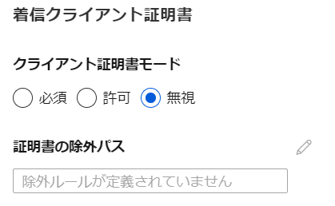

- [ユニット 1: はじめに](https://docs.microsoft.com/ja-jp/learn/modules/configure-web-app-settings/1-introduction)
- [ユニット 2:「アプリケーション設定」の構成](https://docs.microsoft.com/ja-jp/learn/modules/configure-web-app-settings/2-configure-application-settings)
  - アプリケーション設定
    - [環境変数としてアプリに渡される。](https://docs.microsoft.com/ja-jp/azure/app-service/configure-common?tabs=portal#configure-app-settings)
    - 参考: コンテナーアプリの場合、App Serviceは --env (-e) を使用して環境変数を渡す
      - [Dockerの--env (-e)オプション](https://docs.docker.com/engine/reference/commandline/run/#set-environment-variables--e---env---env-file)
    - App Serviceでの設定は、Web.config / appsettings.json の値をオーバーライドする
      - 参考: ASP.NETでは、サーバー構成用に [Web.config (XML形式)](https://docs.microsoft.com/en-us/aspnet/core/host-and-deploy/iis/web-config?view=aspnetcore-6.0) を使用する。また、アプリ構成用に [appsettings.json (JSON形式)](https://docs.microsoft.com/ja-jp/aspnet/core/fundamentals/configuration/?view=aspnetcore-6.0) を利用する
    - [Key Vault参照を利用できる](https://docs.microsoft.com/ja-jp/azure/app-service/app-service-key-vault-references)
  - 接続文字列
    - 接続文字列は保存時に暗号化され、暗号化されたチャネルで送信される。
    - 名前・値・種類（MySQL, SQLServer, SQLAzure, PostgreSQL, Custom）
    - [App Serviceのバックアップ機能でデータベースを含めてバックアップするする場合に、この「接続文字列」設定を利用する](https://docs.microsoft.com/ja-jp/azure/app-service/manage-backup)
- [ユニット 3: 「全般設定」の構成](https://docs.microsoft.com/ja-jp/learn/modules/configure-web-app-settings/3-configure-general-settings)
  - スタックの設定
    - スタック
      - .NET
        - .NETのバージョン
      - Python
      - PHP
        - PHPのバージョン
      - Java
        - Javaバージョン
        - Javaマイナーバージョン
        - Java Webサーバー
    - コンテナーのスタートアップコマンド
    - 参考: [DockerfileのENTRYPOINT](https://docs.docker.jp/engine/reference/builder.html#entrypoint)
  - プラットフォームの設定
    - プラットフォーム ※Basic以上で選択可
      - 32 Bit （デフォルト）
      - 64 Bit
        - メモリを大量に使用するアプリ向け
    - マネージドパイプラインバージョン
      - 統合 （デフォルト）
      - クラシック
      - [参考: パイプラインモード](https://www.codetd.com/ja/article/10724489)
        - 統合: IISとASP.NETがより効率的な要求処理を行うモード。
    - FTPの状態
      - すべて許可（デフォルト）
      - FTPSのみ
      - 無効
    - HTTPバージョン
      - 1.1 （デフォルト）
      - 2.0
      - 参考: [HTTP/2](https://ja.wikipedia.org/wiki/HTTP/2): 主要なWebブラウザはHTTP/2をサポートしている。[Windows 2016 / Windows 10 でサポート](https://docs.microsoft.com/en-us/iis/get-started/whats-new-in-iis-10/http2-on-iis)
      - 参考: [HTTP/3](https://ja.wikipedia.org/wiki/HTTP/3)は、[Windows Server 2022 / Windows 11でサポート](https://docs.microsoft.com/ja-jp/aspnet/core/host-and-deploy/iis/http3?view=aspnetcore-6.0)
    - Webソケット
    - 常時接続
      - デフォルト: OFF
      - 一定時間操作されない場合にアプリがアイドル状態にならないようにする
    - [ARR (Application Request Routing) アフィニティ](https://azure.github.io/AppService/2016/05/16/Disable-Session-affinity-cookie-(ARR-cookie)-for-Azure-web-apps.html)
      - デフォルト: OFF
      - ステートレスアプリの場合はOFFにする
      - ステートフルアプリの場合はONにする
      - OFFのほうがパフォーマンスが向上する
  - デバッグ
  - 着信クライアント証明書
- 既定のドキュメント
  - Default.htm
  - Default.html
  - Default.asp
  - index.htm
  - index.html
  - iisstart.htm
  - default.aspx
  - index.php
  - hostingstart.html
- [ユニット 4: パス マッピングを構成する](https://docs.microsoft.com/ja-jp/learn/modules/configure-web-app-settings/4-configure-path-mappings)
  - Windowsの環境（プラン）の場合
    - ハンドラーマッピング
      - 特定のファイル拡張子を、指定したスクリプトプロセッサで処理できる。
      - [参考: *.pl を FCGI (perl)で動作させる設定](https://level69.net/archives/28278)
    - 仮想アプリケーションとディレクトリ
      - Laravel は、Webアプリのルートとして `public` サブディレクトリを使用する。[参考](https://laravel.com/docs/9.x/structure#the-public-directory)
      - したがってWebアプリにアクセスするために `http://example.com/public` のように `/public` を付与してアクセスしなければならない。
      - これを解決するために、仮想アプリケーション「/」を物理ディレクトリ「site\\\\wwwroot\\\\public」にマッピングする。
  - Linuxの環境（プラン）、コンテナーアプリ(Windows/Linux)の場合
    - ストレージのマウント
      - [Azure Blob Storage（読み取りのみ）またはAzure Files（読み書き）のマウントが可能](https://docs.microsoft.com/ja-jp/azure/app-service/configure-connect-to-azure-storage?tabs=portal&pivots=container-linux)
    - アプリあたり最大5つ
- [ユニット 5: 診断ログの有効化](https://docs.microsoft.com/ja-jp/learn/modules/configure-web-app-settings/5-enable-diagnostic-logging)
  - アプリケーションのログ記録
    - アプリケーションのコードによって生成されたメッセージ
    - カテゴリ: 重大、エラー、警告、情報、デバッグ、トレース
    - 設定
      - ファイルシステム
        - オフ、オン
      - Blob
        - オフ、オン
  - Webサーバー ログ
    - W3C 拡張ログ ファイル形式
    - 設定
      - オフ、ストレージ、ファイルシステム
      - ※ストレージ: Blobのこと。
  - 詳細なエラー メッセージ
    - クライアントのブラウザーに送信された .htm エラー ページのコピー。
    - 設定
      - オフ、オン
      - ※ファイルシステムに記録
  - 失敗した要求のトレース
    - 要求の処理に使用された IIS コンポーネントのトレースや各コンポーネントにかかった時間など、失敗した要求の詳細なトレース情報
    - 設定
      - オフ、オン
      - ※ファイルシステムに記録
  - デプロイ ログ
    - デプロイに失敗した理由を判断するのに役立つログ
    - ※画面上の設定項目はなく、常にON
- [ユニット 6: セキュリティ証明書を構成する](https://docs.microsoft.com/ja-jp/learn/modules/configure-web-app-settings/6-configure-security-certificates)
  - [2018/6/18より、すべてのAzure App ServiceはデフォルトでTLS 1.2で暗号化されている。](https://azure.microsoft.com/ja-jp/updates/new-app-service-apps-deployed-with-tls-1-2-as-default-from-june-30/)
  - [App Service マネージド証明書を使用してカスタム ドメインを無料で保護することができる](https://docs.microsoft.com/ja-jp/azure/app-service/configure-ssl-certificate?tabs=apex%2Cportal#create-a-free-managed-certificate)
    - [2019/11/4 プレビュー](https://azure.microsoft.com/ja-jp/updates/secure-your-custom-domains-at-no-cost-with-app-service-managed-certificates-preview/)
    - [2021/5/25 一般提供開始](https://azure.github.io/AppService/2021/05/25/App-Service-Managed-Certificate-GA.html)
  - [App Serviceで証明書を購入することができる](https://docs.microsoft.com/ja-jp/azure/app-service/configure-ssl-certificate#start-certificate-order)
    - 証明書はKey Vaultに保持される
  - [Key Vaultの証明書をインポートすることができる](https://docs.microsoft.com/ja-jp/azure/app-service/configure-ssl-certificate#import-certificate-into-app-service)
- [ユニット 7: アプリの機能を管理する](https://docs.microsoft.com/ja-jp/learn/modules/configure-web-app-settings/7-manage-app-features)
  - 機能フラグ（機能管理）とは？
    - 従来、新しいアプリケーション機能の配布には、アプリケーション自体を完全に再デプロイする必要があった。
    - 「機能フラグ」（「フィーチャー トグル」、「機能スイッチ」とも）を使用すると、リリースをデプロイから切り離し、必要に応じて機能の利用可否を迅速に変更できる
  - [「.NET Core 機能マネージャー」を使用する方法](https://docs.microsoft.com/ja-jp/azure/azure-app-configuration/use-feature-flags-dotnet-core?tabs=core5x#set-up-feature-management)
    - appsettings.json 内で機能フラグを定義する
  - [「Azure App Configuration」を使用する方法](https://docs.microsoft.com/ja-jp/azure/azure-app-configuration/concept-feature-management)
    - App Configurationで機能フラグを定義する
- [ユニット 8: 知識チェック](https://docs.microsoft.com/ja-jp/learn/modules/configure-web-app-settings/8-knowledge-check)
  - 問1
    - アプリケーション設定
    - **全般設定**
      - スタックの設定
        - **言語・バージョンの設定**
    - パスのマッピング
  - 問2
    - アプリケーションのログ記録: Windows/**Linux**
    - Webサーバーのログ記録: Windows
    - 詳細なエラーログ記録: Windows
    - 失敗した要求トレース: Windows
    - デプロイログ: Windows/**Linux**
  - 問3
    - 機能フラグ
      - 名前
      - [フィルター](https://docs.microsoft.com/ja-jp/azure/azure-app-configuration/concept-feature-management#basic-concepts)
        - 機能フラグの状態を評価するためのルール
        - 考えられるフィルターとしては、ユーザー グループ、デバイスやブラウザーの種類、地理的な場所、時間帯など
        - [1つまたは複数を設定できる](https://docs.microsoft.com/ja-jp/azure/azure-app-configuration/manage-feature-flags#create-feature-flags)
        - [フィルターの解説をしているページ](https://www.daveabrock.com/2020/06/07/custom-filters-in-core-flags/)
          - PercentageFilter
          - TargetingFilter
          - TimeWindowFilter
- [ユニット 9: まとめ](https://docs.microsoft.com/ja-jp/learn/modules/configure-web-app-settings/9-summary)