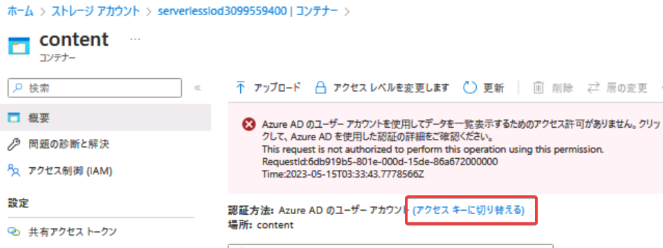

# ラーニングパス2 Azure Functions

■Azure Functions

```
関数アプリ用のストレージアカウント
|
関数アプリ
 ├ 関数1
 └ 関数2
```

「関数アプリ」は、C#のプロジェクトに対応する。

「関数」は、プロジェクト内のC#のクラスのメソッドに対応する。

「関数アプリ」の動作には、ストレージアカウントが必要。「ホストストレージ」と呼ばれる。Azure portalから作成した場合、このストレージアカウントが自動的に作られる。このストレージアカウントは削除してはいけない。

■トリガーとバインド

[トリガーとバインド](pdf/mod02/%E3%83%88%E3%83%AA%E3%82%AC%E3%83%BC%E3%80%81%E3%83%90%E3%82%A4%E3%83%B3%E3%83%89.pdf)

■Azure Functions Core Tools

https://learn.microsoft.com/ja-jp/azure/azure-functions/functions-run-local

「関数アプリ」を作成・デバッグするためのコマンドラインツール。マルチプラットフォーム（Windows/macOS/Linux）に対応。

「関数アプリ」を開発する開発環境にインストールする。

■ラボ2

- ラボの起動
  - 起動するラボ: ラボ2
  - Windowsにサインイン
  - 「ラボ ファイルをデスクトップにダウンロード」をクリック。
    - F:にダウンロードされる
    - AllFiles/Labs/02/Solutions を「ドキュメント」にコピー
- Azure portalへのサインイン
  - Edgeブラウザーを起動
  - https://portal.azure.com
  - 「リソース」タブのユーザーID/パスワードを使用
  - 日本語化
- Azure Functions「関数アプリ」リソースの作成
  - 名前: funcapp(乱数)
  - ランタイムスタック: .NET
  - バージョン: 6 (LTS)
  - ※「確認及び作成」を押しても「検証しています...」が消えず「作成」押せない場合:
    - いったん前の画面に戻って再度「確認及び作成」
    - デプロイが完了するのを待つ
- ストレージアカウントの一覧
  - 作成された「serverlesslod～」ストレージアカウントを表示
    - Blobコンテナー「content」を作成
      - 「アクセスキーに切り替える」をクリック 
      - Solutions フォルダー内の settings.json をアップロード
      - 「編集」をクリックして settings.json の内容を確認。
- Visual Studio Codeの起動
  - 「Azure Functions拡張機能」のインストール ※すでにインストール済みの場合はスキップ
  - Solutions フォルダー内の func フォルダーを開く
    - Reccuring.csファイル内の`*/30`を`*/1`に変更
  - 「関数アプリ」のデプロイ
    - ファイル一覧の空白部分をクリック
    - Deploy to Function App...
    - Sign in to Azure...
      - Webブラウザーでサインイン済みユーザーをクリック
    - Select Subscription...
    - funcapp(乱数)を選択
    - Yes
    - Deploy
    - ※2分ほどで「deployment completed」と表示される
- Azure Functions「関数アプリ」リソースを表示
  - 画面左「関数」メニューをクリック
  - Echo、GetSettingInfo、Recurringの3つの関数が一覧に表示される
    - ※表示されない場合はWebブラウザーでAzure portalページをリロード、またはVisual Studio Codeから関数を再度デプロイ。
  - Echo関数の動作確認
  - GetSettingInfo関数の動作確認
  - Recurring関数の動作確認
