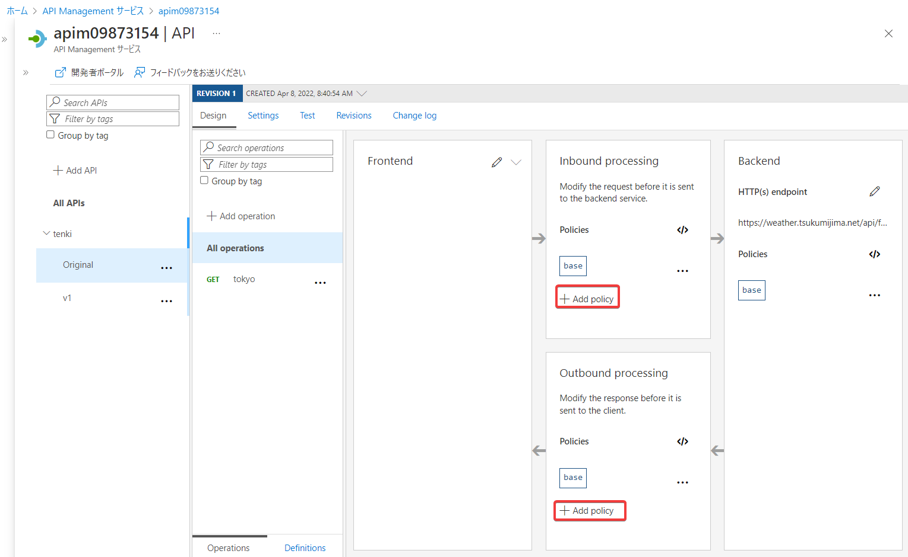
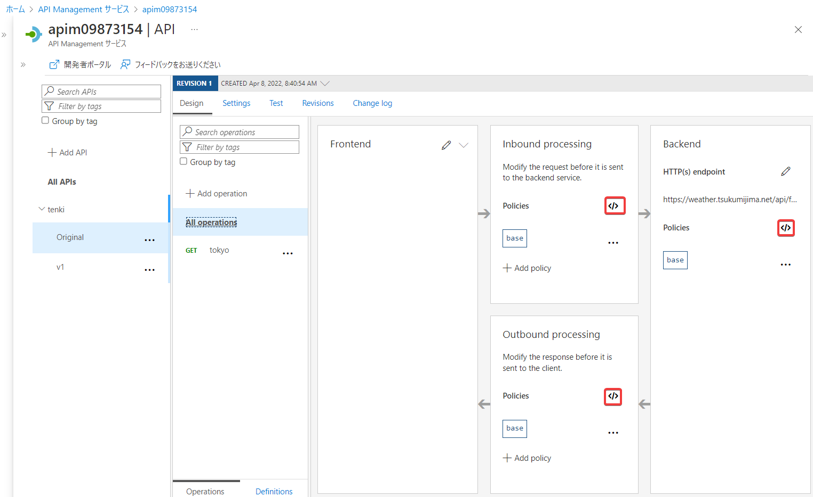
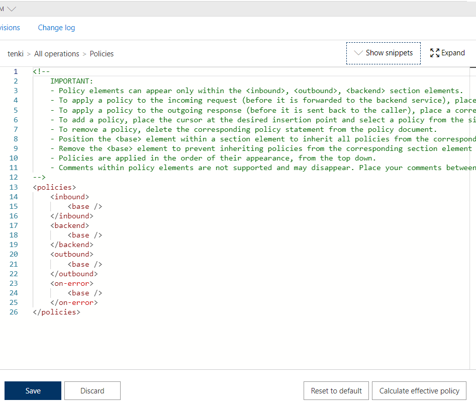

# Azure API Management (APIM)

- [製品ページ](https://azure.microsoft.com/ja-jp/services/api-management/)
- [価格](https://azure.microsoft.com/ja-jp/pricing/details/api-management/)
- [ドキュメント](https://docs.microsoft.com/ja-jp/azure/api-management/api-management-key-concepts)

2014/9/10 一般提供開始 https://azure.microsoft.com/en-us/updates/general-availability-azure-api-management/


■概要

(1)「API ゲートウェイ」を作成できる。

```
フロントエンド
↓
APIゲートウェイ: 認証、キャッシュ、変換、測定
↓
既存のバックエンドのサービス
```

「APIゲートウェイ」は、バックエンドに代わり、認証、キャッシュ、変換、測定などの機能を提供する。バックエンドではこれらの機能を作り込む必要がなくなる。

(2)「開発者ポータル」を作成できる。

https://docs.microsoft.com/ja-jp/azure/api-management/api-management-howto-developer-portal

```
APIを利用したい開発者
↓
開発者ポータル
```

APIを利用したい開発者に対し、APIのドキュメントを提供する。

Premium、Standard、Basic、Developer レベルで使用可能。

■URL

API Managementのリソースを「example」という名前で作成した場合.

- APIゲートウェイ: https://example.azure-api.net
- 開発者ポータル: https://example.developer.azure-api.net

■価格レベル

https://docs.microsoft.com/ja-jp/azure/api-management/api-management-features

価格レベルにより提供される機能が異なる。

- Consumption: 「開発者ポータル」使用不可
- Developer: SLAなし、非運用環境向け
- Basic
- Standard
- Premium
- Isolated: [高レベルの分離](https://docs.microsoft.com/ja-jp/azure/api-management/upgrade-and-scale#compute-isolation)が必要なエンタープライズ向け、プレビュー中

Developerは運用環境向けではない。SLA提供なし。

変更（アップグレード・ダウングレード）が可能。例: StandardからPremiumにアップグレード。

■スケーリング

https://docs.microsoft.com/ja-jp/azure/api-management/upgrade-and-scale#upgrade-and-scale

スケーリング（「ユニット」の追加・削除）を行うことで、より多数のトラフィックを処理することができる。

Basic、Standard、Premiumで、スケーリングが可能。

- Basic: 1-2
- Standard: 1-4
- Premium: 1-10


■API Management「インスタンス」の作成

API Management「インスタンス」の作成にはかなり時間がかかる。

- Consumption: 1分程度
- Developer, Basic等: 1時間程度


■バージョン

https://docs.microsoft.com/ja-jp/azure/api-management/api-management-versions

一つのAPIゲートウェイで複数の「APIバージョン」を扱うことができる。

```
APIバージョン1
└ GET /users/{id} ... ユーザー情報の取得

APIバージョン2
├ GET /users/{id} ... ユーザー情報の取得
└ POST /users ... 新しいユーザーの作成
```

バージョンは「バージョン識別子」で区別される。

APIゲートウェイに接続するクライアントは、任意のバージョンを使用することができる。パスベース、ヘッダーベース、クエリ文字列ベースのいずれかで、バージョンを指定する。

■リビジョン

https://docs.microsoft.com/ja-jp/azure/api-management/api-management-revisions

https://azure.microsoft.com/ja-jp/blog/versions-revisions/

リビジョンを使用すると、開発者は、API 利用者に影響を及ぼすことなく、API を変更（編集・テスト）することができる。

変更を加える場合は、新しいリビジョンを作成する。

各リビジョンには、API の URL の末尾に `;rev={revisionNumber}` を追加して、アクセスできる。

準備ができたら、そのリビジョンを現在のリビジョンにする。


■ サブスクリプション

https://docs.microsoft.com/ja-jp/azure/api-management/api-management-subscriptions

サブスクリプションは、API ユーザーが API Management インスタンスを介して公開されている API へのアクセス権を取得するための方法。 

APIの利用者（開発者）は、「サブスクリプション」を取得する。

サブスクリプションでは、キーが発行される。APIを呼び出すプログラムに、キーを含める必要がある。

※Azure portal の製品の 設定 ページで 「サブスクリプションを要求する」 オプションをオフにすることができ、キーを使用せずに製品のすべての API にアクセスできるようにすることもできる。


■参考: Ocp-Apim-Subscription-Key 

APIを呼び出すプログラムでは、リクエストのOcp-Apim-Subscription-Key ヘッダーで、キーを送信する。

[What is OCP ?](https://stackoverflow.com/questions/52648362/what-does-the-ocp-stand-for-in-ocp-apim-subscription-key-header-azure-api-man)

■ポリシー




ポリシーを使用して、API Managementにさまざまな機能を付与することができる。

- 変換ポリシー
  - JSONからXML
  - XMLからJSON
  - 本文中の文字列の置換
  - ヘッダーの設定
  - クエリ文字列パラメーターの設定
- アクセス制限ポリシー
  - ヘッダーの確認
  - 呼び出しレートに基づく制限
  - 使用量クォータに基づく制限
  - 呼び出し元IPに基づく制限
  - JWTの検証
- キャッシュポリシー
- クロスドメインポリシー
- 高度なポリシー
  - コンカレンシー制限
  - Event Hubsにログ記録
  - Mock response
  - 再試行（条件が満たされるまで囲まれたポリシーステートメントの実行を繰り返す）
  - 制御フロー（条件付きでポリシーを適用）
  - 要求を送信する
  - 変数を設定する
  - 状態コードを設定する

■ポリシー定義





ポリシー定義は、一連の受信ステートメントと送信ステートメントが記述されたXML ドキュメント。

ポリシーの実行順:

```
(in) 
-> inbound policy 
-> backend policy 
-> backend 
-> outbound policy 
-> (out)
```

要求の処理中にエラーが発生した場合、inbound、backend、または outbound セクションの残りの手順はスキップされ、実行は on-error セクションのステートメントにジャンプする。

on-error セクションにポリシー ステートメントを配置することで、エラーが発生した場合の動作を構成できる。

■リクエストの呼び出しの制限（クォータ）

- rate-limit - 呼び出しレートをサブスクリプション別に制限
- rate-limit-by-key - 呼び出しレートをキー別に制限
- quota - 使用量のクォータをサブスクリプション別に設定
- quota-by-key - 使用量のクォータをキー別に設定

■その他のリソース

Microsoft Learn

- [Azure での API 統合の設計](https://docs.microsoft.com/ja-jp/learn/paths/architect-api-integration/)

リンク集:
[aka.ms/apimlove](https://aka.ms/apimlove)
