# Azure Storage

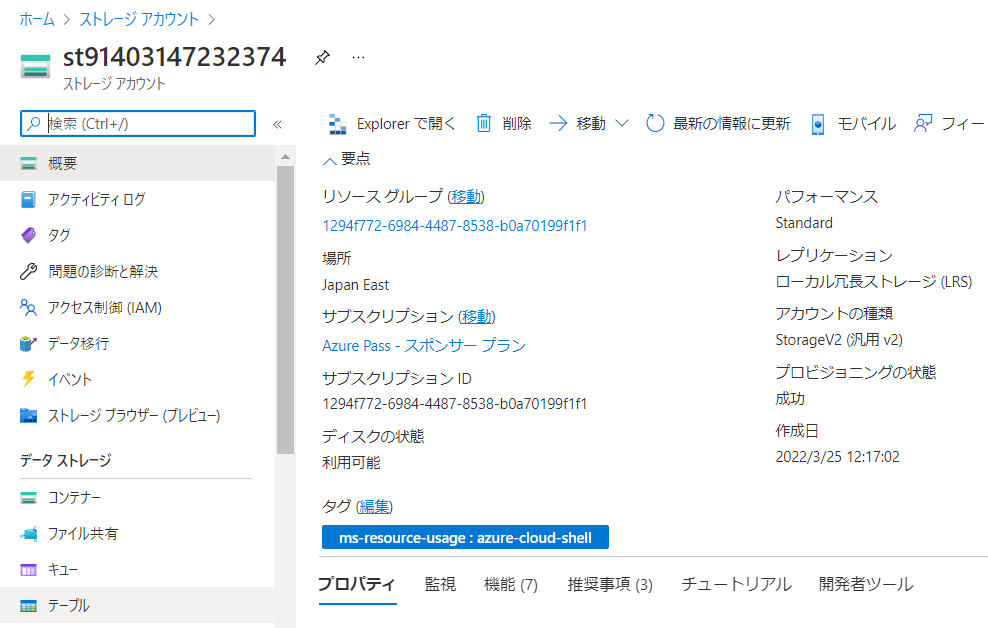
- 「ストレージ アカウント」を作成。
- Blob, Files, Table, Queueのサービスを利用できる
- マネージド: サーバーなどの管理をお客様が実施する必要がない
- 1つのストレージアカウントに 5 [PiB](https://ja.wikipedia.org/wiki/%E3%83%9A%E3%83%93%E3%83%90%E3%82%A4%E3%83%88#:~:text=%E3%83%9A%E3%83%93%E3%83%90%E3%82%A4%E3%83%88%20(pebibyte)%20%E3%81%A8%E3%81%AF%E3%82%B3%E3%83%B3%E3%83%94%E3%83%A5%E3%83%BC%E3%82%BF,PiB%E3%81%A8%E7%95%A5%E8%A8%98%E3%81%95%E3%82%8C%E3%82%8B%E3%80%82&text=SI%E6%8E%A5%E9%A0%AD%E8%BE%9E%E3%83%9A%E3%82%BF%E3%81%8C,%E3%82%92%E8%A1%A8%E3%81%99%E8%A8%80%E8%91%89%E3%81%A7%E3%81%82%E3%82%8B%E3%80%82)までデータを保管できる

■4つのサービス

- [Azure Blob Storage](https://docs.microsoft.com/ja-jp/azure/storage/blobs/storage-blobs-overview)
  - オブジェクトストレージ
  - HTTPSを使用してファイルをアップロード・ダウンロードできる
  - 非構造化データ（画像・動画・テキストファイルなど）の格納に適する
    - ※構造化データはSQL/NoSQLデータベースに格納
- [Azure Files](https://docs.microsoft.com/ja-jp/azure/storage/files/)
  - ファイル共有
  - VMやオンプレミスコンピュータから「ファイル共有」をマウントしてファイルを読み書き
  - SMB/NFSでアクセスできる
  - PDF解説: [Azure File Sync](../AZ-104/pdf/mod07/Azure%20File%20Sync.pdf)
- [Azure Table Storage](https://docs.microsoft.com/ja-jp/azure/storage/tables/table-storage-overview)
  - NoSQLデータストア
  - テーブルに「エンティティ」を書き込む
  - エンティティは複数の「プロパティ」から構成される
  - [Cosmos DB](https://docs.microsoft.com/ja-jp/azure/cosmos-db/introduction)ではTable Storage互換の[Table API](https://docs.microsoft.com/ja-jp/azure/cosmos-db/table/introduction)が利用できる
- [Azure Queue Storage](https://docs.microsoft.com/ja-jp/azure/storage/queues/storage-queues-introduction)
  - メッセージをキューイングするサービス
  - 1メッセージは64KBまで
  - [負荷平準化](https://docs.microsoft.com/ja-jp/azure/architecture/patterns/queue-based-load-leveling)に利用される

■パフォーマンス レベル

https://docs.microsoft.com/ja-jp/azure/storage/common/storage-account-overview#types-of-storage-accounts

- Standard
  - HDDでデータを格納
  - すべてのサービス(Blob, Files, Table, Queue)をサポート
- Premium
  - SSDでデータを格納
  - 低い待機時間
  - 高いトランザクションレートをサポート
  - Blob(ページBlob、ブロックBlob、追加Blob), Filesをサポート

Premium 登場時のブログ:
- Block Blob / 追加Blob(2019/3/25): https://azure.microsoft.com/ja-jp/blog/azure-premium-block-blob-storage-is-now-generally-available/
- Files(2019/6/26): https://azure.microsoft.com/ja-jp/updates/azure-premium-files-is-now-generally-available/

性能比較: 
https://azure.microsoft.com/en-us/blog/premium-block-blob-storage-a-new-level-of-performance/

Premiumストレージは、レイテンシが低く、スループットが高い。

■レプリケーション オプション

ストレージアカウントの作成画面:
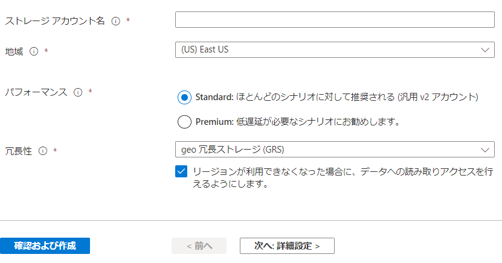

上記の設定(RA-GRS)で作成したストレージアカウントの「概要」:
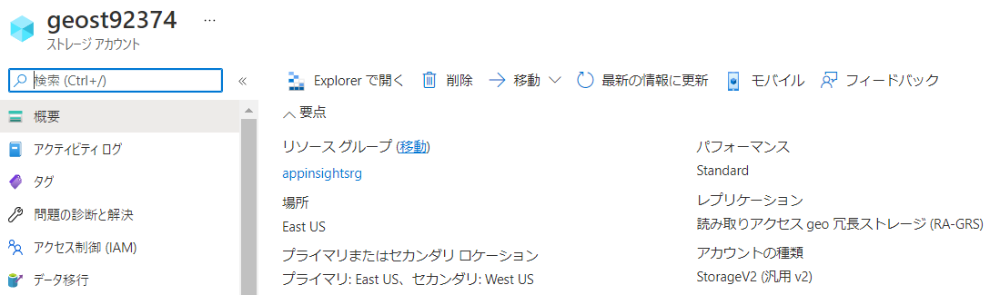


- [LRS](https://docs.microsoft.com/ja-jp/azure/storage/common/storage-redundancy#locally-redundant-storage): 1つのリージョンの1つのデータセンター内でデータをレプリケーション(3重)
- [ZRS](https://docs.microsoft.com/ja-jp/azure/storage/common/storage-redundancy#zone-redundant-storage): 1つのリージョンの3つの可用性ゾーンでデータをレプリケーション(3重)
- [GRS](https://docs.microsoft.com/ja-jp/azure/storage/common/storage-redundancy#geo-redundant-storage): ペアのリージョン間でデータをレプリケーション(6重)
- [GZRS](https://docs.microsoft.com/ja-jp/azure/storage/common/storage-redundancy#geo-zone-redundant-storage): ZRS + GRS(6重)
- [RA-](https://docs.microsoft.com/ja-jp/azure/storage/common/storage-redundancy#read-access-to-data-in-the-secondary-region)GRS: プライマリリージョンで読み書き、セカンダリリージョンで読み取りが可能なGRS
- [RA-](https://docs.microsoft.com/ja-jp/azure/storage/common/storage-redundancy#read-access-to-data-in-the-secondary-region)GZRS: プライマリリージョンで読み書き、セカンダリリージョンで読み取りが可能なGZRS

※RA: Read Access

- LRS/ZRS: 
  - セカンダリリージョンへのレプリケーションはされない
- GRS/GZRS: 
  - セカンダリリージョンへレプリケーションされる
  - フェールオーバー実行前、セカンダリリージョンのデータにはアクセスできない
- RA-GRS/RA-GZRS: 
  - セカンダリリージョンへレプリケーションされる
  - フェールオーバー実行前、セカンダリリージョンのデータに読み取りアクセスができる

[解説PDF](../AZ-104/pdf/mod07/ストレージ冗長化.pdf)

■エンドポイント

LRSで作成したストレージアカウントのBlobのエンドポイント:
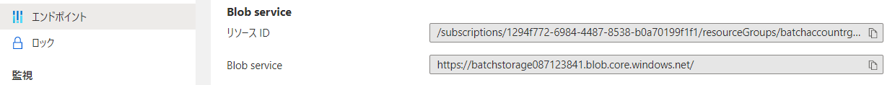

RA-GRSで作成したストレージアカウントのBlobのエンドポイント:
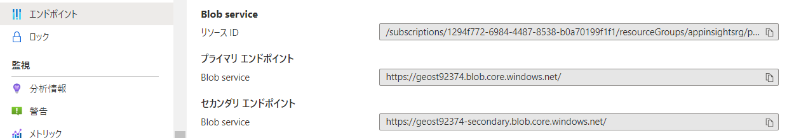

- プライマリエンドポイント
  - プライマリリージョンへのアクセス用
  - 読み書き可能
  - `http://ストレージアカウント名.blob.core.windows.net/` のようなアドレス
- セカンダリエンドポイント
  - セカンダリリージョンへのアクセス用
  - RA-GRS, RA-GZRSを選択した場合に利用可能
  - 読み込みのみ
  - `http://ストレージアカウント名-seconday.blob.core.windows.net/` のようなアドレス

[解説PDF](../AZ-104/pdf/mod06/サービスエンドポイントvsプライベートエンドポイント.pdf)

■フェイルオーバー

「geoレプリケーション」の画面:
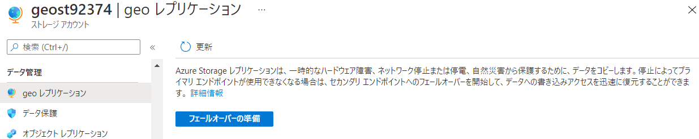

セカンダリリージョンにデータをレプリケーションするオプション（GRS, GZRS, RA-GRS, RA-GZRS）のストレージアカウントで、フェイルオーバーを実行できる。

- セカンダリリージョンが新たなプライマリリージョンとなる
- プライマリエンドポイントは変化しない
- フェイルオーバー完了後、レプリケーションオプションはLRSになる

Microsoft Learn: [リージョン間でストレージ データをレプリケートし、セカンダリ ロケーションにフェールオーバーすることで、ディザスター リカバリーを実現する](https://docs.microsoft.com/ja-jp/learn/modules/provide-disaster-recovery-replicate-storage-data/)

[ペアのリージョンの一覧](https://docs.microsoft.com/ja-jp/azure/best-practices-availability-paired-regions#azure-regional-pairs)

■RA-GRSでの運用例

平常時: アプリケーションは「読み書き」モードで運用

```
                  アプリケーション
                  ↓
    プライマリエンドポイント(rw)  セカンダリエンドポイント(r)
                  ↓
プライマリリージョン         セカンダリリージョン
└データ ------------------> └データ
           レプリケーション
```

プライマリリージョンでの障害発生時:アプリケーションを「読み取り専用」のモードで運用
- アプリケーションは、セカンダリエンドポイントを使用して、データの読み取りだけを実行できる

```
                  アプリケーション
                                  ↓
    プライマリエンドポイント(rw)  セカンダリエンドポイント(r)
                                  ↓
プライマリリージョン（障害）      セカンダリリージョン
└データ                           └データ
```

フェールオーバーを実行し、フェールオーバーが完了: アプリケーションは「読み書き」モードで運用。
- 読み書きを行うためのプライマリエンドポイントのアドレスは変わらない
- ストレージアカウントの冗長性は「LRS」となる。
  - セカンダリエンドポイントはなくなる

```
                  アプリケーション
                  ↓
    プライマリエンドポイント(rw)
                              ↓
プライマリリージョン（障害）  セカンダリリージョン
                              └データ
```

■アクセス層

Blobの一覧:
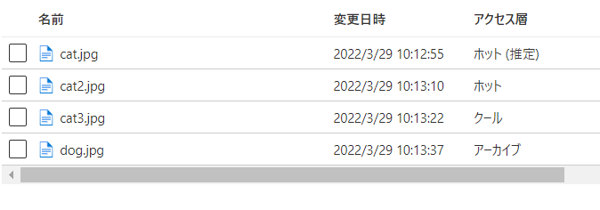

アクセス層「アーカイブ」で保存されたのBlobのメニュー:
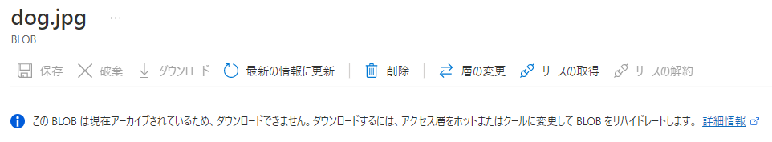

アクセス層「アーカイブ」で保存されたのBlobの、アクセス層の変更:
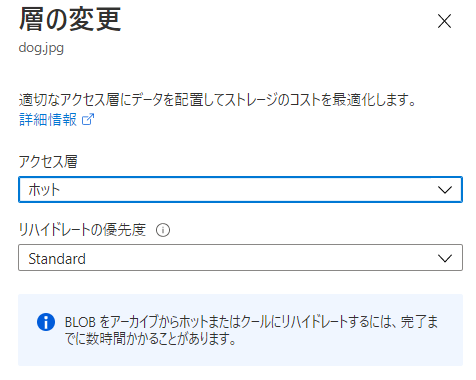

ストレージアカウントの「構成」、デフォルト（規定）の「BLOBのアクセス レベル」
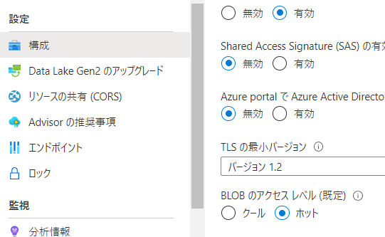

- Blob個々の単位でホット、クール、アーカイブの「アクセス層」を設定できる
- 料金が変わる
  - ストレージ料金: ホット ＞ クール ＞ アーカイブ
  - 読み取り操作料金: ホット ＝ クール ＜ アーカイブ
  - データ取得料金: ホット ＜ クール ＜ アーカイブ
- ホットとクールに設定されたBlobには、リアルタイムのアクセス（ダウンロード等）が可能
- アーカイブに設定されたBlobには、リアルタイムアクセスが不可能
  - アクセスする前に[「リハイドレート」を実行する](https://docs.microsoft.com/ja-jp/azure/storage/blobs/archive-rehydrate-overview)必要がある
  - リハイドレートには時間がかかる
    - 通常: 1～15時間
    - 優先度高: 1時間未満
  - ※rehydrate: 水分補給をする、水を与えてもとに戻す
- ストレージアカウントの設定で、アクセス層を明示的に指定しないBlobに対するデフォルト値を「ホット」または「クール」に設定できる。
  - Azure portal上では「ホット（推定）」や「クール（推定）」のように表示される。

※推定: 英語UIでは「inferred」となっている。「あるBlobに対して明示的にアクセス層が設定されていないので、ストレージアカウントのデフォルト（規定）の「BLOBのアクセス レベル」に記録している」という状態。ストレージアカウントのデフォルト（規定）の「BLOBのアクセス レベル」を変更すると、それに伴って、**推定（inferred）として保存されているすべてのBlobの層が変更される**ので注意。

参考: [Azure Storageの「アーカイブ」では、コスト、エラー率の低さ、安全性、長期耐久性の観点から、テープストレージを採用](https://www.fujifilm.com/jp/ja/business/data-management/data-archive/tips/efficiency/007)

■ライフサイクル管理ポリシー

ライフサイクル管理:
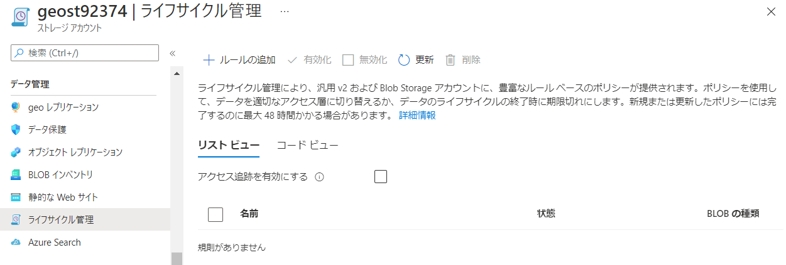

「アクセス追跡」の有効化:
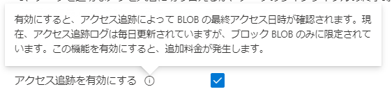

ライフサイクル管理ルールの設定画面:
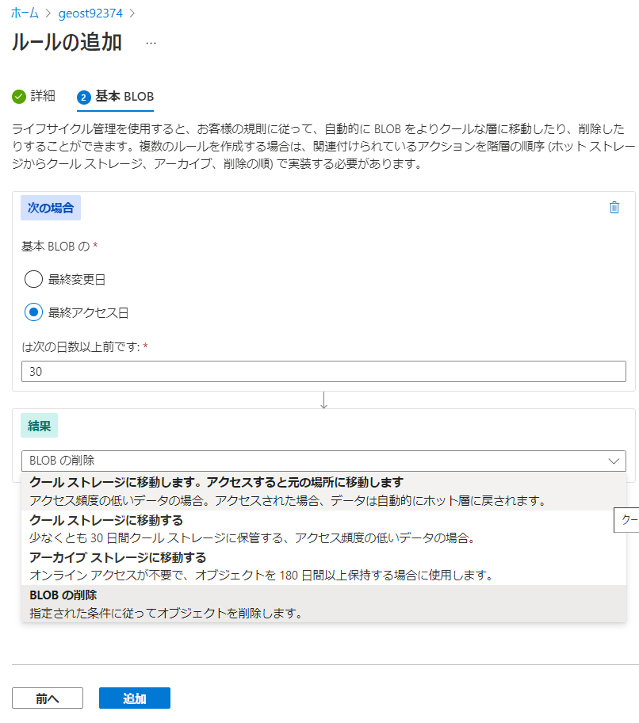

- [ライフサイクル管理ポリシーを設定](https://docs.microsoft.com/ja-jp/azure/storage/blobs/storage-lifecycle-management-concepts?tabs=azure-portal)することで、ホット、クール、アーカイブの変更を自動化することができる。

[まとめPDF: ライフサイクル管理ポリシーの設定例](../AZ-104/pdf/mod07/ライフサイクルルール.pdf)

■アクセス層による料金

条件: LRS, Japan East, 2021/8現在

ストレージ料金(GBあたり, 1ヶ月, 最初の50TB):

- ホット
  - 2.24円
- クール
  - 1.68円
- アーカイブ
  - 0.024円

読み取り操作料金(10000件あたり):

- ホット
  - 0.448円
- クール
  - 0.448円
- アーカイブ
  - 616円
  - 8120円(「優先度:高」の場合)

データ取得料金(GBあたり):

- ホット
  - 無料
- クール
  - 1.12円
- アーカイブ
  - 2.464円
  - 16.24円(「優先度:高」の場合)

[まとめPDF: アクセス層と料金の例](../AZ-104/pdf/mod07/アクセス層.pdf)


