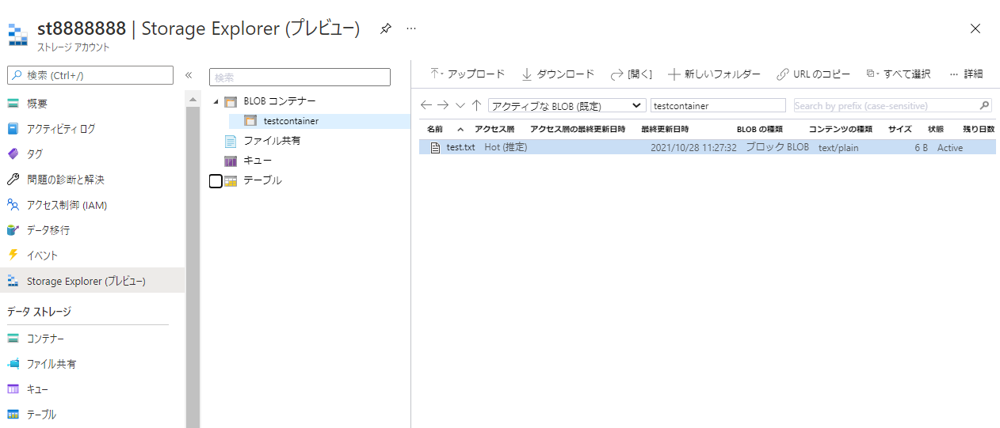
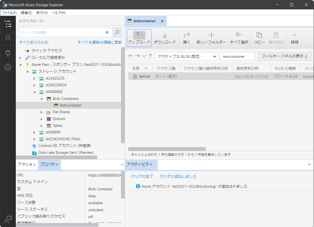
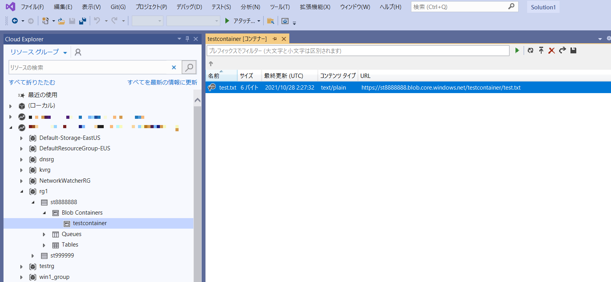

■Azure portal

「Storage Explorer」から、Blob、ファイル共有、キュー、テーブルの操作を行うことができる。

■Azure Storage Explorer

https://azure.microsoft.com/ja-jp/features/storage-explorer/#overview

Azure クラウド ストレージ リソースを簡単に管理できる、スタンドアロンのアプリケーション。Windows/Mac/Linuxで利用可能。

■AzCopy

[モジュール3で解説済み](mod03-03-azcopy.md)

■Microsoft Visual Studio Cloud Explorer

Visual Studioに内蔵された、クラウドリソースの表示・管理を行うツール。

