# Azure Data Factory (ADF)

https://docs.microsoft.com/ja-jp/azure/data-factory/

ETL 、ELT 、データ統合という複雑なハイブリッド プロジェクト用に構築された、マネージドなクラウド サービス。

※ETLとELT

- [ETL](https://ja.wikipedia.org/wiki/Extract/Transform/Load)
  - Extract - Transform - Load
  - 抽出 - 変換 - 読み込み。
  - [1970年ころから存在する概念](https://en.wikipedia.org/wiki/Extract,_transform,_load)
    - データウェアハウスへのデータ取り込みなど。
- [ELT](https://www.talend.com/jp/resources/elt-vs-etl/)
  - Extract - Load - Transform, 抽出 - 読み込み - 変換。
  - 2020/12、John Lafleur氏が提唱。
    - https://www.kdnuggets.com/2020/12/future-etl-is-elt.html
  - データを変換せずDWHに読み込む。
  - データの利用者が必要に応じて変換作業を実施。
  - 変換のやり直しがきく。

■歴史

2015/8/6 ADF (V1) 一般提供開始
https://docs.microsoft.com/en-us/archive/blogs/machinelearning/announcing-the-general-availability-of-azure-data-factory

2018/6/27 ADV V2 が一般提供開始。[V1は2023/8/31に廃止予定。](https://azure.microsoft.com/ja-jp/updates/migrate-your-azure-data-factory-version-1-to-2-service/) V1からV2への移行ツールが利用可能。
https://azure.microsoft.com/en-in/blog/azure-data-factory-new-capabilities-are-now-generally-available/

2019/10/7 ADF「マッピングデータフロー」一般提供開始。ブラウザーベースのデザイナーを使用して、データ パイプラインを作成。コーディング不要。組み込みの変換機能を使用して、結合、集計、ピボット、並べ替えなどを実行できる。
https://azure.microsoft.com/ja-jp/blog/azure-data-factory-mapping-data-flows-are-now-generally-available/

■基本的な操作例 - Blobコンテナー間でのBlobのコピー

Azure portal 画面上部の検索で「データ ファクトリ」を検索

基本:
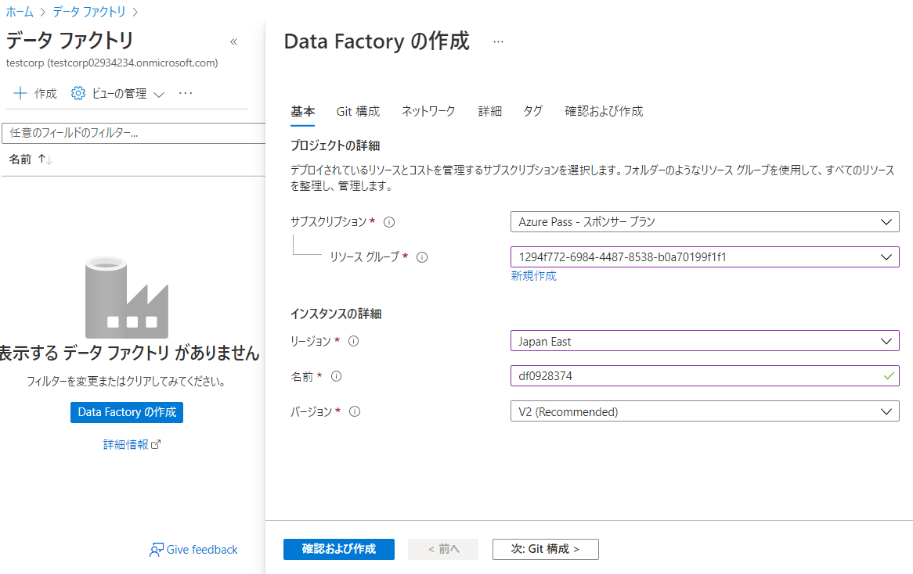

Git構成:
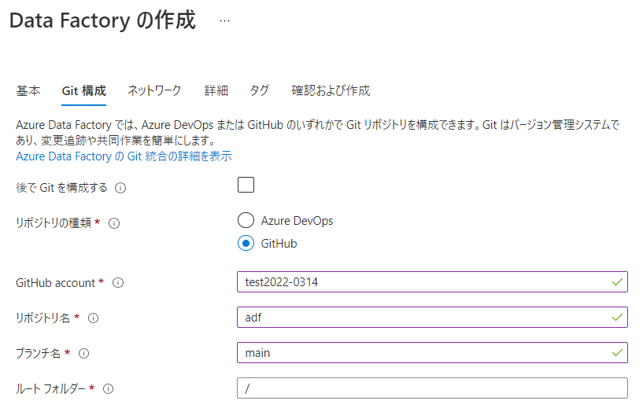

「概要」から「Azure Data Factory Studio」を開く:
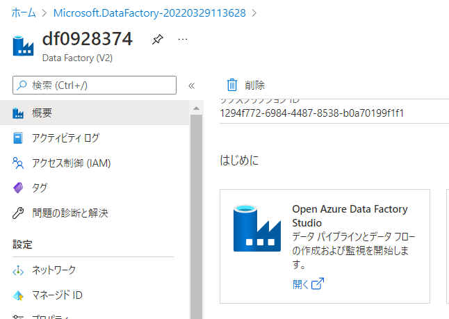

GitHubにログイン:
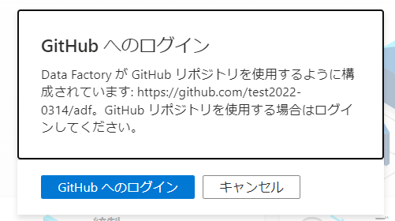

パイプラインの定義. コピー アクティビティを追加:
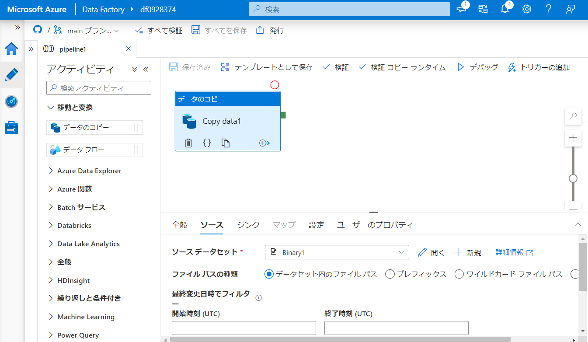

コピー アクティビティの「ソース」（コピー元）と「シンク」（コピー先）を指定:
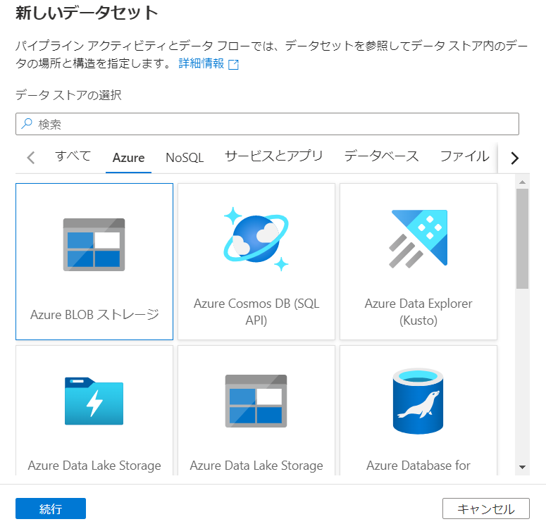

Azure Data Factory でパイプラインの変更を保存:
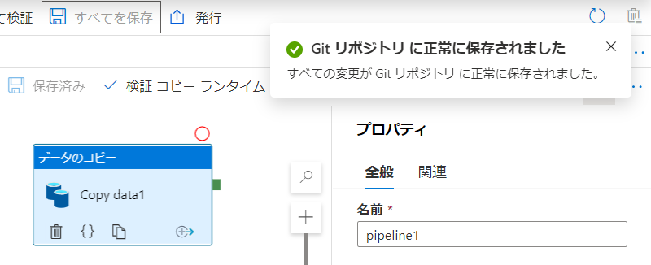

GitHubリポジトリにパイプラインの情報が保存される:
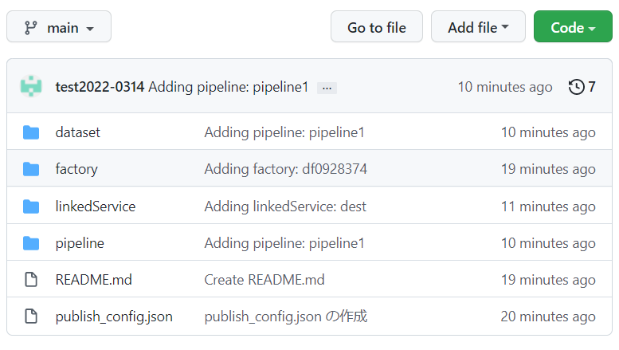

デバッグ実行:
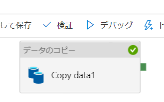

実行結果:
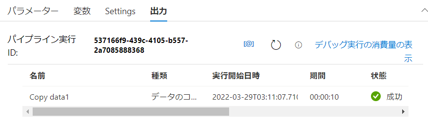

実行結果の詳細:
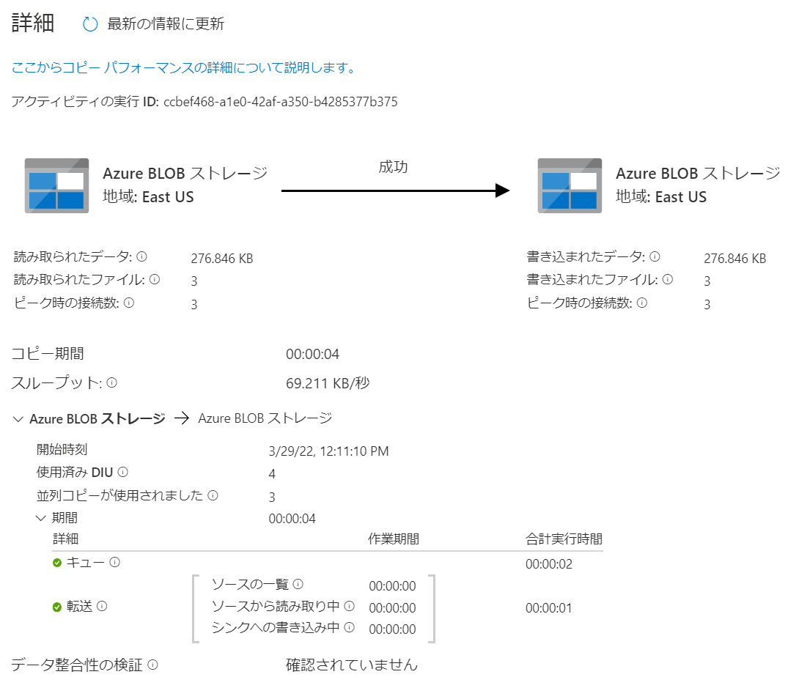

■コネクタ

https://docs.microsoft.com/ja-jp/azure/data-factory/connector-overview

90個を超えるコネクタを使用して、データを統合することができる。

- Azure Blob, Files, Tables
- Azure Cosmos DB
- Azure SQL Database
- Azure Database for MySQL/MariaDB/PostgreSQL
- Amazon S3, RDS, Redshift
- Oracle
- Access
- Cassandra
- MongoDB
- ファイルシステム
- FTP
- など

[コネクターの一覧](https://docs.microsoft.com/ja-jp/azure/data-factory/connector-overview#supported-data-stores)

■Azure Data FactoryとAzure Synapse Analytics

- Azure Data Factory: ETL/ELTを行う
- Azure Synapse Analytics: データ ウェアハウスやビッグ データ システムの分析を行う

この2つのサービスでは、いくつか共通の仕組みを利用する。

- [共通のコネクターを利用できる](https://docs.microsoft.com/ja-jp/azure/data-factory/connector-overview)
- [パイプラインとアクティビティで構成される](https://docs.microsoft.com/ja-jp/azure/data-factory/concepts-pipelines-activities)
  - パイプライン: アクティビティ の論理的なグループ
  - [データ移動アクティビティ](https://docs.microsoft.com/ja-jp/azure/data-factory/copy-activity-overview)
  - [データ変換アクティビティ](https://docs.microsoft.com/ja-jp/azure/data-factory/transform-data)
  - [制御（制御フロー）アクティビティ](https://docs.microsoft.com/ja-jp/azure/data-factory/concepts-pipelines-activities#control-flow-activities)
- [パイプライン実行とトリガー](https://docs.microsoft.com/ja-jp/azure/data-factory/concepts-pipeline-execution-triggers)

■参考: Microsoft Learn

- [Azure Data Factory の概要](https://docs.microsoft.com/ja-jp/learn/modules/intro-to-azure-data-factory/)
- [Azure Data Factory または Azure Synapse パイプラインを使用した大規模なデータ統合](https://docs.microsoft.com/ja-jp/learn/paths/data-integration-scale-azure-data-factory/)