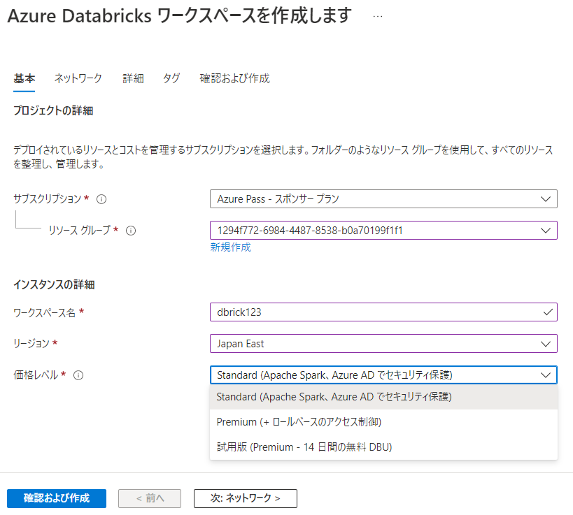
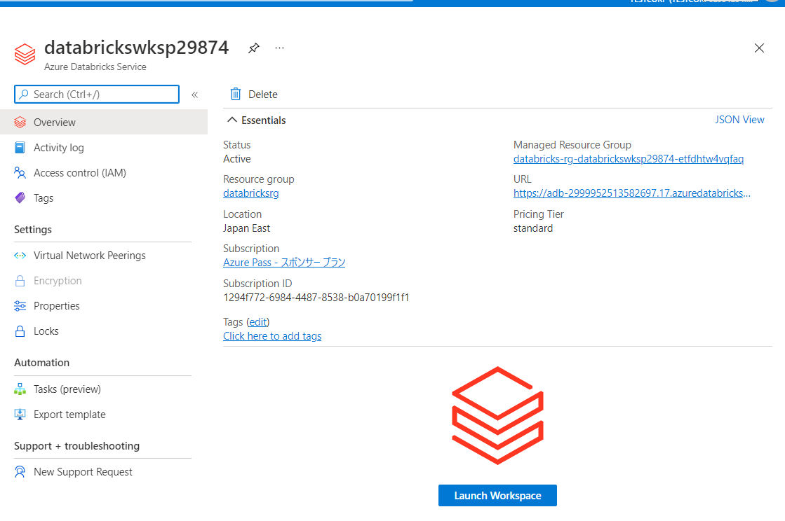
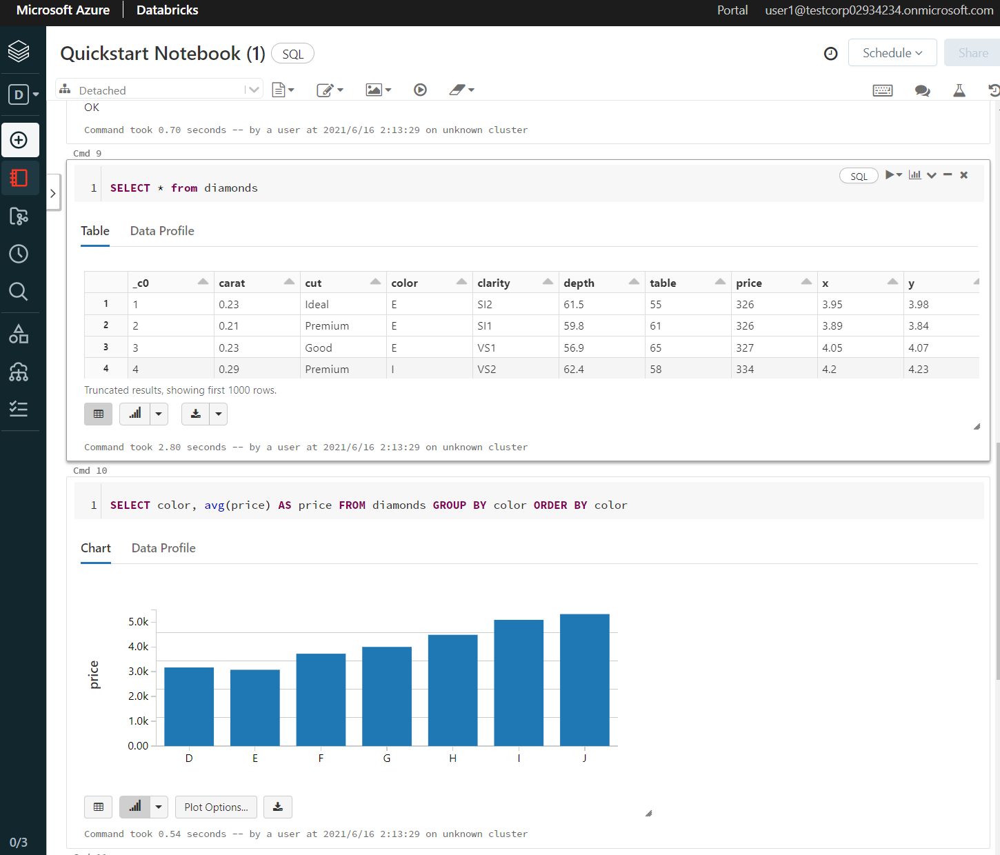

# Azure Databricks

https://docs.microsoft.com/ja-jp/azure/databricks/scenarios/what-is-azure-databricks

Microsoft Azure クラウド サービス プラットフォーム用に最適化された 、フルマネージド、クラウドベースの データ分析プラットフォーム。「Databricks社」とMicrosoftが共同で開発。Azureに向けて最適化・統合されている。

- データの取り込み
- データ分析、可視化
- 機械学習、ディープラーニング
- ノートブックによるプログラミング（Python、Scala、R、SQL）

■歴史

2015/6/15 [Databricks](https://databricks.com/jp/) 一般提供開始。[Apache Spark](https://docs.microsoft.com/ja-jp/azure/hdinsight/spark/apache-spark-overview#what-is-apache-spark)クラスターを起動し、ビッグデータをインタラクティブに分析できる。ノートブックを使用してデータを探索・視覚化できる。
https://databricks.com/jp/blog/2015/06/15/databricks-is-now-generally-available.html

2018/3/22 Azure Databricks 一般提供開始
https://azure.microsoft.com/en-us/blog/azure-databricks-industry-leading-analytics-platform-powered-by-apache-spark/

2018/9/24 新機能追加、日本を含む追加リージョンで利用可能に
https://azure.microsoft.com/en-in/blog/azure-databricks-delta-in-preview-9-regions-added-and-other-exciting-announcements/

■Databrics（社）とは

https://ja.wikipedia.org/wiki/%E3%83%87%E3%83%BC%E3%82%BF%E3%83%96%E3%83%AA%E3%83%83%E3%82%AF%E3%82%B9

- Apache Spark、Delta Lake、および MLflow の作成者によって設立された企業
- Databricsプラットフォームは世界で5,000社を超える企業に利用されている
- 2021年ガートナー「マジッククアドラント」において、データサイエンスおよび機械学習プラットフォーム部門のリーダーとして評価されている

■Databrics（プラットフォーム）とは

- Databrics社が開発した分析プラットフォーム

■「Azure Databricksワークスペース」の作成

価格レベル:
- Standard
- Premium
- 試用版（Trial）: Premium機能、14日間、無料のDBUを利用可能）

※DBU: Databricks Unit. 1時間あたりの処理能力の単位。1秒あたりの使用量で課金される。

価格の説明: [Azure公式](https://azure.microsoft.com/ja-jp/pricing/details/databricks/) / [Databricks社公式](https://databricks.com/jp/product/azure-pricing)

■Databricksワークスペースへの接続

概要:

ワークスペースを起動:

■参考

- Microsoft Learn
  - [Azure Databricks の説明](https://docs.microsoft.com/ja-jp/learn/modules/describe-azure-databricks/)
  - [Azure Databricks を使ってみる](https://docs.microsoft.com/ja-jp/learn/modules/get-started-azure-databricks/?ns-enrollment-type=LearningPath&ns-enrollment-id=learn.wwl.build-operate-machine-learning-solutions-azure-databricks)
- コース [DP-090: Implementing a Machine Learning Solution with Microsoft Azure Databricks](https://docs.microsoft.com/en-us/learn/certifications/courses/dp-090t00)
  - [ラボ](https://microsoftlearning.github.io/dp-090-databricks-ml/)