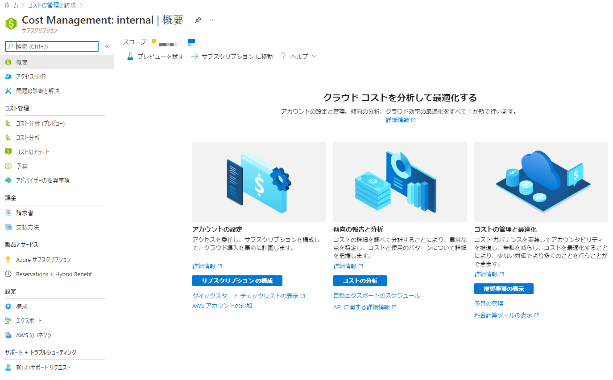
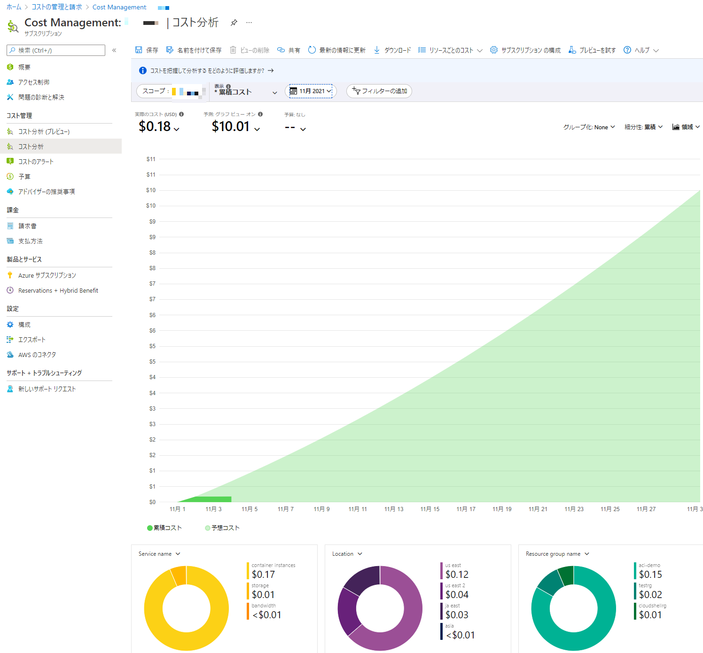
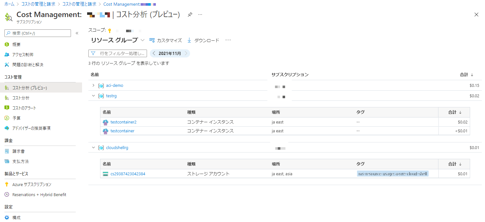
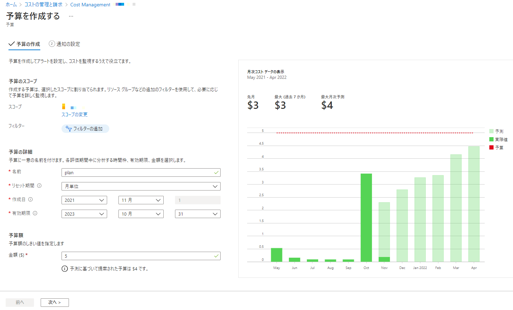

# Cost Management + Billing （コストの管理と請求）

**※注意: Azure Passサブスクリプションでは、この機能を利用できない。**

Azure Passサブスリプションの利用状況と期限については[専用のサイト](https://www.microsoftazuresponsorships.com/balance)で確認できる.

■ドキュメント

https://docs.microsoft.com/ja-jp/azure/cost-management-billing/cost-management-billing-overview

■Azure portal＞コストの管理と請求＞コスト管理

■Azure portal＞コストの管理と請求＞コスト管理＞コスト分析

- 実際のコスト: 当月の合計使用量と購入コスト
- 予測: 選択した期間に対する合計予想コスト
- 予算: 選択したスコープの計画的な使用制限（設定した場合）

■Azure portal＞コストの管理と請求＞コスト管理＞コスト分析（プレビュー）

- リソースグループとリソースのコストがよりわかりやすく表示されるようになった

■Azure portal＞コストの管理と請求＞コスト管理＞予算＞追加

- （月単位など）特定の期間中に対する予算を設定できる。
- 作成した予算のしきい値を超えた場合は、通知がトリガーされる。 

