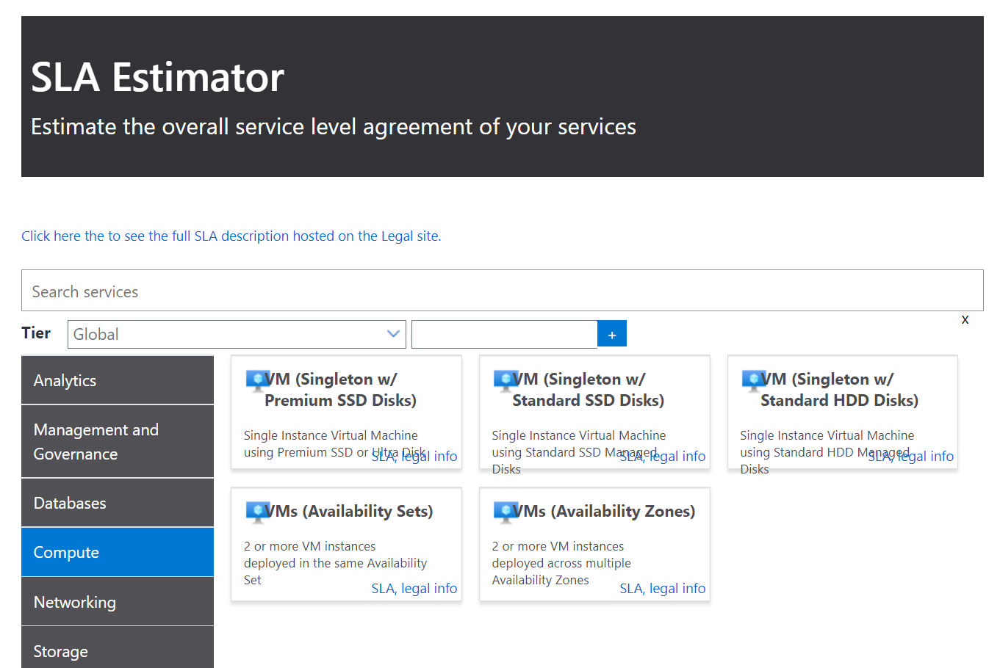
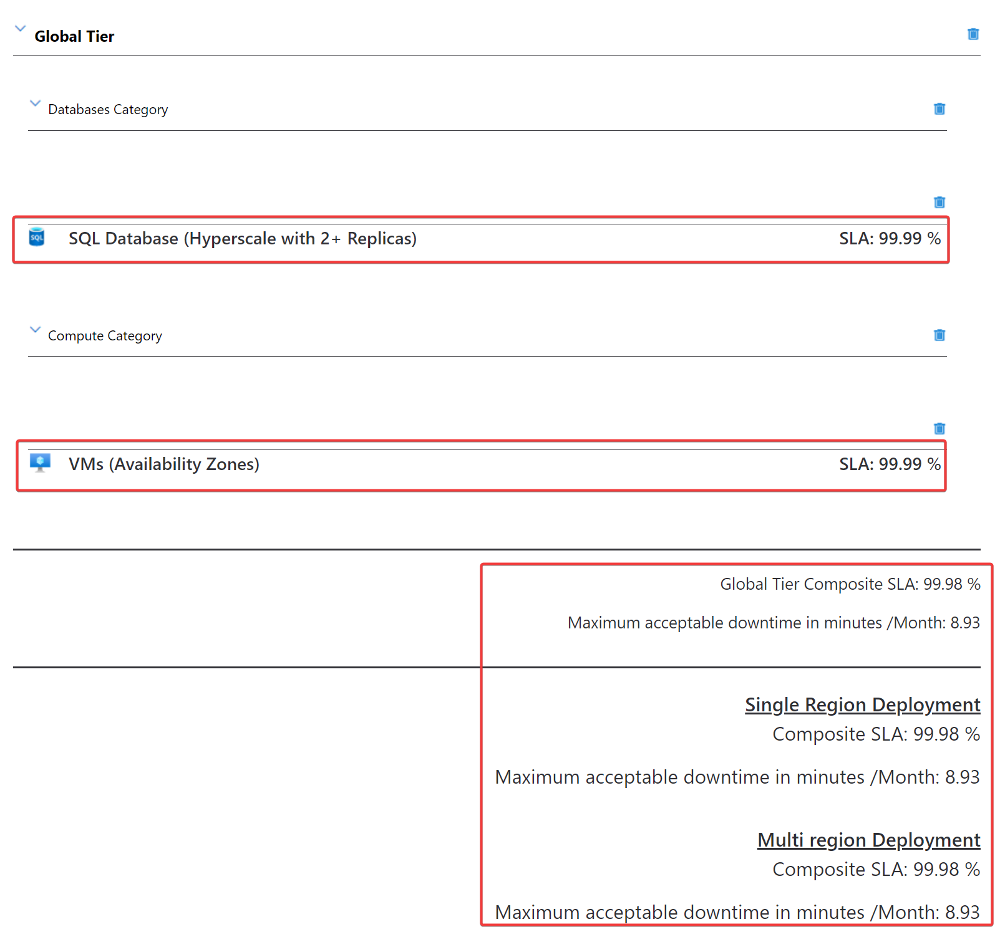

# 可用性

■可用性とは？

https://ja.wikipedia.org/wiki/%E5%8F%AF%E7%94%A8%E6%80%A7

> 可用性（かようせい、英: availability; アベイラビリティ）は、システムが継続して稼働できる度合いや能力のこと。

■VMの可用性を高めるには？

典型的には以下のようなしくみを活用する。

- 可用性ゾーンが使えない場合
  - 複数のVMを「可用性セット」に入れる
- 可用性ゾーンが使える場合
  - 複数のVMを「可用性ゾーン」に分散させる

[わかりやすい解説(MS社員)](https://ayuina.github.io/ainaba-csa-blog/azure-vm-availability/)

[わかりやすいまとめ(Qiita)](https://qiita.com/fukasawah/items/486563aa66a1bfe8a278)

# SLA

■SLAとは？

SLA: Service Level Agreement, サービス品質保証

https://www.meti.go.jp/policy/netsecurity/secdoc/contents/downloadfils/080121saasgl.pdf

> SLA(Service Level Agreement)は、提供されるサービスの範囲・内容・前提事項を踏ま
えた上で「サービス品質に対する利用者側の要求水準と提供者側の運営ルールについて明
文化したもの」である。サービス利用契約を締結する際に、SaaS 提供者とサービスの利用
者（以下、利用者）双方による合意の結果として、契約文書の一部もしくは独立した文書
として締結されるケースが多い。

> 財務上の対応については、払い戻しではなく将来の請求額から差し引く形態をとり、上限を設定することが一般的である（例：月の請求額に対する１０％、１日分の請求額、等）。

■AzureのSLA

以下のページでSLAの定義を参照できる。

- [AzureのSLA](https://azure.microsoft.com/ja-jp/support/legal/sla/)
  - 各サービスの詳細なSLA定義
- [AzureのSLAの概要](https://azure.microsoft.com/ja-jp/support/legal/sla/summary/)
  - 各サービスのSLAの概要

■SLA見積もりツール

[SLA見積もりツール](https://github.com/mspnp/samples/tree/master/Reliability/SLAEstimator)

[Azure料金計算ツール](https://azure.microsoft.com/ja-jp/pricing/calculator/)と同様のインターフェースで、選択したサービスのSLAの見積もりを行うことができる。

■Azureの「サービスクレジット」（利用料の返金）

https://satonaoki.wordpress.com/2017/04/27/azure-sla-service-credit/

> マイクロソフトが本 SLA に規定されている各本サービスのサービス レベルを達成および維持しない場合、お客様は、月間サービス料金の一部についてクレジットの適用を受けることができます。

