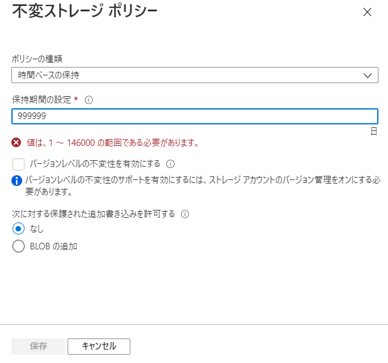

# アクセスポリシー

Blobコンテナーの「アクセスポリシー」

```
Blobコンテナー
└アクセスポリシー
  ├(1)保存されているアクセスポリシー
  └(2)不変 Blob ストレージ ポリシー
```


ファイル共有 / テーブル / キューの「アクセスポリシー」

```
ファイル共有
└アクセスポリシー

テーブル
└アクセスポリシー

キュー
└アクセスポリシー
```


※[ファイル共有の「アクセスポリシー」は、Azure portalからは設定できない。Azure CLIかAzure Storage Explorerから設定できる。](https://azurebrian.com/how-to/2020/05/11/Stored-Access-Policies-For-Azure-Files.html)

## (1)保存されているアクセスポリシー (stored access policy)

「格納されているアクセス ポリシー」とも。

https://docs.microsoft.com/ja-jp/rest/api/storageservices/define-stored-access-policy


各コンテナー（、テーブル、キュー、ファイル共有）に「アクセスポリシー」を5個まで保存することができる。

■アクセスポリシーのプロパティ（設定項目）

- 名前(ID)
- アクセス許可(複数可)
  - 読み取り
  - 追加
  - 作成
  - 書き込み
  - 削除
  - リスト
- 開始時刻
- 終了時刻

保存した「アクセスポリシー」は、個々のBlobの「共有アクセス署名(SAS)」の生成の際に組み合わせて使用することができる。


このようにSASを生成した場合、以下のような操作が可能となる。

- アクセスポリシーの名前(ID)を変更する
  - SASが無効になる
- アクセスポリシーの開始時刻・終了時刻を変更する
  - SASの開始時刻・終了時刻が変更される
- アクセスポリシーを削除する
  - SASが無効になる

※アクセスポリシーを使わずに発行したSASの場合、そのSASを変更・無効化する方法はない。

[SASの3種類](https://docs.microsoft.com/ja-jp/rest/api/storageservices/delegate-access-with-shared-access-signature#types-of-shared-access-signatures)のうち、「保存されているアクセスポリシー」が使用できるのは「サービスSAS」のみである。
- [アカウント SAS](https://docs.microsoft.com/ja-jp/rest/api/storageservices/create-account-sas)
- [サービス SAS](https://docs.microsoft.com/ja-jp/rest/api/storageservices/create-service-sas) ... 「保存されているアクセスポリシー」使用可能
- [ユーザー委任 SAS](https://docs.microsoft.com/ja-jp/rest/api/storageservices/create-user-delegation-sas)

## (2)不変 Blob ストレージ ポリシー

```
不変 Blob ストレージ ポリシー
├訴訟ホールド
└時間ベースの保持
```

■「訴訟ホールド」ポリシー (legal-hold policy)


※訴訟ホールドとは？

> そもそも「訴訟ホールド」とは法律用語で、「欧米法において訴訟や司法調査などの可能性があると判断される段階で「関連した全ての資料・情報をそのままの状態で安全に保存する」という処置」をいう

https://note.com/nihonnekonote/n/nf52355217810

■「時間ベースの保持」ポリシー (time-based-retention policy)



「時間ベースの保持」ポリシーが設定されている場合、指定された日数の間、オブジェクトの作成と読み取りはできるが、変更または削除はできなくなる。

たとえば「重要な書類を保存したBlobコンテナーがあり、3年間はそのコンテナーや中のBlobを変更・削除できないようにしたい」といった場合に、「時間ベースの保持」ポリシーを使用する。
