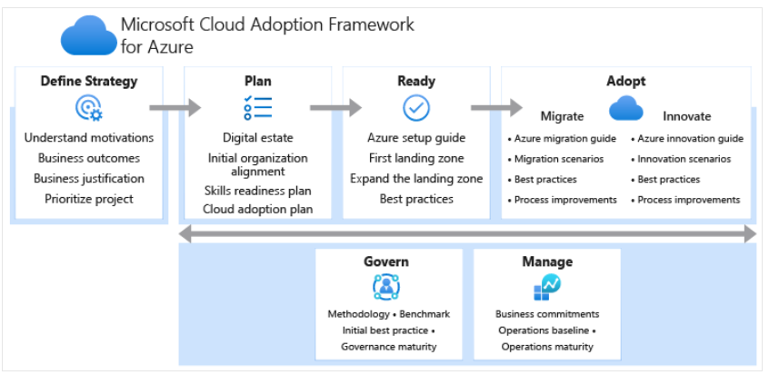
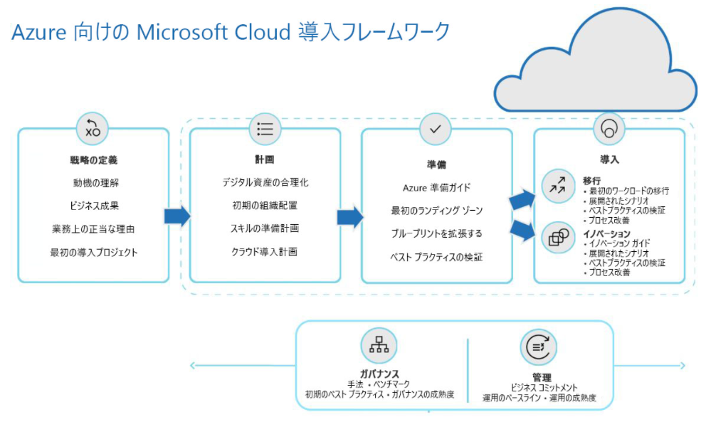
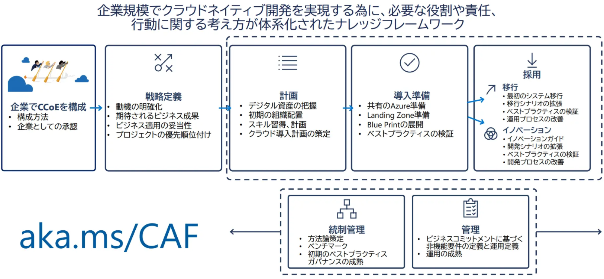
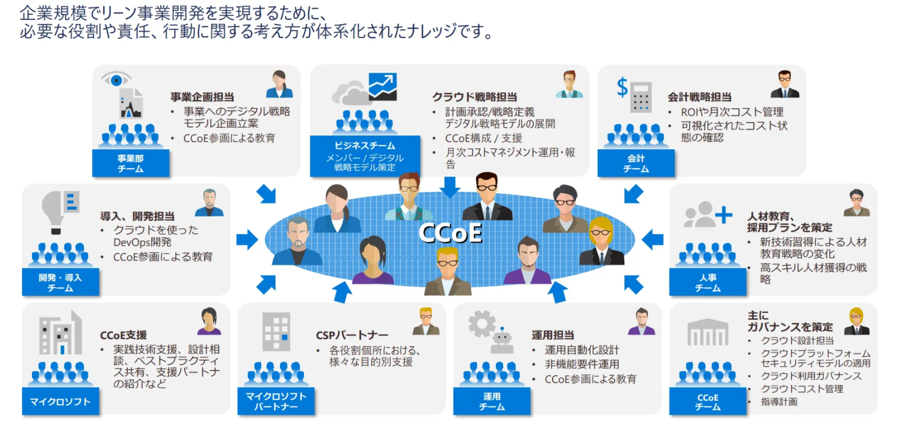

# CAFの「ステージ」

「ライフサイクル」 または 「フェーズ」 とも。

図（英語）:
https://docs.microsoft.com/ja-jp/azure/cloud-adoption-framework/overview#understand-the-lifecycle

図（日本語、CCoEの構成を含まない）
https://docs.microsoft.com/ja-jp/learn/modules/microsoft-cloud-adoption-framework-for-azure/2-cloud-adoption-framework-overview

図（日本語、CCoEの構成を含む）:
https://codezine.jp/article/detail/13473?p=2

CAFは、6つ（「CCoEの構成」を含めると7つ）の「ステージ」で構成される。

- (1)CCoEの構成
- (2)戦略定義 - [Define Strategy](https://docs.microsoft.com/ja-jp/azure/cloud-adoption-framework/strategy/)
- (3)計画 - [Plan](https://docs.microsoft.com/ja-jp/azure/cloud-adoption-framework/plan/)
- (4)準備(導入準備) - [Ready](https://docs.microsoft.com/ja-jp/azure/cloud-adoption-framework/ready/)
- (5)導入(採用) - Adopt ([Migrate](https://docs.microsoft.com/ja-jp/azure/cloud-adoption-framework/migrate/) または [Innovate](https://docs.microsoft.com/ja-jp/azure/cloud-adoption-framework/innovate/))
- (6)統制管理 - [Govern](https://docs.microsoft.com/ja-jp/azure/cloud-adoption-framework/govern/)
- (7)管理 - [Manage](https://docs.microsoft.com/ja-jp/azure/cloud-adoption-framework/manage/)

(1)～(5)は順に実施。「(6)統制管理」と「(7)管理」は、「(3)計画」「(4)導入準備」「(5)採用」と並行で実施される。

[「計画」「準備」「採用」が、「3つの主要段階」とされる。](https://docs.microsoft.com/ja-jp/learn/modules/microsoft-cloud-adoption-framework-for-azure/2-cloud-adoption-framework-overview)

## (1)CCoEの構成

CCoE（Cloud Center of Excellence）

https://enterprisezine.jp/article/detail/13670?p=3

> CCoEとは、クラウドを利用したビジネス変革実現に向けて、クラウド戦略やガバナンスの管理を行うための組織横断的なチームのことである。

> デジタルトランスフォーメーションに成功している非IT企業の大半は、CCoEを設置していたという結果があり注目を集めている

> CAFは最適なクラウド導入と運用を支えるためのフレームワークであるが、CCoE（Cloud Center of Excellence）の設置が前提として考えられている。

https://docs.microsoft.com/ja-jp/azure/cloud-adoption-framework/organize/cloud-center-of-excellence

> CCoE チームの主要な職務は、クラウドネイティブまたはハイブリッド ソリューションを通じてクラウド導入を加速することです。

## (2)戦略の定義 - Define Storategy - 「動機」に対応した戦略を立て、導入プロジェクトを選定する

- Microsoft Learn: https://docs.microsoft.com/ja-jp/learn/modules/microsoft-cloud-adoption-framework-for-azure/3-define-strategy
- Microsoft Docs: https://docs.microsoft.com/ja-jp/azure/cloud-adoption-framework/strategy/
- アンチパターン: https://docs.microsoft.com/ja-jp/azure/cloud-adoption-framework/antipatterns/strategy-antipatterns

クラウドの導入には様々な「動機」がある。

- コスト削減
- 組織やビジネスの規模の拡大
- 製品・サービスの変革
- ビジネスの俊敏性（アジリティ）の向上
- 顧客体験・エンゲージメントの改善

動機に基づいてクラウド導入戦略を立てる。

「最初の導入プロジェクト」を決める。

「最初の導入プロジェクト」は、導入の動機に対応している必要がある。現在運用されているアプリケーションで、クラウドに移行する強い動機があるものを選択する。セキュリティで保護されたデータ（個人情報等）とのやり取りがないアプリケーションを選択する。

## (3)計画 - Plan - 資産を「合理化」し、「クラウド導入計画」を作成する

- Microsoft Learn: https://docs.microsoft.com/ja-jp/learn/modules/microsoft-cloud-adoption-framework-for-azure/4-plan
- Microsoft Docs: https://docs.microsoft.com/ja-jp/azure/cloud-adoption-framework/plan/
- アンチパターン: https://docs.microsoft.com/ja-jp/azure/cloud-adoption-framework/antipatterns/plan-antipatterns

デジタル資産を、クラウド向けに「合理化」（Rationalize）する。合理化には5つの方法（5つのR）が考えられる。

- Rehost
  - [リフトアンドシフト](https://www.google.com/search?q=%E3%83%AA%E3%83%95%E3%83%88%E3%82%A2%E3%83%B3%E3%83%89%E3%82%B7%E3%83%95%E3%83%88)とも
  - アーキテクチャの変更を最小限に抑える
  - 現在の資産（サーバー等）をそのままクラウドに移動する
- Refactor
  - コードをリファクタリング（機能を変えず、クラウド向けにチューニング）する
- Rearchitect
  - アプリケーションを再設計する
- Rebuid/New
  - クラウドネイティブアプリケーション
- Replace
  - 現行のアプリケーションを、クラウドでホストされているアプリケーションに移行する

参考: [AWSの6つのR（スライド9枚目～）](https://pages.awscloud.com/rs/112-TZM-766/images/Migrating-to-AWS_Best-Practices-and-Strategies_eBook.pdf)

参考: [Gartnerの5つのR](https://techtarget.itmedia.co.jp/tt/news/1904/17/news07.html)

## (4)準備(導入準備) - Ready

- Microsoft Learn: https://docs.microsoft.com/ja-jp/learn/modules/microsoft-cloud-adoption-framework-for-azure/5-ready
- Microsoft Docs: https://docs.microsoft.com/ja-jp/azure/cloud-adoption-framework/ready/
- アンチパターン: https://docs.microsoft.com/ja-jp/azure/cloud-adoption-framework/antipatterns/ready-antipatterns

ランディング ゾーン

Cloud Adoption Framework for Azure Terraform landing zones
https://github.com/azure/caf-terraform-landingzones

## (5)導入(採用) - Adopt

- Microsoft Learn: https://docs.microsoft.com/ja-jp/learn/modules/microsoft-cloud-adoption-framework-for-azure/6-adopt
- Microsoft Docs: 
  - Migrate: https://docs.microsoft.com/ja-jp/azure/cloud-adoption-framework/migrate/
  - Innovate: https://docs.microsoft.com/ja-jp/azure/cloud-adoption-framework/innovate/
- アンチパターン: 
  - Migrate: https://docs.microsoft.com/ja-jp/azure/cloud-adoption-framework/antipatterns/migrate-antipatterns
  - Innovate: （なし）

## (6)統制管理 - Govern

- Microsoft Learn: https://docs.microsoft.com/ja-jp/learn/modules/microsoft-cloud-adoption-framework-for-azure/7-govern-and-manage
- Microsoft Docs: https://docs.microsoft.com/ja-jp/azure/cloud-adoption-framework/govern/
- アンチパターン: https://docs.microsoft.com/ja-jp/azure/cloud-adoption-framework/antipatterns/govern-antipatterns

ガバナンス: ガードレールを作成する

## (7)管理 - Manage

- Microsoft Learn: https://docs.microsoft.com/ja-jp/learn/modules/microsoft-cloud-adoption-framework-for-azure/7-govern-and-manage
- Microsoft Docs: https://docs.microsoft.com/ja-jp/azure/cloud-adoption-framework/manage/
- アンチパターン: https://docs.microsoft.com/ja-jp/azure/cloud-adoption-framework/antipatterns/manage-antipatterns

管理: 安定性と運用コストのバランスを取る

## 参考: CAFの「インフォグラフィック」

https://azure.microsoft.com/ja-jp/resources/cloud-adoption-framework/

Define Strategy, Plan, Ready, Adopt, Govern, Manageの各ステージで行うことと、ステージで活用することができるツールへのリンク。

> Organizations that do not have a high-level cloud strategy driven by their business strategy will significantly increase their risk of failure and wasted investment.

> ビジネス戦略に基づく高レベルのクラウド戦略を持たない組織では、失敗や投資の浪費のリスクが大幅に高まります。
