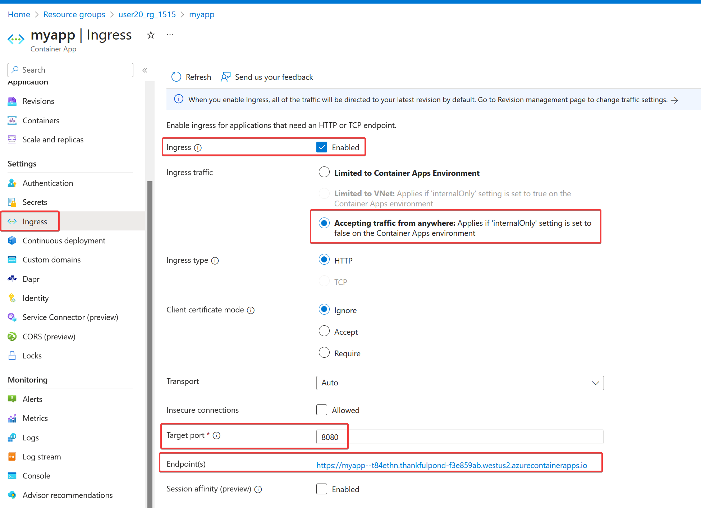
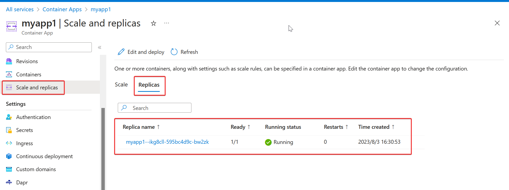
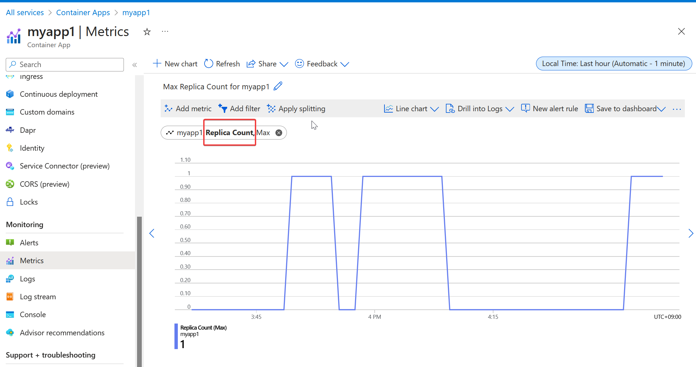

# Azure Container Apps

「コンテナーアプリ」を実行する、マネージドなサーバーレスコンテナーサービス。マイクロサービスの運用向け。

公式サイト
https://azure.microsoft.com/ja-jp/services/container-apps/

ドキュメント
https://docs.microsoft.com/ja-jp/azure/container-apps/overview

価格
https://azure.microsoft.com/ja-jp/pricing/details/container-apps/

公式による解説（英語）「Introducing Azure Container Apps: a serverless container service for running modern apps at scale」
https://techcommunity.microsoft.com/t5/apps-on-azure-blog/introducing-azure-container-apps-a-serverless-container-service/ba-p/2867265?ocid=AID3042118

Roadmap and issues for Azure Container Apps
https://github.com/microsoft/azure-container-apps


# 使用例(クイックスタート手順・改)

[Azure portalからの利用例](container-apps-portal.md)

[Azure CLIからの利用例](container-apps-azcli.md)

# 歴史

2021/11/2 パブリックプレビュー
https://azure.microsoft.com/ja-jp/updates/public-preview-azure-container-apps/

2022/5/24 一般提供開始
https://azure.microsoft.com/ja-jp/updates/generally-available-azure-container-apps/

2022/10/12 「Azure Monitor統合」がパブリックプレビューに。デフォルトではログはLog Analyticsワークスペースに送信されるが、「Azure Monitor統合」により、ログをAzure Monitorに送信し、そこからAzure StorageやEvent Hubsなどに送信できるようになった。
https://azure.microsoft.com/ja-jp/updates/public-preview-azure-container-apps-azure-monitor-integration/

2023/3/16 「Azure Monitor統合」一般提供開始。
https://azure.microsoft.com/en-us/updates/generally-available-azure-monitor-integration-with-azure-container-apps/

2023/4/12 「Consumption and Dedicated plan」パブリックプレビュー。
https://techcommunity.microsoft.com/t5/apps-on-azure-blog/azure-container-apps-announces-new-pricing-plan-and-enhanced/ba-p/3790723

2023/5/10 「Initコンテナー」パブリックプレビュー。
https://azure.microsoft.com/en-us/updates/public-preview-init-containers-in-azure-container-apps/

2023/5/23 「ジョブ」がパブリックプレビューに。マニュアル、スケジュール、イベントによって起動され、任意の作業を実行できる
。
https://techcommunity.microsoft.com/t5/apps-on-azure-blog/introducing-jobs-for-azure-container-apps/ba-p/3826677

# Azure Container Appsの特徴

■「コンテナー化されたアプリ」を実行するサービス

任意の言語を使用してアプリを開発できる。

Linux ベースの x86-64 (linux/amd64) コンテナー を運用できる。

[Windowsコンテナーはサポートされない。](https://learn.microsoft.com/en-us/answers/questions/814737/azure-container-apps-and-windows-images) Windowsコンテナーを実行する必要がある場合はApp ServiceやAzure Container Instanceを使用する。

■マネージド型

オーケストレーター（Kubernetes）、VMなどのインフラを管理する必要がない。

■Kubernetes

Azure Container Appsは、内部的には Kubernetes（Azure Kubernetes Service）上で動作する。

ただし、Kubernetesを管理する必要はない。（Kubernetesやコントロールプレーンに直接アクセスすることはできない。）

■オープンソースのテクノロジ

内部では、Dapr（「ダーパー」: マイクロサービス間通信）、KEDA（「ケイダー」: Kubernetes向けイベントドリブンスケーラー）、Envoy（「エンヴォイ」: プロキシ）などのテクノロジが利用されている。

→ [Daprの解説](container-apps-dapr.md)

→ [KEDAの解説](container-apps-keda.md)

→ [Envoyの解説](container-apps-envoy.md)

→ [Dapr vs Envoy](https://itnext.io/dapr-vs-envoy-when-to-use-what-6c2ac3caaed2)

Azure Container Appsでは[「Dapr」を有効化することで、コンテナーでDaprの「ビルディングブロック」を利用できる。](https://docs.microsoft.com/ja-jp/azure/container-apps/dapr-overview)

Azure Container Appsでは、[KEDAでサポートされているすべてのイベントがサポートされており、例えばService Busのキューのメッセージに比例したスケーリングが実行できる。](https://docs.microsoft.com/ja-jp/azure/container-apps/scale-app#event-driven)

Azure Container Appsでは、[Envoy は エッジ HTTP プロキシとして使用されている。](https://docs.microsoft.com/ja-jp/azure/container-apps/networking#http-edge-proxy-behavior)

■Log Analytics ワークスペース

https://docs.microsoft.com/ja-jp/azure/container-apps/monitor

コンテナー アプリから収集されたデータ、標準出力 (stdout) または標準エラー (stderr)への出力は、Log Analytics ワークスペースへと書き込まれる。

# 用途

マイクロサービスの運用

[Azure Container Apps を使用したマイクロサービスのデプロイ](https://docs.microsoft.com/ja-jp/azure/architecture/example-scenario/serverless/microservices-with-container-apps)

# リソースの構成

「Container Apps 環境」の中で「コンテナー アプリ」を動かすことができる。

```
Container Apps 環境 -> Log Analyticsワークスペース
└コンテナー アプリ
```

※Azure portalでは「コンテナー アプリ」を作成すると一緒に「Container Apps 環境」「Log Analyticsワークスペース」が作成される。

※App Serviceのプランとアプリの関係に似ているが、「Container Apps 環境」に対しての料金は発生しない。料金は「アプリで使われたvCPU＊時間」＋「アプリで使われたメモリ＊時間」＋「アプリで受け付けたリクエスト数」に応じて発生（後述）。

1つの「Container Apps 環境」で複数の「コンテナー アプリ」を動かすことができる。

```
Container Apps 環境
├コンテナー アプリ1 (マイクロサービス1)
│ ↑ ↓ 通信可能
└コンテナー アプリ2 (マイクロサービス2)
```

[「Container Apps 環境」内の「コンテナー アプリ」はDaprを使用して相互に通信できる。](https://docs.microsoft.com/ja-jp/azure/container-apps/environment) アプリ間の通信をさせる必要がない（分離したい）場合は、別の環境に分ける。

```
Container Apps 環境1
└コンテナー アプリ1

Container Apps 環境2
└コンテナー アプリ2
```

[環境で実行できるアプリ数には制限はない。](https://learn.microsoft.com/ja-jp/azure/container-apps/quotas)

# コンテナー アプリ

https://docs.microsoft.com/ja-jp/azure/container-apps/containers#multiple-containers

1つのコンテナーアプリの中で、1つ～複数のコンテナーを運用できる。

コンテナー アプリ内のコンテナー:

- ハード ディスクとネットワーク リソースを共有
- 同じアプリケーション ライフサイクルを共有
- 通信が可能。

```
Container Apps 環境
└コンテナーアプリ
  └リビジョン
    └レプリカ
      ├コンテナー1（メイン）
      └コンテナー2（サイドカー）
```

※リビジョン、レプリカについては後述。

# Container Apps 環境

https://docs.microsoft.com/ja-jp/azure/container-apps/environment

「Container Apps 環境」は、環境内の1つ～複数のコンテナー アプリを囲む「安全な境界」である。要するに、環境＝仮想ネットワーク（VNet）である。

同じ環境内のコンテナー アプリは、同じ仮想ネットワークにデプロイされ、同じ Log Analytics ワークスペースにログを書き込む。

```
VNet
└Container Apps 環境 --> Log Analyticsワークスペース
  ├コンテナーアプリ1
  └コンテナーアプリ2
```

# イングレス

https://docs.microsoft.com/ja-jp/azure/container-apps/ingress

「イングレス」を有効にすることで、コンテナー アプリにHTTPSでアクセスできる。アプリケーションには完全修飾ドメイン名 (FQDN) が割り当てられる。



FQDNは https://my-container-apps.ambitioussky-123456.japaneast.azurecontainerapps.io のような形式になる。

※イングレスは必ずしも有効にする必要はない。たとえばキューからメッセージを読み込んで処理をするアプリの場合、イングレスは無効でもよい。

# スケーリング

https://docs.microsoft.com/ja-jp/azure/container-apps/scale-app

Container Appsではスケーリング（インスタンスの増減）が行われる。インスタンスは「レプリカ」と呼ばれる。

[レプリカは、アプリのコンテナー（＋オプションのサイドカーのコンテナー）で構成される。](https://docs.microsoft.com/ja-jp/azure/architecture/example-scenario/serverless/microservices-with-container-apps)

※以下の図の「リビジョン」については後述。

```
Container Apps 環境
└コンテナーアプリ (名前: example)
  └リビジョン
    └レプリカ1
      └コンテナー
```

↓スケールアウト ↑スケールイン

```
Container Apps 環境
└コンテナーアプリ (名前: example)
  └リビジョン
    ├レプリカ1
    │└コンテナー
    └レプリカ2
      └コンテナー
```

レプリカの数は最小値と最大値を指定できる。最大値は300まで設定可能。デフォルトは「最小0～最大10」。

レプリカの状況は「Scale and replicas」で確認できる。


レプリカ数は「メトリック」の「Replica Count」でも確認できる。


以下に基づくスケーリングが可能

- HTTPトラフィック
- イベント ドリブン
- CPU または メモリ

# 課金（料金）

https://docs.microsoft.com/ja-jp/azure/container-apps/environment#billing

課金は、個々のコンテナー アプリとそのリソース使用量にのみ関連する。Container Apps 環境に関連付けられている基本料金はない。

- 1 秒あたりのリソース割り当て
  - vCPU (秒)
    - アクティブ使用料金 1 秒あたり ¥0.0030510
    - アイドル使用料金 1 秒あたり ¥0.0003814
  - メモリ (GiB 秒)
    - アクティブ使用料金 1 秒あたり 1 秒あたり ¥0.0003814
    - アイドル使用料金 1 秒あたり ¥0.0003814
- リクエスト
  - 100 万あたり ¥50.850
- 毎月最初の 180,000 vCPU 秒、360,000 GiB 秒、200 万件のリクエストは無料

※インスタンス数が0になったレプリカは「アイドル料金」のカテゴリで課金される。

※最新の価格は次を参照: https://azure.microsoft.com/ja-jp/pricing/details/container-apps/


# リビジョン

https://docs.microsoft.com/ja-jp/azure/container-apps/revisions

コンテナーアプリを作成すると最初の「リビジョン」が作成される。

```
Container Apps 環境
└コンテナーアプリ (名前: example)
  └リビジョン1 (コンテナイメージ: container1)
```

↓たとえば、コンテナーイメージの変更を行うと、新しい「リビジョン」が作られる。

```
Container Apps 環境
└コンテナーアプリ (名前: example)
  ├リビジョン1 (コンテナイメージ: container1)
  └リビジョン2 (コンテナイメージ: container2)
```

リビジョンの利用方法

- リビジョンの切り替え（切り戻し）ができる
- 「ブルーグリーンデプロイ」ができる
  - リビジョン2の準備ができたら、トラフィックをリビジョン2に流す
- 「A/Bテスト」ができる
  - リビジョン1に90%, リビジョン2に10%のトラフィックを流す、など
  - この場合は複数のリビジョンを「アクティブ化」する

リビジョンは一度作られると変更できない。不要なリビジョンは削除できる。

アプリ内で最大 100 個のリビジョンを保持できる。

リビジョンにはオプションの「サフィックス」（接尾辞）を付けて区別できる。

```
Container Apps 環境
└コンテナーアプリ (名前: example)
  ├リビジョン1 (サフィックス:ver1)
  └リビジョン2 (サフィックス:ver2)
```

各リビジョンは「example--ver1」「example--ver2」といった「リビジョン名」となる（「コンテナーアプリ名--サフィックス」）。

リビジョンは、「アクティブ」「非アクティブ」のいずれかに設定できる（[アプリケーションライフサイクル管理](https://docs.microsoft.com/ja-jp/azure/container-apps/application-lifecycle-management)）。

非アクティブ化すると、リビジョンの実行中のすべてのレプリカが停止する。非アクティブなリビジョンには課金されない。

# IDプロバイダーによる認証

Microsoft、Apple、Facebook、GitHub、Google、Twitter、OpenID Connectを使用したサインイン機能を追加できる。

たとえば、「Microsoft」IDプロバイダーを追加して、Azure ADでサインインしたユーザーだけがアプリにアクセスできるように設定できる。

Microsoftでサインインした場合はMicrosoft API呼び出し、Appleでサインインした場合はApple APIの呼び出し、・・・（以下同様 Facebook, Google, Twitter のAPI呼び出し）が可能となる。

# マネージドID

https://docs.microsoft.com/ja-jp/azure/container-apps/managed-identity

システム割り当て / ユーザー割り当て マネージドIDに対応。コンテナーアプリがその他のAzureサービスにアクセスする際に使用される。

# シークレット

https://docs.microsoft.com/ja-jp/azure/container-apps/manage-secrets

コンテナーアプリ独自のしくみ「シークレット」（キー・値）管理が利用できる。

使用例: Azure Service Busキューを使用して[イベントドリブンのスケーリング](https://docs.microsoft.com/ja-jp/azure/container-apps/scale-app#event-driven)を行う場合に、キューへの接続文字列をシークレットとして記録しておく。

# カスタム ドメイン

https://docs.microsoft.com/ja-jp/azure/container-apps/custom-domains-certificates

オプションで、アプリにカスタムドメインを割り当て可能。

# Azure Container Apps vs Azureのコンテナー系サービス

https://docs.microsoft.com/ja-jp/azure/container-apps/compare-options

- マイクロサービスの運用（Kubernetes不要） → Azure Container Apps
- マイクロサービスの運用（Kubernetesを使いたい） → AKS
- 単純なタスクの実行（Kubernetes不要、プロビジョニング不要） → ACI
- Webアプリの運用（非コンテナーにも対応） → App Service
- イベントドリブンな処理がしたい（非コンテナーにも対応） → Azure Functions
- Java＋[Spring Boot](https://spring.io/projects/spring-boot) → [Azure Spring Apps](https://docs.microsoft.com/ja-jp/azure/spring-cloud/overview)(旧 Azure Spring Cloud)

# 参考

Hack Azure! #8 - Azure Container Apps の使いドコロを探る！
https://www.youtube.com/watch?v=oKUX3Px1FOU

Microsoft、フルマネージドサーバレスコンテナ「Azure Container Apps」を一般提供
https://codezine.jp/article/detail/15991
