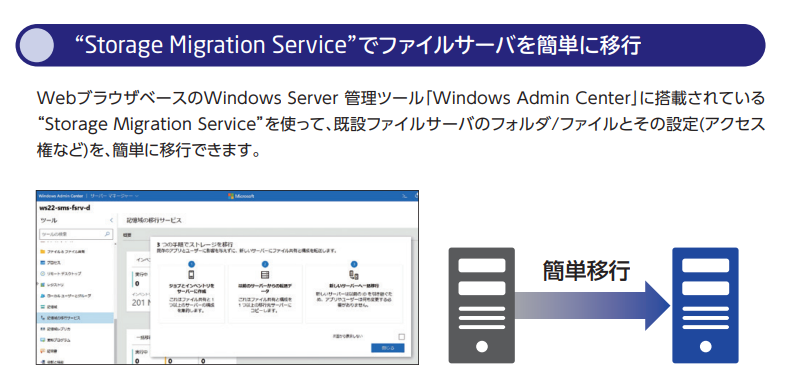

# 知識チェック

■知識チェック重要ポイント

「大規模なデータ転送」、「オンプレミスのストレージ から Azure Storage アカウントへと大量のデータを転送」、「配送やロジスティクスを Microsoft に任せたい」→ Azure Data Box。参考: [Azure Data Boxはクセがつよい！](https://note.com/avakansai/n/ndc6705dd2c0d)

「サーバーとデータのインベントリを作成する」 → [Storage Migration Service（記憶域移行サービス）](https://learn.microsoft.com/ja-jp/windows-server/storage/storage-migration-service/overview#requirements)を使用して、複数のサーバーとそのデータのインベントリを作成し、データを別サーバーに移行することができる。

 https://jpn.nec.com/windowsserver/docs/2012eosbooklet_2nd.pdf

「Azure の推定コストをオンプレミスのコストと比較したい」→ [Azure TCO計算ツール](https://azure.microsoft.com/ja-jp/pricing/tco/?cdn=disable)

「Windows ASP.NET Web アプリを Azure に移行」→ [Azure App Service移行ツール（Migration Tool）](https://azure.microsoft.com/ja-jp/services/app-service/migration-tools/)

「オンプレミスの SQL Server を移行」 → [Azure Database Migration Service](https://azure.microsoft.com/ja-jp/services/database-migration/#overview) または [Data Migration Assistant (DMA)](https://docs.microsoft.com/ja-jp/sql/dma/dma-overview?view=sql-server-ver15)

■知識チェック

https://docs.microsoft.com/ja-jp/learn/modules/design-migrations/9-knowledge-check