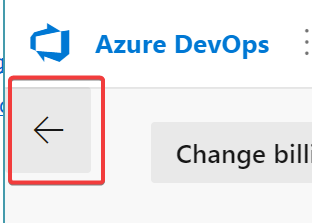
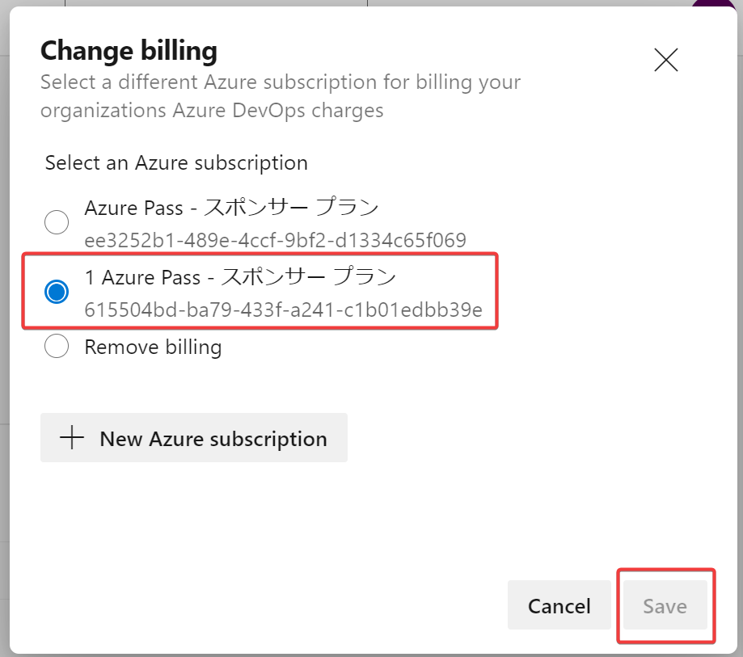
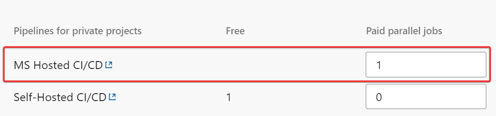

- https://dev.azure.com/ を開く
- 画面左下「Organization settings」をクリック
- 画面左メニュー「General」の「Billing」をクリック
  - 画面が狭くて画面左メニューが出ない場合は画面左側の「←」をクリックするとメニューが出る 
  - （画面遷移に少し時間がかかる）
- 「Set up billing」をクリック
  - サブスクリプション「Azure Pass - スポンサープラン」を選択して「Save」をクリック 
- 「MS Hosted CI/CD」の「Paid parallel jobs」を 1 に設定 
- 画面下の「Save」をクリック
- 画面左メニュー「Security」の「Policy」をクリック
  - 画面が狭くて画面左メニューが出ない場合は画面左側の「←」をクリックするとメニューが出る
- 「Third-party application access via OAuth」のスイッチを「On」にする 
- 「Allow public projects」を「On」にする 
  - 「Change policy settings」ダイアログが出るので「Save」をクリック

上記設定の意味について以下の手順13～を参照。

https://microsoftlearning.github.io/AZ400-DesigningandImplementingMicrosoftDevOpsSolutions.ja-jp/Instructions/Labs/AZ400_M00_Validate_lab_environment.html

