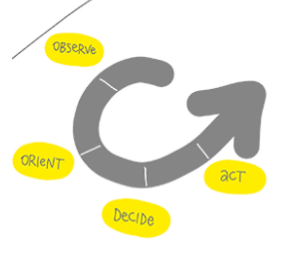
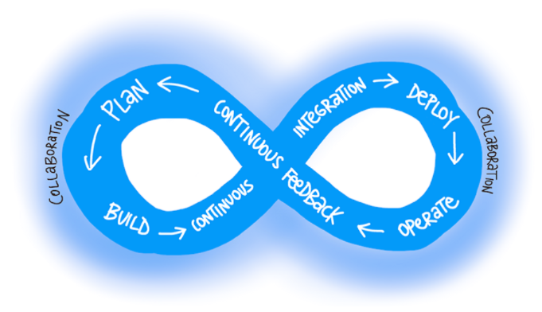

# DevOpsとは

- DevOps変革(Transformation)とは。
- DevOpsとは何か。なぜ必要なのか。
- DevOpsをどのプロジェクトに導入するか。
- 組織にどのようにDevOpsを導入するか。
- DevOpsのプロジェクトの成果物（新機能）をどのように顧客へリリースするか。

## DevOps変革とは？

DevOps変革(DevOps transformation): DevOpsをチームや組織（会社）に導入すること。

DevOpsとはなにか、組織にどうやってDevOpsを導入していけばよいかをここで学ぶ。

## DevOpsとは？

DevOpsとは何か。なぜ必要なのか。

参考: [DevOpsとはなにか](https://medium.com/@yuhattor/devops%E3%81%A8%E3%81%AF%E3%81%AA%E3%81%AB%E3%81%8B-601c68005371) - [Sam Guckenheimer(サム・グッケンハイマー)](https://devblogs.microsoft.com/devops/author/samgumicrosoft-com/) による記事、[Yuki Hattori](https://www.linkedin.com/in/yukihattori)による翻訳. Skillpipeの内容と一緒だが、Yuki Hattoriにより解説が加えられていてわかりやすい。

- DevOpsとは、**顧客に継続的に価値を届ける**ための、人、プロセス、テクノロジの集まり
  - [ドノヴァン・ブラウンによる定義](https://www.donovanbrown.com/post/what-is-devops)
  - Donovan Brown
    - 
    - Microsoft社員
    - 元 DevOpsのプログラムマネージャ/クラウドアドボケイトマネージャ
    - 現 パートナープログラムマネージャ
    - [Youtube](https://www.youtube.com/c/DonovanBrown)
    - [LinkedIn](https://www.linkedin.com/in/darquewarrior/)
- サイクルをなるべく早く回す。
  - DevOpsにおける「サイクル」 = OODAループ
  - [OODA(ウーダ)ループ](https://ja.wikipedia.org/wiki/OODA%E3%83%AB%E3%83%BC%E3%83%97)：Observe(データの収集) — Orient(判断、認識) — Decide(方針・手段の決定) — Act(実行)
    - 意思決定に関する理論。
    - 
    - [PDCA(Plan-Do-Check-Act)との違い](https://data.wingarc.com/what-is-ooda-11126): OODAは **Observe(データの収集)** から始まる。PDCAは **Plan(自己計画)** から始まる。
- 各サイクルで、データに基づく学習(Validated Learning)を行う
  - [Validated Learning](https://en.wikipedia.org/wiki/Validated_learning)
    - Skillpipeテキストでは「検証済みの学習」
    - 各サイクルで目標を設定し、アイデアを試行し、データを集め、**目標に近づいたことを確認** する
    - Validated Learningは、リーンスタートアップにおける考え方。
  - [リーンスタートアップ](https://ja.wikipedia.org/wiki/%E3%83%AA%E3%83%BC%E3%83%B3%E3%82%B9%E3%82%BF%E3%83%BC%E3%83%88%E3%82%A2%E3%83%83%E3%83%97)
    - 起業の方法論の一つ。
    - リーン(lean) （1）もたれる。傾く。（2）**無駄のない**。ひきしまった。
    - MVP（Minimum Viable Product）を作る。
    - MVPをアーリーアダプターに提供して意見を求める。
    - MVPを改良する。またはピボット（方向転換）する。

[DevOps (Wikipedia)](https://ja.wikipedia.org/wiki/DevOps)

> DevOpsは、ソフトウェア開発手法の一つ。開発 (**Dev**elopment) と運用 (**Op**eration**s**) の組み合わせ。開発担当者と運用担当者が連携して協力する開発手法。

[DevOps とは (Microsoft Docs)](https://docs.microsoft.com/ja-jp/devops/what-is-devops)

> DevOps は、顧客に継続的に価値を提供する人、プロセス、テクノロジの和合(Union、あわせたもの)です。

DevOpsの「8の字ループ」（∞: 無限大）の意味: [DevOps (Atlassian社)](https://www.atlassian.com/ja/devops)

- ループの左側: **開発**に必要なプロセス、機能、ツール
- ループの右側: **運用**に必要なプロセス、機能、ツール

DevOpsのプロセスは繰り返される（反復的）。運用からはフィードバックが得られる。フィードバックをもとに次の開発の方針を決定する。

### DevOpsの実践

DevOpsを実践するとは、具体的にどういうことなのか。

参考: [DevOpsとはなにか](https://medium.com/@yuhattor/devops%E3%81%A8%E3%81%AF%E3%81%AA%E3%81%AB%E3%81%8B-601c68005371)

- [継続的インテグレーション(CI)](https://docs.microsoft.com/ja-jp/devops/develop/what-is-continuous-integration)を行う
  - チーム メンバーがバージョン管理 に変更をコミットするたび、コードのビルドとテストを自動的に行う
- [継続的デリバリー(CD)](https://docs.microsoft.com/ja-jp/devops/deliver/what-is-continuous-delivery)を行う
  - ビルドされた成果物のデプロイを自動的に行う。
  - デプロイ先はステージング環境や本番環境
  - CI/CDで、エンドユーザーに対して新機能をリリースすることを[継続的デプロイ](https://azure.microsoft.com/ja-jp/overview/continuous-delivery-vs-continuous-deployment/)と呼ぶ場合もある
- バージョンコントロールを利用する
  - [Git (Wikipedia)](https://ja.wikipedia.org/wiki/Git)
  - [Gitとは (Microsoft Docs)](https://docs.microsoft.com/ja-jp/devops/develop/git/what-is-git)
  - [Microsoft Learn: Gitでのバージョンコントロール](https://docs.microsoft.com/ja-jp/learn/paths/intro-to-vc-git/)
  - [Git for Windows](https://gitforwindows.org/)
- アジャイルな計画とリーンなプロジェクト手法を採用する
  - [アジャイルソフトウェア開発宣言](https://agilemanifesto.org/iso/ja/manifesto.html)
  - [リーンスタートアップ](https://ja.wikipedia.org/wiki/%E3%83%AA%E3%83%BC%E3%83%B3%E3%82%B9%E3%82%BF%E3%83%BC%E3%83%88%E3%82%A2%E3%83%83%E3%83%97)
  - [アジャイル開発の進め方（IPA）](https://www.ipa.go.jp/files/000065606.pdf)
- アプリケーションのモニタリングを行い、検証に必要なデータを集める
  - [Azure Monitor](https://docs.microsoft.com/ja-jp/azure/azure-monitor/overview)
  - [Log Analytics](https://docs.microsoft.com/ja-jp/azure/azure-monitor/logs/log-analytics-overview)
  - [Application Insights](https://docs.microsoft.com/ja-jp/azure/azure-monitor/app/app-insights-overview)
- クラウドを活用する
  - [Azure DevOps](https://azure.microsoft.com/ja-jp/services/devops/): Azureクラウド上ですぐに利用できるDevOps製品。
- IaCを活用する（インフラをコード化する）
  - [IaC (Microsoft Docs)](https://docs.microsoft.com/ja-jp/dotnet/architecture/cloud-native/infrastructure-as-code)
- マイクロサービスアーキテクチャを採用する
  - [マイクロサービス アーキテクチャ (Microsoft Docs)](https://docs.microsoft.com/ja-jp/azure/architecture/guide/architecture-styles/microservices#what-are-microservices)
- コンテナー技術を活用する
  - [イメージとコンテナ](https://docs.docker.jp/get-started/index.html#images-and-containers)
  - [Docker とは (Red Hat社)](https://www.redhat.com/ja/topics/containers/what-is-docker)

参考: [The Twelve-Factor App](https://12factor.net/ja/): SaaSのための方法論、技術の利用原則。

### 変革チームの分離

DevOps変革(DevOps transformation)とは: DevOpsをチームや組織（会社）に導入すること。

変革のためのアドバイス: チームを「分離」する。つまり、全社で一斉にDevOpsに切り替えることは難しいので、一部のチームからDevOpsを導入する。

- 既存のスタッフがDevOps変革を行うのは困難な場合が多い
  - 日常業務とDevOps変革を同時に達成するのは難しい
- DevOps変革を達成するためのチームを別に作る
  - 日常業務には関与しない
  - 高い評価を持ち、幅広い知識を持つスタッフをチームメンバーとする
  - チームに、外部のDevOps専門家を含める

### 共有目標の定義

- 測定可能な目標が必要
- 顧客に価値を届けるための目標に焦点を当てる

### 目標に向けたタイムラインの設定

長いタイムラインと短いタイムラインを設定する。

- 長いタイムライン
  - DevOps変革(DevOps transformation)には1年～2年の期間が必要である
- 短いタイムライン
  - 数週間単位での、測定可能な目標を設定し、レビューを行う
  - 必要に応じてプランや優先順位の変更を行う
  - 肯定的な結果が得られると、組織のサポートを維持しやすい

参考: [Microsoft社内におけるDevOps導入](https://medium.com/@yuhattor/microsoft-%E3%81%AE-devops-%E3%81%B8%E3%81%AE%E9%81%93%E3%81%AE%E3%82%8A-db59c0848d78)

- 2014年頃からDevOpsの導入を開始
- 2017年には、75000人の社員がDevOpsを利用（3年で約3倍に）
- Azure DevOps自体が、Azure DevOpsを使用して開発されている。
  - 3週間のスプリントを設定。
    - つまり新機能や改善が3週間ごとに出てくる
    - 3週間ごとに、**継続して、顧客に新しい価値を届ける**
  - 最初のスプリントは2010/8に開始
  - https://docs.microsoft.com/en-us/azure/devops/release-notes/features-timeline

## プロジェクトの選択

- どのようなプロジェクトにDevOpsを導入すべきか？
  - グリーン vs ブラウン
  - SoR vs SoE
- DevOpsプロジェクトの成果物をどのようにリリースしていくか？
  - 利用者
  - リリース粒度

### プロジェクトの種類（定義と選択）

DevOpsを、新規プロジェクト（グリーンフィールド）に導入すべきか、既存プロジェクト（ブラウンフィールド）に導入すべきか。

グリーンフィールド/ブラウンフィールド: ソフトウェアサービスや製品の分類方法の一種。もともと都市計画やビルの建築プロジェクトで使われていた用語。グリーン：草が生えた土地、ブラウン：工業目的で使われた土地。

結論：多くの組織は、DevOpsを、グリーンフィールドのプロジェクトで導入する。ただし、ブラウンフィールドで導入することも可能。

### プロジェクトで開発しているシステムの種類（記録システムとエンゲージメント システムの選択）

DevOpsを、SoRプロジェクトに導入すべきか、SoEプロジェクトに導入すべきか。

- SoR: 記録システム (System of Record)
  - 情報を正しく記録する/業務を省力化するためのシステム、いわゆる基幹システム
  - 正しい仕様が存在
  - 開発においてはスケジュールと品質が優先される
- SoE: エンゲージメントシステム (System of Engatement)
  - [ジェフリー・ムーア氏が2011年に提唱した考え方](https://www.google.com/search?q=%E3%82%B8%E3%82%A7%E3%83%95%E3%83%AA%E3%83%BC%E3%83%BB%E3%83%A0%E3%83%BC%E3%82%A2+soe)
  - ユーザーや取引先との「絆」を作るシステム
    - ショッピングサイト
    - コミュニケーションツール
    - スマホアプリ、ゲーム
    - など
  - 正しい仕様が存在しないことがある
  - 変化が早い
  - トライ&エラー

[参考](https://speakerdeck.com/naoya/system-of-record-to-system-of-engagement?slide=4)

結論：DevOpsは、SoEのプロジェクトで導入する方が容易である。ただし、DevOpsはSoRでも適用は可能。

### リリース: 利用者とリリース粒度（初期抵抗を最小限に抑えるためのグループの選択）

DevOpsの成果物（新機能）を、どのグループの利用者にリリースするか。

- カナリア: とても積極的な人々。
- アーリーアダプター: 積極的な人々。
- 一般ユーザー: 積極的ではないな人々。安定を望む。

参考：[カナリアリリース](https://www.google.com/search?q=%E3%82%AB%E3%83%8A%E3%83%AA%E3%82%A2%E3%83%AA%E3%83%AA%E3%83%BC%E3%82%B9)：新機能を一部のユーザーにリリースし、問題がないことを確認しながら段階的に全体に向けてリリースしていく。上記の「カナリア」とは、カナリアリリースのターゲットとなるユーザー。生理学者の John Scott Haldane 氏が、一酸化炭素をすばやく検出するためにカナリア（鳥）を炭鉱に連れて行ったことに由来。カナリアは一酸化炭素に弱く、カナリアを観察することで一酸化炭素の危険を素早く発見できたという。[参考](https://cloud.google.com/blog/ja/products/gcp/how-release-canaries-can-save-your-bacon-cre-life-lessons)

参考：[Azure App Configurationの「機能フラグ」](https://docs.microsoft.com/ja-jp/azure/azure-app-configuration/concept-feature-management)を利用すると、**リリースしたソフトウェアにおいて**、特定のユーザーやグループに対して、特定の機能を有効化することができる。

リリースの粒度: 新機能をどの程度の粒度でリリースするか。

- 変更を一度にリリースする（ビッグバン）
- 変更を段階的にリリースする

結論：変更は段階的にリリースしたほうがよい。大規模なリリースは失敗することが多い。

### プロジェクト メトリックと主要業績評価指標 (KPI) を識別する

DevOpsができているかどうかは、どうやって評価するか？

- メトリック: プロジェクトの活動を測定し、数値化する。
- 目標(KPI)を確立し、合意する

結論：プロジェクトのメトリックを集める。KPIを定める。

## チーム構造

チームにアジャイルソフトウェア開発を導入することは、DevOpsのプラクティスの一つ。

### アジャイル開発プラクティスの定義

ウォーターフォール型 vs アジャイル型

- ウォーターフォール型
  - 明確なフェーズがある（要件定義、設計、開発、テスト）
  - 変更は想定しない
  - プロジェクトを完了させることを重視
- アジャイル型
  - 反復的（スプリントを繰り返す）
  - 要件の変更に柔軟に対応
  - 顧客の要求に答えることを重視

**継続的に**価値を届けるにはアジャイル型が適している。

アジャイルについて学ぶ

- [アジャイルとは（Microsoft Docs）](https://docs.microsoft.com/ja-jp/devops/plan/what-is-agile)
- [アジャイル開発とは（Microsoft Docs）](https://docs.microsoft.com/ja-jp/devops/plan/what-is-agile-development)
- [アジャイルソフトウェア開発（Wikipedia）](https://ja.wikipedia.org/wiki/%E3%82%A2%E3%82%B8%E3%83%A3%E3%82%A4%E3%83%AB%E3%82%BD%E3%83%95%E3%83%88%E3%82%A6%E3%82%A7%E3%82%A2%E9%96%8B%E7%99%BA)
- [アジャイル手法](https://www.microsoft.com/ja-jp/microsoft-365/business-insights-ideas/resources/how-to-choose-the-best-agile-methodology-for-your-project)

参考: [Microsoft Officeは、20年間、ウォーターフォール型で開発されていた](https://codezine.jp/article/detail/7677)

- プランを立ててから動くものができるまで1年、外部へのリリースに1年かかっていた
- プランの誤りや、プラットフォームやデバイスの変化により、開発したものが無駄になるリスクが増大
- 2013年頃に、アジャイル型に転換
- （現在）Microsoft は、世界最大規模のアジャイル企業の1つ

### アジャイルの原則

アジャイル開発のマインドセット（心構え）。

- [アジャイルソフトウェア開発宣言](https://agilemanifesto.org/iso/ja/manifesto.html)
- [アジャイル宣言の背後にある原則](https://agilemanifesto.org/iso/ja/principles.html)

- [アジャイルソフトウェア開発宣言の読みとき方(IPA: 情報処理推進機構)](https://www.ipa.go.jp/files/000065601.pdf)

### 組織構造

水平型チームと垂直型チームとは。

- 水平型
  - 役割別のチーム
  - デザインチーム(UI)、アプリ開発チーム(API)、DBチーム(Data)、など
- 垂直型
  - 製品別のチーム
  - 製品Aのチーム、製品Bのチーム、製品Cのチーム、など

垂直型のメリット
- より大きい成果を提供できる
- チームを追加することでスケーリングできる
  - 機能別のチームなど

[Microsoftでのチーム構成の事例](https://docs.microsoft.com/ja-jp/devops/plan/how-microsoft-plans-devops#makeup-of-teams)

- 以前は水平型だった
- 現在は垂直型をめざしている

### 理想的な チーム メンバー

アジャイル開発における理想的なチームメンバーとは。

- DevOpsの必要性を理解している
- 変革の必要性を感じ、変革する力を持っている
- 組織内で尊敬を集めている
- 組織内で幅広い知識を持つ

### チームメンバーの指導

チームメンバーをどうやって教育するか。

- トレーニングは望ましいが、実践がより重要である
- 多くのチームが外部のコーチやメンターを雇う
- 時間が経つにつれて、チーム メンバーがお互いを指導する能力を身に着ける

### チームのコラボレーション

アジャイルに適した仕事のスタイル。

- 不要な会議を減らす
- チャットなど、非同期的なコミュニケーションを活用する
- タスクに集中できる時間をつくる
- リモートワークに対応する
- ヒューマンスキルのトレーニングもあるとよい

機能横断型チームとは。

- クロスファンクショナルチーム（CFT）とも
- 部門の枠を超えたチーム
- 部署や役職にとらわれない
- 場合によっては社外からも必要な人材を集めて構成
- [スクラム](https://docs.microsoft.com/ja-jp/devops/plan/what-is-scrum)のチーム
  - https://scrumguides.org/docs/scrumguide/v2020/2020-Scrum-Guide-US.pdf
  - スクラムのチームはクロスファンクショナルチーム
  - チームは、各スプリントで価値を創造するスキルを持つ

### ツール

コラボレーションに使うことができるツールの例

- Microsoft Teams
- Slack

アジャイルプラクティスのためのツール

- Azure DevOps
- GitHub
