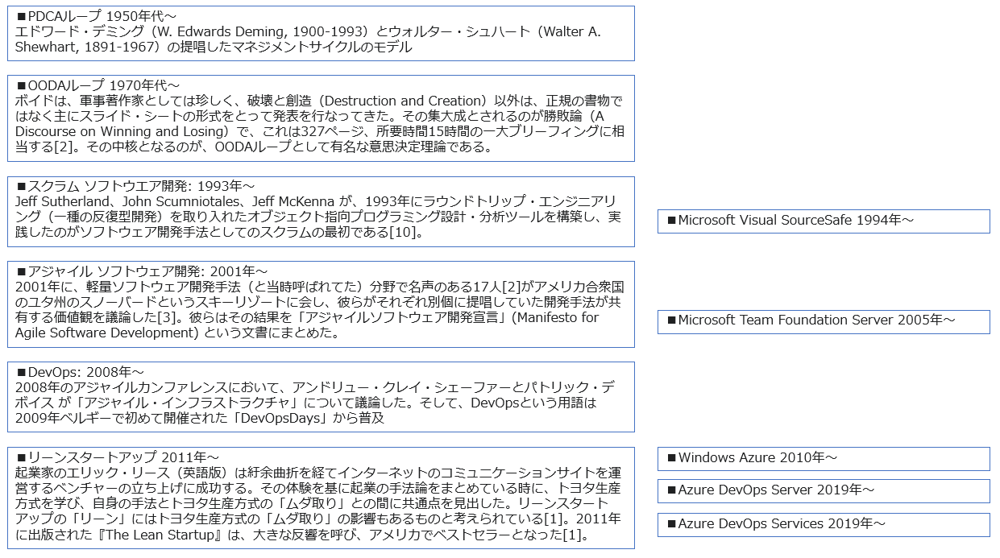

# DevOpsとは

- DevOps変革(Transformation)とは。
- DevOpsとは何か。なぜ必要なのか。
- DevOpsをどのプロジェクトに導入するか。
- 組織にどのようにDevOpsを導入するか。
- DevOpsのプロジェクトの成果物（新機能）をどのように顧客へリリースするか。

## DevOps変革とは？

DevOps変革(DevOps transformation): DevOpsをチームや組織（会社）に導入すること。

DevOpsとはなにか、組織にどうやってDevOpsを導入していけばよいかをここで学ぶ。

## DevOpsとは？

DevOpsとは何か。なぜ必要なのか。

参考: [DevOpsとはなにか](https://medium.com/@yuhattor/devops%E3%81%A8%E3%81%AF%E3%81%AA%E3%81%AB%E3%81%8B-601c68005371) - [Yuki Hattori](https://www.linkedin.com/in/yukihattori)さんによる翻訳. 解説が加えられていてわかりやすい。この記事はもともと[Sam Guckenheimer(サム・グッケンハイマー)](https://www.kinokuniya.co.jp/f/dsg-01-9784822294687) によって書かれた。

- DevOpsとは、**顧客に継続的に価値を届ける**ための、人、プロセス、テクノロジの集まり
  - [ドノヴァン・ブラウンによる定義](https://www.donovanbrown.com/post/what-is-devops)
  - Donovan Brown
    - 
    - Microsoft社員
    - 元 DevOpsのプログラムマネージャ/クラウドアドボケイトマネージャ
    - 現 パートナープログラムマネージャ
    - [YouTube](https://www.youtube.com/c/DonovanBrown)
    - [LinkedIn](https://www.linkedin.com/in/darquewarrior/)
- サイクルをなるべく早く回す。
  - DevOpsにおける「サイクル」 = OODAループ
  - [OODA(ウーダ)ループ](https://ja.wikipedia.org/wiki/OODA%E3%83%AB%E3%83%BC%E3%83%97)：Observe(データの収集) — Orient(判断、認識) — Decide(方針・手段の決定) — Act(実行)
    - 意思決定に関する理論。
    - 
    - [PDCA(Plan-Do-Check-Act)との違い](https://data.wingarc.com/what-is-ooda-11126): OODAは **Observe(データの収集)** から始まる。PDCAは **Plan(自己計画)** から始まる。
- 各サイクルで、データに基づく学習(Validated Learning)を行う
  - [Validated Learning](https://en.wikipedia.org/wiki/Validated_learning)
    - 各サイクルで目標を設定し、アイデアを試行し、データを集め、**目標に近づいたことを確認** する
    - Validated Learningは、リーンスタートアップにおける考え方。
  - [リーンスタートアップ](https://ja.wikipedia.org/wiki/%E3%83%AA%E3%83%BC%E3%83%B3%E3%82%B9%E3%82%BF%E3%83%BC%E3%83%88%E3%82%A2%E3%83%83%E3%83%97)
    - 起業の方法論の一つ。
    - リーン(lean) （1）もたれる。傾く。（2）**無駄のない**。ひきしまった。
    - MVP（Minimum Viable Product）を作る。
    - MVPをアーリーアダプターに提供して意見を求める。
    - MVPを改良する。またはピボット（方向転換）する。

[DevOps (Wikipedia)](https://ja.wikipedia.org/wiki/DevOps)

> DevOpsは、ソフトウェア開発手法の一つ。開発 (**Dev**elopment) と運用 (**Op**eration**s**) の組み合わせ。開発担当者と運用担当者が連携して協力する開発手法。

[DevOps とは (Microsoft Docs)](https://docs.microsoft.com/ja-jp/devops/what-is-devops)

> DevOps は、顧客に継続的に価値を提供する人、プロセス、テクノロジの和合(Union、あわせたもの)です。

DevOpsの「8の字ループ」（∞: 無限大）の意味: [DevOps (Atlassian社)](https://www.atlassian.com/ja/devops)

- ループの左側: **開発**に必要なプロセス、機能、ツール
- ループの右側: **運用**に必要なプロセス、機能、ツール

DevOpsのプロセスは繰り返される（反復的）。運用からはフィードバックが得られる。フィードバックをもとに次の開発の方針を決定する。

[DevOps とは? (AWS)](https://aws.amazon.com/jp/devops/what-is-devops/)

> DevOps では、従来型のソフトウェア開発と、インフラストラクチャ管理プロセスを使用するよりも速いペースで製品の進歩と向上を達成し、企業がアプリケーションやサービスを高速で配信できるように、文化的な基本方針、プラクティス、ツールが組み合わされています。この高速化により、企業は顧客により良いサービスを提供し、市場競争力を高めることができます。

### DevOpsの実践

DevOpsを実践するとは、具体的にどういうことなのか。

参考: [DevOpsとはなにか](https://medium.com/@yuhattor/devops%E3%81%A8%E3%81%AF%E3%81%AA%E3%81%AB%E3%81%8B-601c68005371)

- [継続的インテグレーション(CI)](https://docs.microsoft.com/ja-jp/devops/develop/what-is-continuous-integration)を行う - Day2前半で学習
  - チーム メンバーがバージョン管理 に変更をコミットするたび、コードのビルドとテストを自動的に行う
- [継続的デリバリー(CD)](https://docs.microsoft.com/ja-jp/devops/deliver/what-is-continuous-delivery)を行う - Day2後半～Day3前半で学習
  - ビルドされた成果物のデプロイを自動的に行う。
  - デプロイ先はステージング環境や本番環境
  - CI/CDで、エンドユーザーに対して新機能をリリースすることを[継続的デプロイ](https://azure.microsoft.com/ja-jp/overview/continuous-delivery-vs-continuous-deployment/)と呼ぶ場合もある
- バージョンコントロールを利用する - Day1後半・Day2前半で学習
  - [Git (Wikipedia)](https://ja.wikipedia.org/wiki/Git)
  - [Gitとは (Microsoft Docs)](https://docs.microsoft.com/ja-jp/devops/develop/git/what-is-git)
  - [Microsoft Learn: Gitでのバージョンコントロール](https://docs.microsoft.com/ja-jp/learn/paths/intro-to-vc-git/)
  - [Git for Windows](https://gitforwindows.org/)
- アジャイルな計画とリーンなプロジェクト手法を採用する
  - [アジャイルソフトウェア開発宣言](https://agilemanifesto.org/iso/ja/manifesto.html)
  - [リーンスタートアップ](https://ja.wikipedia.org/wiki/%E3%83%AA%E3%83%BC%E3%83%B3%E3%82%B9%E3%82%BF%E3%83%BC%E3%83%88%E3%82%A2%E3%83%83%E3%83%97)
  - [アジャイル開発の進め方（IPA）](https://www.ipa.go.jp/files/000065606.pdf)
- アプリケーションのモニタリングを行い、検証に必要なデータを集める - OODAループを形成する
  - [Azure Monitor](https://docs.microsoft.com/ja-jp/azure/azure-monitor/overview)
  - [Log Analytics](https://docs.microsoft.com/ja-jp/azure/azure-monitor/logs/log-analytics-overview)
  - [Application Insights](https://docs.microsoft.com/ja-jp/azure/azure-monitor/app/app-insights-overview)
- クラウドを活用する
  - [Azure DevOps](https://azure.microsoft.com/ja-jp/services/devops/): Azureクラウド上ですぐに利用できるDevOps製品。
- IaCを活用する（インフラをコード化する） - Day3後半で学習
  - [IaC (Microsoft Docs)](https://docs.microsoft.com/ja-jp/dotnet/architecture/cloud-native/infrastructure-as-code)
- マイクロサービスアーキテクチャを採用する
  - [マイクロサービス アーキテクチャ (Microsoft Docs)](https://docs.microsoft.com/ja-jp/azure/architecture/guide/architecture-styles/microservices#what-are-microservices)
- コンテナー技術を活用する - Day4後半で学習
  - [イメージとコンテナ](https://docs.docker.jp/get-started/index.html#images-and-containers)
  - [Docker とは (Red Hat社)](https://www.redhat.com/ja/topics/containers/what-is-docker)

参考: [The Twelve-Factor App](https://12factor.net/ja/): SaaSのための方法論、技術の利用原則。
