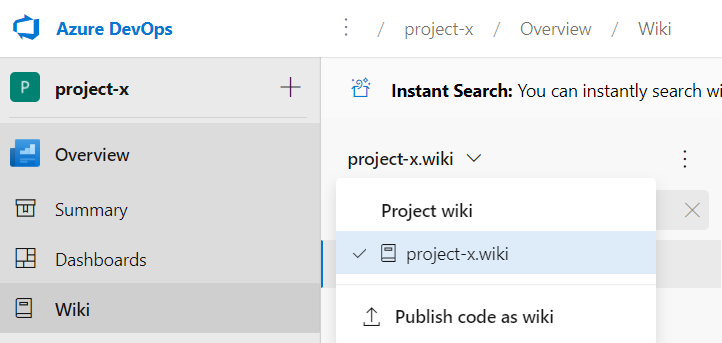
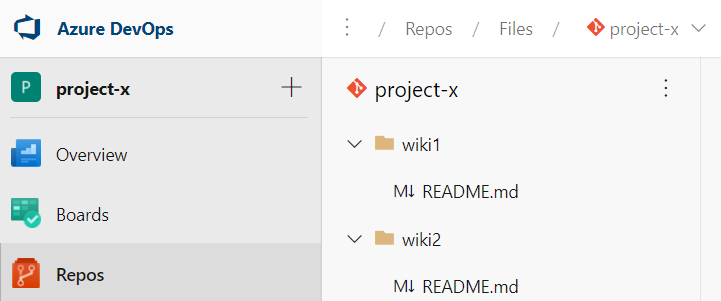
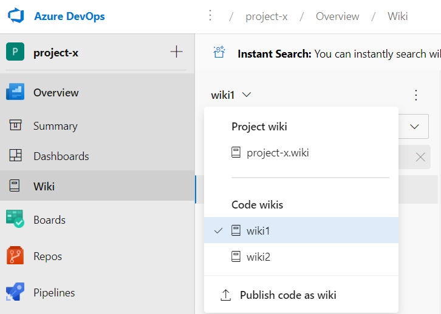

# モジュール3 技術的負債の管理

- 技術的負債（Technical debt）とは何か。なぜ発生するのか。
- コードの品質とは何か。
- コードの品質を測定するには。
- コードの臭い（Code smell）とは何か。
- 効果的なコードレビューとは。
- チーム内で情報を共有するには。
- GitHub Codespacesとは何か。
- SonarCloudとは何か。

## 技術的負債の特定

技術的負債(Technical debt テクニカルデット)とは何か。

- コードの問題を修正するのにかかるコスト。
- 品質が低いコードは、メンテナンスするために大きなコストがかかる。
- よく、開発済みの「ソフトウェア資産」などという言い方をするが・・・
- 多くのシステムが技術的負債を抱えている。
- 負債は時間とともに増えていく
  - メンテナンスができるエンジニアが退職
  - 昔の技術や仕様が若い世代に継承されない
  - 新しいプラットフォームへの移行・移植が困難
- 「2025年の崖」問題: [2025年以降、最大で、毎年12兆円の経済損失が生じる可能性がある（経済産業省）](https://www.meti.go.jp/shingikai/mono_info_service/digital_transformation/pdf/20180907_01.pdf)
- [技術的負債（Wikipedia）](https://ja.wikipedia.org/wiki/%E6%8A%80%E8%A1%93%E7%9A%84%E8%B2%A0%E5%82%B5)

技術的負債の解決策の一つは、品質重視の文化を作成すること。

### コード品質の定義

コードの品質とは何か。

コードの品質を表すいくつかの性質・指標がある。（コードの品質を高めるには、これらを高める）

- 信頼性 reliability
  - 欠陥（バグ）がないこと（仕様通りに動くこと）
  - 可用性が高いこと（故障せずに動き、故障した際にすぐに直せること）
  - [参考(wikipedia)](https://ja.wikipedia.org/wiki/%E3%82%BD%E3%83%95%E3%83%88%E3%82%A6%E3%82%A7%E3%82%A2%E5%93%81%E8%B3%AA#%E3%82%BD%E3%83%95%E3%83%88%E3%82%A6%E3%82%A7%E3%82%A2%E3%81%AE%E4%BF%A1%E9%A0%BC%E6%80%A7)
- 保守容易性 maintenanceability
  - サイズが小さいこと
  - 一貫性があること
  - シンプルであること
- テスト容易性 testability
  - テストができること
  - テストが自動化できること
  - [参考 テスタビリティを作り込む](https://thinkit.co.jp/article/14136)
- 移植性 portability
  - さまざまなコンピュータ構成で容易に動作すること
- 再利用性 reusability
  - 既存資産を再利用しやすいこと
    - 依存関係が少ないこと
    - 疎結合であること（モジュール間が直接通信しないこと）

（コードの品質は「[ソフトウェア工学](https://ja.wikipedia.org/wiki/%E3%82%BD%E3%83%95%E3%83%88%E3%82%A6%E3%82%A7%E3%82%A2%E5%B7%A5%E5%AD%A6)」の研究領域でもある。詳しくは専門の書籍などを参照のこと）

### 複雑度指標

ソースコードの複雑さを表す指標がいくつかある。

- [ハルステッド（Halstead）複雑度](https://www.google.com/search?q=%E3%83%8F%E3%83%AB%E3%82%B9%E3%83%86%E3%83%83%E3%83%89%EF%BC%88Halstead%EF%BC%89+%E8%A4%87%E9%9B%91%E6%80%A7)
- [サイクロマティック（Cyclomatic）複雑度](https://www.google.com/search?q=%E3%82%B5%E3%82%A4%E3%82%AF%E3%83%AD%E3%83%9E%E3%83%86%E3%82%A3%E3%83%83%E3%82%AF%E8%A4%87%E9%9B%91%E5%BA%A6)

コード分析ツールを使って、コードの複雑さを測定することができる。

- [Visual Studio のコード分析（アナライザー）](https://docs.microsoft.com/ja-jp/visualstudio/code-quality/roslyn-analyzers-overview)
  - コードのスタイル、品質、保守容易性、設計、その他の問題を検査します
- [Visual Studio のコードメトリック値](https://docs.microsoft.com/ja-jp/visualstudio/code-quality/code-metrics-values)
  - コードの複雑さと保守容易性を測定するコード メトリック データを生成できます

### 品質メトリックの測定と管理

品質に関わる問題を発見するには。

プロジェクトにおいて、品質管理に利用できる指標（メトリック）がある。

- 失敗したビルドの割合
- 失敗したデプロイの割合
- チケットの量
- バグ バウンス（バグチケットの再オープン）の割合
- 計画外の作業の割合

これらのメトリックを測定、記録、監視することで、品質の問題を早期に発見することができる。

### 技術的負債(Technical debt)の定義, 原因, 影響

（定義については前述）

技術的負債はなぜ発生するのか。

- コーディング基準がない
- テストが欠如している
- オブジェクト指向を理解していない
- モノリシッククラス（1クラスに機能を詰め込みすぎ）
- テクノロジー、アーキテクチャ等の不充分な想定（検討が充分に行われていない）
- オーバーエンジニアリング（不要なコード、レイヤー、コンポーネントを追加している）
- コメントとドキュメントが不十分
- 自己文書化コードを記述していない（変数名などが暗号的）
- コード開発の締め切りが短い
- 開発者のスキルが低い
- 要件の変更が多い

### 自動テストを利用した技術的負債の測定

[SonarCloud](https://sonarcloud.io/)をAzure DevOpsやGitHubと組み合わせて使用することで、技術的負債の原因となるコードを自動的に発見することができる。

[参考1](https://blog.tagbangers.co.jp/ja/2019/09/30/sonar_analytics)
[参考2](https://creators-note.chatwork.com/entry/2020/11/27/110226)

SonarCloud（SonarQube）についてはモジュール20で扱う。

### ディスカッション - コード品質管理のツール

講師（山田）は昔、開発案件で、[PMD](https://ja.wikipedia.org/wiki/PMD_(%E3%82%BD%E3%83%95%E3%83%88%E3%82%A6%E3%82%A7%E3%82%A2))、[FindBugs](https://ja.wikipedia.org/wiki/FindBugs)、[Checkstyle](https://ja.wikipedia.org/wiki/Checkstyle)などを使用したことがあります。みなさんはいかがですか？

皆さんが使っている品質管理のツールは、[Marketplace](https://marketplace.visualstudio.com/azuredevops)に登録されていますか？（Azure DevOpsで利用できますか？）

なにか思い出や教訓などがございましたら、ぜひチャットに書き込んでください。

### その他のコード品質ツールの統合

- [Code Quality NDepend for Azure DevOps](https://marketplace.visualstudio.com/items?itemName=ndepend.ndependextension)
  - 150以上のルールに基づき、技術的負債や「[コードの臭い(Code smell)](https://ja.wikipedia.org/wiki/%E3%82%B3%E3%83%BC%E3%83%89%E3%81%AE%E8%87%AD%E3%81%84)」を発見
    - コードの臭い: 重複コード、長すぎるメソッド、巨大すぎるクラスなど、コードにおける、深刻な問題につながる兆候があるコード。
    - リファクタリングが必要なコード。
- [ReSharper Code Quality Analysis](https://marketplace.visualstudio.com/items?itemName=alanwales.resharper-code-analysis)
  - [ReSharper](https://www.jetbrains.com/ja-jp/resharper/)は[JetBrains社](https://www.jetbrains.com/ja-jp/)製の、.NET開発者向けのコード解析ツール。
  - Visual Studioのアドオンだが、Azure DevOpsと組み合わせて使用することもできる。

### 効果的なコードレビューを計画する

コードの品質を維持するために（コード解析ツールを使うだけではなく）人によるレビューも行う。

効果的なコードレビューとは。

- レビューでは、作成者を非難するのではなく、コード改善のアイデアを共有するメンタリングセッションにするとよい。
- 改善が必要なものを指摘するだけではなく、よく書かれたコードを強調する（ほめる）ことも行うとよい。
- チーム内で知識を共有することも重要。特定の作成者だけではなく、チームの関係者全員が、レビューから学ぶようにするとよい。

参考: 
- [コードレビューをより効果的にする方法](https://www.infoq.com/jp/articles/effective-code-reviews/)
- [開発現場に学ぶ、円滑なコードレビューに必要な8つの手法](https://eh-career.com/engineerhub/entry/2018/04/03/110000)

## チーム内での情報共有

チーム内で情報を共有するには。

### 獲得した知識を開発チーム内で共有

チームや組織が、教訓を忘れてしまい、再学習することを避けることが重要。

チームや組織が獲得した貴重な知識・教訓を適切に記録し、共有する必要がある。

チームの情報を記録・共有することができるツール:

- Azure DevOps: Azure DevOpsプロジェクトの wiki
- GitHub: リポジトリ内の wiki

### ディスカッション: 知識共有ツール

講師（山田）は昔、開発案件で、ヌーラボさんの[Backlog](https://backlog.com/ja/)、[GitLab](https://about.gitlab.com/ja-jp/)の[イシュー管理](https://docs.gitlab.com/ee/user/project/issues/issue_data_and_actions.html)、かなり昔には[GroupSession](https://groupsession.jp/)、[富士通さんのProjectWEB](https://www.google.com/search?q=projectweb)などを使用したことがあります。また現在は、チームでの情報共有や連絡には主に[Microsoft Teams](https://www.microsoft.com/ja-jp/microsoft-teams/group-chat-software)、教材の開発における問題管理では[Azure DevOps](https://azure.microsoft.com/ja-jp/services/devops/)を使用しています。みなさんはいかがですか？

皆さんが使っている知識共有ツールは、[Marketplace](https://marketplace.visualstudio.com/azuredevops)に登録されていますか？（Azure DevOpsと連携できますか？）

なにか思い出や教訓などがございましたら、ぜひチャットに書き込んでください。

### Azure DevOpsプロジェクト wiki

Azure DevOpsでプロジェクトを作成すると、プロジェクトでの情報共有のための[Wiki](https://ja.wikipedia.org/wiki/%E3%82%A6%E3%82%A3%E3%82%AD)が作成される。

※念の為補足：WikiとWikipediaは別のものです。
- Wiki: コンテンツをWebブラウザから直接編集することができるWebサイト（のしくみ）
- Wikipedia: オンライン百科事典

Azure DevOps / Project / Overview / Wiki に、2つのボタンがある。
- Create project wiki
  - 新しい「プロジェクト用 wiki」を作成する
  - 「Project wiki」以下に「プロジェクト名.wiki」として表示される
  
  - このWikiは1つだけ作成できる（中に復数のページは作れる）
- Publish code as wiki
  - プロジェクト内のAzure Reposリポジトリに格納されている、Markdownファイル（～.md）が含まれたフォルダを「publish」（Wiki化）する
  
  - プロジェクト内のAzure Reposリポジトリを先に作っておく必要がある
  - 「publish」（Wiki化）するリポジトリ、ブランチ、フォルダ、Wiki名を指定する
  - 復数のフォルダを「publish」（Wiki化）できる
    - Code wikisとして一覧表示される
    
  - unpublish することもできる。

各Wikiには以下のリポジトリを使用してアクセスできる

- Azure Repos: https://組織名@dev.azure.com/組織名/プロジェクト名/_git/リポジトリ名
- Project Wiki: https://組織名@dev.azure.com/組織名/プロジェクト名/_git/リポジトリ名.wiki
- Code Wiki: https://組織名@dev.azure.com/組織名/プロジェクト名/_git/リポジトリ名/CodeWikiのフォルダ名/

■Azure Devops Wiki の内容 (使用できるマークダウン形式)

- GFM ([GitHub Flavored Markdown](https://github.github.com/gfm/))
- [Mermaid](https://mermaid-js.github.io/mermaid/#/)
  - フローチャート
  - シーケンス図
  - ガントチャート
  - クラス図
  - Git グラフ
  - E-R図
  - User Journey Diagram 
    - [ジャーニーマップ](https://drm.ricoh.jp/lab/glossary/g00053.html)

※参考: 
- Marmaid
  - [Marmaid Live Editor](https://mermaid.live/)
  - Visual Studio Code拡張: [Markdown Preview Mermaid Support](https://marketplace.visualstudio.com/items?itemName=bierner.markdown-mermaid) 
- Graphvis
  - [Graphviz](https://www.graphviz.org/)
  - [Graphviz Online](https://dreampuf.github.io/GraphvizOnline)
  - Visual Studio Code拡張: [Graphvis Interactive Preview](https://marketplace.visualstudio.com/items?itemName=tintinweb.graphviz-interactive-preview)
  - [GitHubにGraphvisを埋め込む](https://qiita.com/kaiinui/items/6d8204c6102e05c1dc77)
- PlantUML
  - [解説](https://plantuml.com/ja/)
  - Visual Studio Code拡張: [PlantUML](https://marketplace.visualstudio.com/items?itemName=jebbs.plantuml)
  - [GitHubのREADMEにPlantUMLを埋め込む](https://qiita.com/takke/items/86a5ddf145cf9693b6e9)

### GitHubのwiki

https://docs.github.com/ja/communities/documenting-your-project-with-wikis/adding-or-editing-wiki-pages

各リポジトリの画面上部の「wiki」から、リポジトリのwikiを作成できる。

[フッターやサイドバーを追加することができる。](https://docs.github.com/ja/communities/documenting-your-project-with-wikis/creating-a-footer-or-sidebar-for-your-wiki)

wikiのコンテンツは、リポジトリのコードとは別のGitリポジトリで管理される。

- code: https://github.com/リポジトリ名/プロジェクト名.git
- Wiki: https://github.com/リポジトリ名/プロジェクト名.wiki.git

wikiのリポジトリでは、ブランチを利用することもできるが、デフォルトのブランチのみがライブとなる（GitHubサイト上に表示される）。

## GitHub Codespacesを使用したオンライン開発

複数のユーザーでオンライン開発ができる環境を提供。

- https://github.co.jp/features/codespaces
- https://visualstudio.microsoft.com/ja/services/github-codespaces/

Webブラウザー（またはローカルのVisual Studio Code）から、クラウドの開発環境にアクセスできる。

現在、ベータ版として、一部のGitHubユーザーにのみ提供される。参加の申し込みをすると「ウェイトリスト」に登録され、利用可能になるとメールで通知される。

##  GitHubからVisual Studio Code for the Web を呼び出す

Visual Studio Code for the Web: Webブラウザからすぐに使用することができるVisual Studio. https://vscode.dev/

GitHubのリポジトリで（ファイルを選択し）、「.」をタイプすると、Visual Studio Code for the Webでそのファイルの編集をスタートできる。編集後Commitすると、即時GitHubのリポジトリに反映される。

ローカル開発環境へのCloneをすることなく、Visual Studio Codeでファイルを編集・コミットすることができて便利。

- [2021/8/11、「GitHub」上でコードエディタ「Visual Studio Code」のWebブラウザ版を起動できる機能「Codespaces」のβ版を公開](https://www.itmedia.co.jp/news/articles/2108/12/news145.html)
- [2021/10/20 Visual Studio Code for the Web 提供開始](https://pc.watch.impress.co.jp/docs/news/1360273.html)

参考: GitHub1s（1 second）
https://github.com/conwnet/github1s

