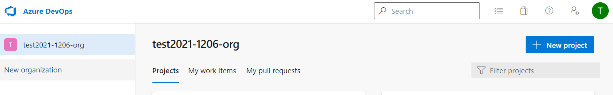
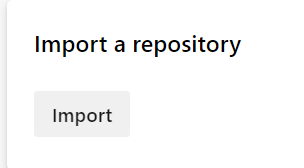
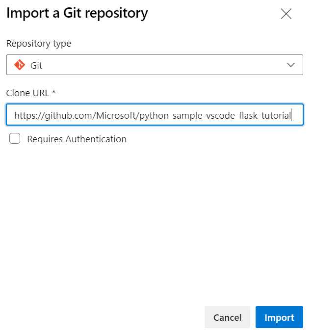

# モジュール4 エンタープライズ DevOps 用のGitの操作

- [モノレポ vs 複数リポジトリ](mod04-01-monorepo.md)
- [プロジェクトの変更ログ（CHANGELOG.md）](mod04-02-changelog.md)
- [ブランチの運用](mod04-03-branch.md)
- [プルリクエストの運用](mod04-04-pr.md)
- [Gitフック](mod04-05-git-hooks.md)
- [インナーソース（内部ソース）](mod04-06-inner-source.md)
- [Gitリポジトリの運用](mod04-mod04-07-operating-git-repo.md)

ハンズオンラボ

- 基本
  - 組織に新しいプロジェクトを作る（＋New Project）
  
    - プロジェクト名は任意のものでOK
  - ソースコードの準備
    - プロジェクトのAzure Repos をクリック
    
    - Importをクリック 
    
    - Clone URLに`https://github.com/Microsoft/python-sample-vscode-flask-tutorial` を入力し、Importをクリック
    
    - インポートが完了するまでしばらく待つ
- オプション
  - [Version Controlling with Git in Visual Studio Code and Azure DevOps](https://azuredevopslabs.com/labs/azuredevops/git/)
