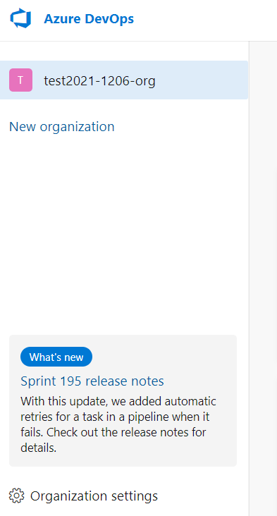
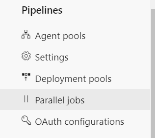
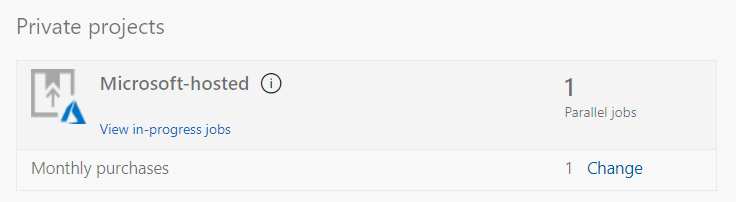
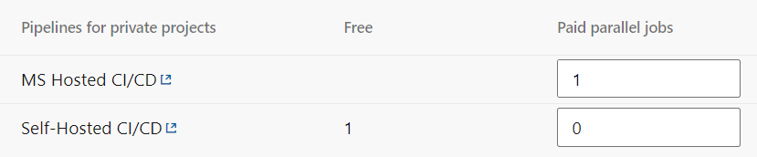
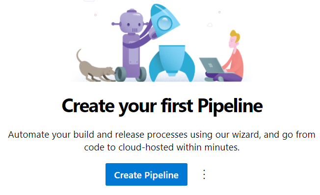
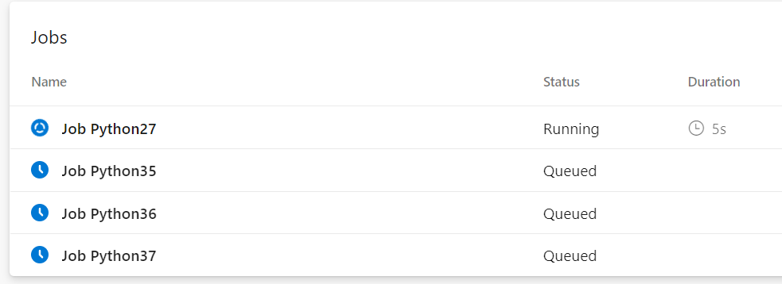

# モジュール5 Azure Pipelinesの構成

- [DevOps のCI/CDパイプラインの概念](mod05-01-cicd.md)
- [Azure Pipelines](mod05-02-azure-pipeline.md)
- [エージェント](mod05-03-agent.md)
- [エージェントプール](mod05-04-agent-pool.md)
- [パイプライン](mod05-05-pipeline.md)
- [オープンソースでのAzure Pipelinesの利用](mod05-06-azure-pipeline-oss.md)
- [YAMLパイプラインとClassicパイプライン](mod05-07-yaml-and-classic.md)

## ラボ

- 基本
  - Azure DevOpsの「Organization Settings」に移動
  
    - PipelinesのParallel Jobsを選択
    
    - Private projectsのMicrosoft-hostedのChangeをクリック
    
    - Pipelines for private projectsのMS Hosted CI/CDのPaid parallel jobsを1に変更して、画面下部のSaveをクリック
    
  - パイプラインの設定と実行
    - プロジェクトのAzure Pipelines をクリック
    
    - Create Pipelineをクリック
    
    - Azure Repos Gitをクリック
    
    - Gitリポジトリ（プロジェクト名と同じ名前がついている）をクリック
    
    - Python packageをクリック
    
    - Save and runをクリック
    
    - 画面右下のSave and runをクリック
    
    - しばらく待つ。
    - パイプライン内で4つのJobが生成され、実行される。
    
    - 2～3分ですべてのJobが完了し、それぞれのStatusはSuccessとなる。
- 応用
  - [Enabling Continuous Integration with Azure Pipelines](https://azuredevopslabs.com//labs/azuredevops/continuousintegration/)
  - 短いラボなので30分ほどで完了できる。

