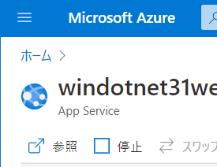
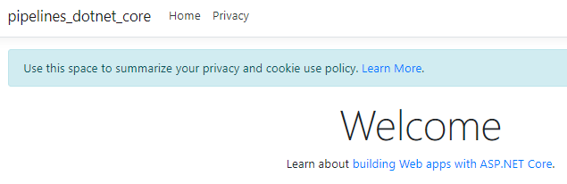

# module 6 ハンズオン

## ハンズオン1

複数のジョブを生成する例

  - Azure DevOpsの「Organization Settings」に移動
    - PipelinesのParallel Jobsを選択
    - Private projectsのMicrosoft-hostedのChangeをクリック
    - Pipelines for private projectsのMS Hosted CI/CDのPaid parallel jobsを1に変更して、画面下部のSaveをクリック
  - 組織に新しいプロジェクトを作る（＋New Project）
    - プロジェクト名は任意のものでOK
  - ソースコードの準備
    - プロジェクトのAzure Repos をクリック
    - Import
    - Clone URLに`https://github.com/Microsoft/python-sample-vscode-flask-tutorial`を指定して Import
  - パイプラインの設定と実行
    - プロジェクトのAzure Pipelines をクリック
    - Create Pipelineをクリック
    - Azure Repos Gitをクリック
    - Gitリポジトリ（プロジェクト名と同じ名前がついている）をクリック
    - Python packageをクリック
    - Save and runをクリック
    - 画面右下のSave and runをクリック
    - しばらく待つ。
    - パイプライン内で4つのJobが生成され、実行される。
    - 2～3分ですべてのJobが完了し、それぞれのStatusはSuccessとなる。

※このパイプラインでは、以下の記述（ strategy とmatrix ）を使用して、復数のジョブを生成しています。

```
pool:
  vmImage: ubuntu-latest
strategy:
  matrix:
    Python27:
      python.version: '2.7'
    Python35:
      python.version: '3.5'
    Python36:
      python.version: '3.6'
    Python37:
      python.version: '3.7'

steps:
- task: UsePythonVersion@0
  inputs:
    versionSpec: '$(python.version)'
  displayName: 'Use Python $(python.version)'

```

実行結果例（ジョブ実行中）


※手順冒頭の「Parallel Jobs」の設定で、ジョブの数を2や3に設定し、「Run Pipeline」で再度パイプラインを実行すると、よりたくさんのジョブが並列で実行される様子が確認できます。

## ハンズオン2

Azure Web Apps のWebアプリへのデプロイ

- Azure portal (portal.azure.com)での作業
  - App Service の Webアプリを作成する
  - ランタイムスタック: .NET Core 3.1
  - オペーレーティングシステム: Windows
  - 「参照」をクリック。
  
  - 別タブで、Webアプリにアクセスが行われる。「Hey, App Service Developers!」といったメッセージが出る。
  
- Azure DevOps側での作業
  - 組織に新しいプロジェクトを作る（＋New Project）
    - プロジェクト名は任意のものでOK
  - ソースコードの準備
    - プロジェクトのAzure Repos をクリック
    - Importをクリック 
    - Clone URLに`https://github.com/MicrosoftDocs/pipelines-dotnet-core` を入力し、Importをクリック
    - インポートが完了するまでしばらく待つ
  - パイプラインの準備
    - プロジェクトのAzure Pipelines をクリック
    - パイプラインを新規作成
    - Azure Repos Git
    - プロジェクトのリポジトリを選択
    - ASP.NET Core を選択 ※ ASP.NET Core (.NET Framework) **ではない**
    - 生成された azure-pipeline.yml を削除し、以下を貼り付ける。**以下の書き換えを行う**
      - azureSubscription 内のカッコ内のIDは、ご自身のサブスクリプションのIDに書き換える
        - サブスクリプションIDはAzure portalのAzure Passサブスクリプションを表示して確認
      - WebAppName は、前の手順で作成したWebアプリの名前を指定。URLではなく～～.azurewebsites.netの～～の部分
    - Save and run
    - 再度Save and run
    - 「There was a resource authorization issue: "The pipeline is not valid. Job Job: Step AzureRmWebAppDeployment input ConnectedServiceName references service connection Azure Pass - スポンサー プラン (ZZZZ) which could not be found」 というエラーが出たら、その右側の「Authorize resources」をクリックして右上の「Run new」をクリック、「Run」をクリック
    - 「This pipeline needs permission to access a resource before this run can continue」というエラーが出たら、「View」をクリックし、「Permit」をクリック。再度「Permit」をクリック。
- Azure portal (portal.azure.com)での作業
  - App Service の Webアプリに「参照」でアクセスする。pipelines_dotnet_coreという、先程とは別のWebが表示されている。
  

```
trigger:
- master

pool:
  vmImage: ubuntu-latest

variables:
  buildConfiguration: 'Release'

steps:
- script: dotnet build --configuration $(buildConfiguration)
  displayName: 'dotnet build $(buildConfiguration)'

- task: DotNetCoreCLI@2
  inputs:
    command: 'publish'
    publishWebProjects: true
    arguments: '--configuration $(BuildConfiguration) --output $(Build.ArtifactStagingDirectory)'
    zipAfterPublish: true

- task: PublishPipelineArtifact@1
  inputs:
    targetPath: '$(Build.ArtifactStagingDirectory)'
    artifact: 'web'
    publishLocation: 'pipeline'

- task: DownloadPipelineArtifact@2
  inputs:
    source: 'current'
    artifact: 'web'
    path: '$(Build.ArtifactStagingDirectory)'

- task: AzureRmWebAppDeployment@4
  inputs:
    ConnectionType: 'AzureRM'
    azureSubscription: 'Azure Pass - スポンサー プラン(YOURSUBSCRIPTIONID)'
    appType: 'webApp'
    WebAppName: 'YOURWEBAPPNAME'
    packageForLinux: '$(Build.ArtifactStagingDirectory)/**/*.zip'
```

参考:
- [最初のパイプラインの作成(.NET)](https://docs.microsoft.com/ja-jp/azure/devops/pipelines/create-first-pipeline?view=azure-devops&tabs=tfs-2018-2%2Cbrowser%2Cnet#create-your-first-pipeline-1)
- [.NET Core アプリをビルド、テスト、デプロイする](https://docs.microsoft.com/ja-jp/azure/devops/pipelines/ecosystems/dotnet-core?view=azure-devops&tabs=dotnetfive)
- [Azure App Service Web アプリをデプロイする](https://docs.microsoft.com/ja-jp/azure/devops/pipelines/targets/webapp?view=azure-devops&tabs=yaml%2Cwindows)


## ハンズオン3（オプション）

※時間があまったら実施。

- [Enabling Continuous Integration with Azure Pipelines](https://azuredevopslabs.com//labs/azuredevops/continuousintegration/)
- [Integrate Your GitHub Projects With Azure Pipelines](https://azuredevopslabs.com/labs/azuredevops/github-integration/)
