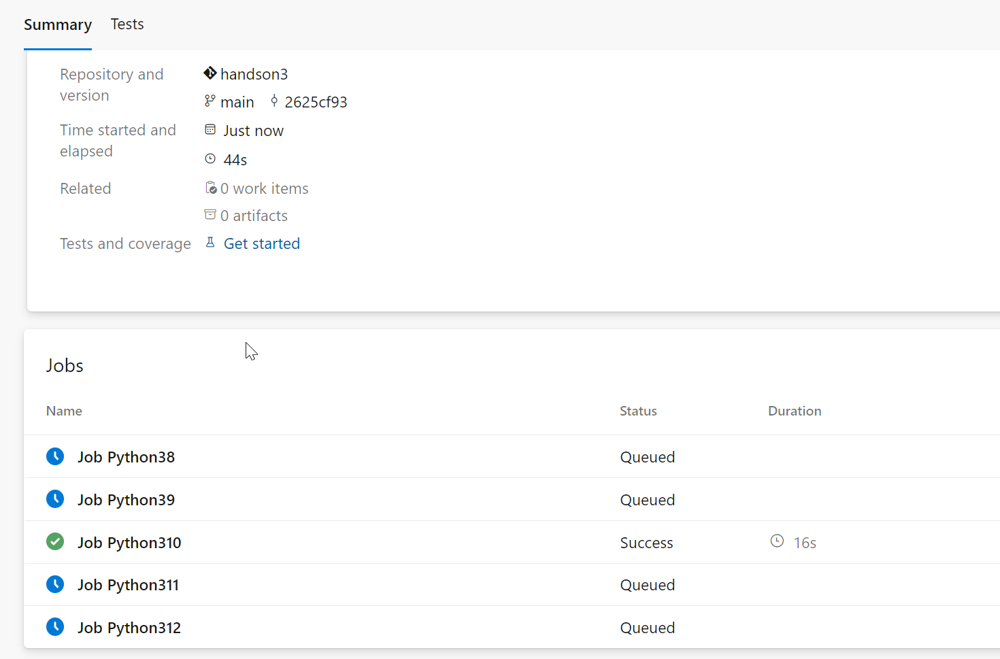

# ハンズオン: 複数のジョブを生成する例

  - Azure DevOpsの「Organization Settings」に移動
    - PipelinesのParallel Jobsを選択
    - Private projectsのMicrosoft-hostedのChangeをクリック
    - Pipelines for private projectsのMS Hosted CI/CDのPaid parallel jobsを1に変更して、画面下部のSaveをクリック
  - 組織に新しいプロジェクトを作る（＋New Project）
    - プロジェクト名は任意のものでOK
  - ソースコードの準備
    - プロジェクトのAzure Repos をクリック
    - Import
    - Clone URLに`https://github.com/Microsoft/python-sample-vscode-flask-tutorial`を指定して Import
  - パイプラインの設定と実行
    - プロジェクトのAzure Pipelines をクリック
    - Create Pipelineをクリック
    - Azure Repos Gitをクリック
    - Gitリポジトリ（プロジェクト名と同じ名前がついている）をクリック
    - Python packageをクリック
    - 生成されたYAMLの以下の部分を削除し、
      ```
          Python27:
            python.version: '2.7'
          Python35:
            python.version: '3.5'
          Python36:
            python.version: '3.6'
          Python37:
            python.version: '3.7'
      ```
      以下に置き換える
      ```
          Python38:
            python.version: '3.8'
          Python39:
            python.version: '3.9'
          Python310:
            python.version: '3.10'
          Python311:
            python.version: '3.11'
      ```
    - Save and runをクリック
    - 画面右下のSave and runをクリック
    - しばらく待つ。
    - パイプライン内で5つのJobが生成され、実行される。
    - 2～3分ですべてのJobが完了し、それぞれのStatusはSuccessとなる。

※このパイプラインでは、以下の記述（ strategy とmatrix ）を使用して、復数のジョブを生成しています。

```
pool:
  vmImage: ubuntu-latest
strategy:
  matrix:
    Python38:
      python.version: '3.8'
    Python39:
      python.version: '3.9'
    Python310:
      python.version: '3.10'
    Python311:
      python.version: '3.11'

steps:
- task: UsePythonVersion@0
  inputs:
    versionSpec: '$(python.version)'
  displayName: 'Use Python $(python.version)'

- script: |
    python -m pip install --upgrade pip
    pip install -r requirements.txt
  displayName: 'Install dependencies'

- script: |
    pip install pytest pytest-azurepipelines
    pytest
  displayName: 'pytest'

```

実行結果例（ジョブ実行中）


※手順冒頭の「Parallel Jobs」の設定で、ジョブの数を2や3に設定し、「Run Pipeline」で再度パイプラインを実行すると、よりたくさんのジョブが並列で実行される様子が確認できます。

## 参考

- [Python バージョンの使用タスク](https://docs.microsoft.com/ja-jp/azure/devops/pipelines/tasks/tool/use-python-version?view=azure-devops)