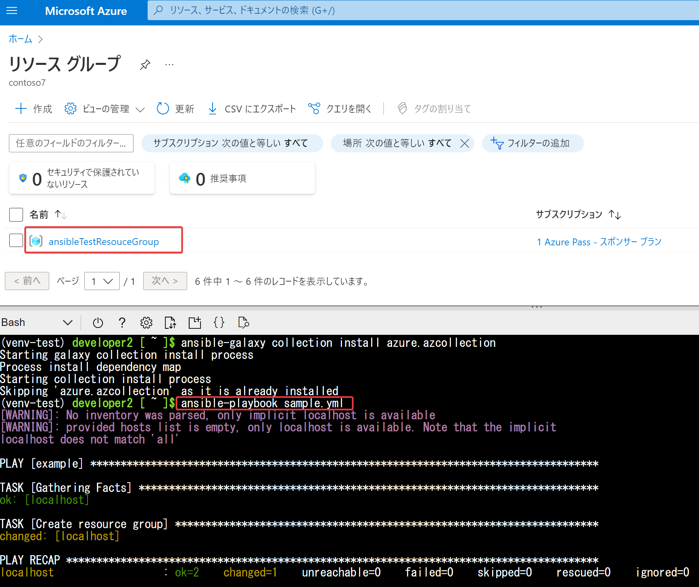

# Ansible ハンズオン

■プレイブック（sample.yml）

```
- name: example
  hosts: localhost
  connection: local
  tasks:
  - name: Create resource group
    azure.azcollection.azure_rm_resourcegroup:
      name: ansibleTestResouceGroup
      location: eastus
```


■準備

2022/3/16
Azure Cloud ShellでAnsibleを実行すると「ModuleNotFoundError: No module named 'azure.mgmt.network.version'」といったエラーが出てしまう。

下記のコマンドを事前に投入することで問題を解決できる。

```
python3 -m venv venv-test && . venv-test/bin/activate && pip3 install --upgrade pip && pip3 install wheel
pip3 install ansible==2.10.0
ansible-galaxy collection install azure.azcollection
pip3 install -r ~/.ansible/collections/ansible_collections/azure/azcollection/requirements-azure.txt
```

参考:
- https://github.com/ansible-collections/azure/issues/699
- https://github.com/Azure/azure-cli/issues/15431
- https://stackoverflow.com/questions/68345685/ansible-playbook-error-was-modulenotfounderror-no-module-named-azure-mgmt-mon

■手順（Azure Cloud Shellを使用）

- 上記のプレイブック（sample.yml）を作成
- `ansible-playbook sample.yml`
- コマンドの実行が完了してから、Azure portal側の一覧に反映されるまで、1分ほどかかる。
- Azure portalの「リソースグループ」画面で、リソースグループが作成されたことを確認

実行結果例:



■仮想環境を抜ける

上記「準備」で作成された仮想環境を抜ける（無効化）。

```
deactivate
```
