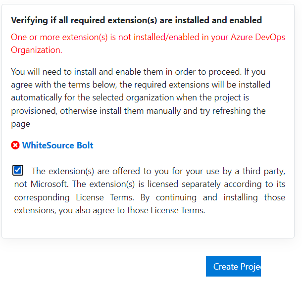
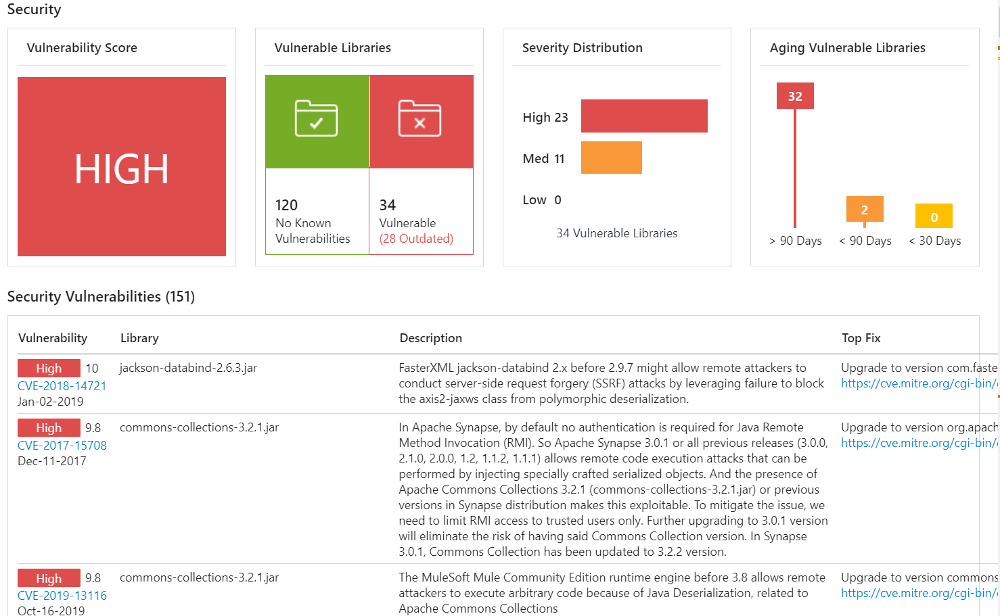

# ハンズオン: Mend Bolt (以前のWhiteSource Bolt) による脆弱性レポート

- 組織の設定で、Security＞Policiesと進み、Third-party application access via OAuth をONにする。[参考(GitHub Issue)](https://github.com/microsoft/AzureDevOpsDemoGenerator/issues/626)

- MarketplaceでMend Bolt拡張機能を追加
  - Marketplace に移動 https://marketplace.visualstudio.com/azuredevops
  - Mendで検索
  - Mend Bolt（紫色のアイコン）をクリック
  - Get it free
  - Select an Azure DevOps organization: デフォルトでDevOps組織が選択されている。Install
  - Proceed to organization
  - Azure DevOpsのトップ画面に移動  https://dev.azure.com/
  - 画面右上の右から4つ目のアイコン（カバン）をクリック
  - Manage extensions
  - Installed に Mend Bolt が表示されていればOK。
- Azure DevOpsプロジェクトの準備
  - ジェネレータに移動 https://azuredevopsdemogenerator.azurewebsites.net
  - Sign in
  - パスワードの入力等を求められた場合は入力
  - New Project Name: lab18
  - Select Organization: 自分のAzure DevOps組織名
  - Selected Template: Choose Template, DevOps LabsのMend Bolt をクリック、Select Template
  - The extension(s) are ... にチェック
  - Create Project
  - しばらく待つ
  - Navigate to project
- Mend Boltの初期設定
  - プロジェクトのPipelinesのMend Boltに移動
  - Work Email: トレーニング用に新しく作成したMicrosoftアカウントのメールアドレスを入力
  - Company Name: test
  - Country: Japan
  - Get Started
- プロジェクトのパイプラインを起動
  - Azure DevOpsプロジェクトに戻る
  - プロジェクトのPipelinesに移動
  - Mend Bold-YAMLをクリック
  - Run pipeline
  - Run
  - Jobが完了するのを待つ
- 結果を確認する
  - プロジェクトのPipelinesのMend Boltに移動
  - Please wait...と表示されたら30秒ほどそのまま待つ。
  - 脆弱性レポートが表示される

