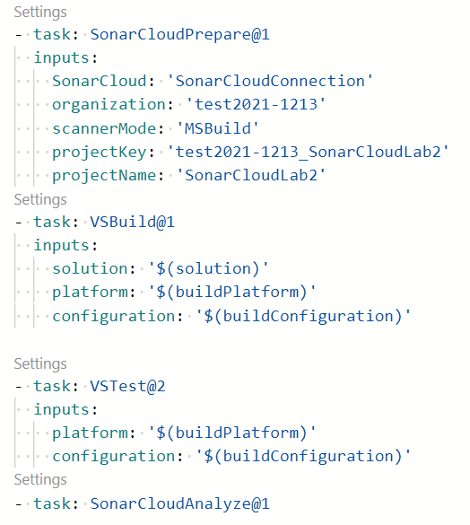
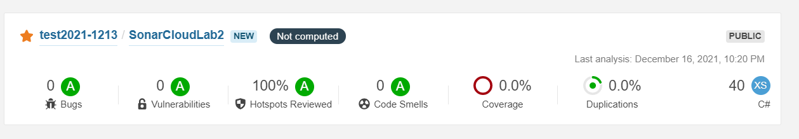

# モジュール20 コンプライアンス向けのコード ベースの検証

■前半: オープンソースソフトウェア

- オープンソースソフトウェアとは
- ライセンスとは

■後半: 脆弱性セキュリティチェックツール

- OWASPとは
- SonarCloud
- CodeQL
- Dependabot

## オープンソース ソフトウェア

### ソフトウェアのビルト方法

注: タイトルに「ビルド方法」とあるが、ここはOSSの使用に関する解説。

■ライセンス

参考: http://www.it-houmu.com/archives/1848

利用するソフトウェアの各ライセンスを確認し、それを遵守することが重要。

[TLDRLegal](https://tldrlegal.com/) - ソフトウェアのライセンスの概要、Can, Cannot, Mustをわかりやすく説明。

[FOSSA](https://www.hitachi-solutions.co.jp/fossa/) - OSSライセンス管理ツール

プロジェクトで使用しているライブラリのライセンスの一覧を生成するツール:

- [LicensePlist](https://medium.com/swift-column/license-plist-c0363a008c67) - iOS/Androidアプリ用
- [Nuget License Utility](https://github.com/tomchavakis/nuget-license) - .NETアプリ用
- [licensee](https://backport.net/blog/2021/12/18/licensee/) - Androidアプリ向け。依存関係グラフに含まれる各ライブラリのライセンスが期待通りのものかどうかを検証してくれるGradleプラグイン

■オープンソースとクローズドソース


### オープンソース ソフトウェアとは?

■オープンソースの定義

- オープンソースの定義
  - 米国の公益法人であるOpen Source Initiative (OSI)が策定した、オープンソースとされるものが満たすべき条件を示した文書
  - [原文](https://opensource.org/osd-annotated)
  - [OSG-JP(Open Source Group Japan)による日本語訳](https://opensource.jp/osd/osd19/)
  - [Wikipedia](https://ja.wikipedia.org/wiki/%E3%82%AA%E3%83%BC%E3%83%97%E3%83%B3%E3%82%BD%E3%83%BC%E3%82%B9%E3%81%AE%E5%AE%9A%E7%BE%A9)

■Microsoftとオープンソースの関係

マイクロソフトはオープンソースに関して以下のような取り組みを行っている。

- いくつかのソフトウェアをオープンソースとして提供している
  - [.NETは、オープンソースである](https://dotnet.microsoft.com/ja-jp/platform/open-source)
  - Visual Studio Code
  - TypeScript
  - Windows Terminal
- [オープンソースプロジェクトにAzureの無償クレジットを提供している。](https://www.publickey1.jp/blog/21/azure_1.html)
- [すべてのオープン ソース プロジェクトで、Azure Pipelinesの10 個の無料の並列ジョブ (ビルド時間無制限) を利用できる。](https://azure.microsoft.com/ja-jp/services/devops/pipelines/)
- [Azureでは、Linux, MySQL, PostgreSQL, MongoDB, Cassandra, Redisなどのオープンソースソフトウェアを利用できる](https://azure.microsoft.com/ja-jp/overview/open-source/#open-source)
- [Microsoftのオープンソースへの取り組みを紹介する公式サイト](https://opensource.microsoft.com/)
- [Cloud Foundry Foundation と Cloud Native Computing Foundation に参加している](https://blogs.partner.microsoft.com/mpnjapan/2017/08/03/%E3%83%9E%E3%82%A4%E3%82%AF%E3%83%AD%E3%82%BD%E3%83%95%E3%83%88%E3%81%AE%E3%82%AA%E3%83%BC%E3%83%97%E3%83%B3%E3%82%BD%E3%83%BC%E3%82%B9%E3%81%B8%E3%81%AE%E5%8F%96%E3%82%8A%E7%B5%84%E3%81%BF-cloud-fou/)

### オープンソース ソフトウェア コンポーネントに関する企業の懸念

OSS利用時の課題

### オープンソース ライセンス

オープンソースの定義による、ライセンスでしてはいけないこと。

### 一般的なオープンソース ライセンス

GPL、MPL、BSDなどの分類

### ライセンスの意味と評価

## セキュリティおよびコンプライアンス ポリシーの管理

### コンプライアンスのためのコード ベースの検査と検証

### OWASP セキュア コーディング プラクティスの実装計画

■OWASPとは？

https://owasp.org/www-chapter-japan/

> OWASP - Open Web Application Security Project とは、Webをはじめとするソフトウェアのセキュリティ環境の現状、またセキュアなソフトウェア開発を促進する技術・プロセスに関する情報共有と普及啓発を目的としたプロフェッショナルの集まる、オープンソース・ソフトウェアコミュニティです。The OWASP Foundationは、NPO団体として全世界のOWASPの活動を支えています。


## 継続的なセキュリティ検証の実装

### OWASP ZAP 侵入テスト

[IPA（情報処理推進機構）による、脆弱性検査ツールの紹介](https://www.ipa.go.jp/about/technicalwatch/20131212.html)。[OWASP ZAP](https://owasp.org/www-project-zap/)、Paros、Ratproxyを比較している。

### SonarCloud

https://sonarcloud.io/

[Azure Pipelineの拡張機能](https://marketplace.visualstudio.com/items?itemName=SonarSource.sonarcloud)として利用できる。

パブリックプロジェクト（GitHubのパブリックリポジトリでホスティングされているプロジェクト等）では[無料で使用することができる](https://sonarcloud.io/pricing)。

※SonarQubeとSonarCloudの違い

- SonarQube
  - オンプレミスで運用できる
  - インストールが必要
  - Community editionは無料、その他は有料
  - Azure DevOps Serverにも対応
- SonarCloud
  - クラウド型(SaaS)
  - インストール不要
  - パブリックプロジェクトでは無料、その他は有料
  - GitHub, Bitbucket, GitLab, Azure DevOps Servicesと組み合わせて利用できる

SonarSource社による情報:

- [価格と機能](https://www.sonarsource.com/plans-and-pricing/)
- [Q&A](https://community.sonarsource.com/t/sonarcloud-vs-sonarqube/9557/2)

### GitHub の CodeQL

コードの脆弱性診断を行うツール。

パブリックプロジェクトでは[無料で使用することができる](https://project.nikkeibp.co.jp/idg/atcl/19/00002/00052/)。

[CodeQL for research](https://securitylab.github.com/tools/codeql/)

[Githubの新しいセキュリティ機能 CodeQLを使ってみる](https://security-index.hatenablog.com/entry/2020/06/05/211454)

### GitHub Dependabot アラートとセキュリティ更新プログラム

脆弱性があるライブラリをプロジェクトで使用している場合、自動的に通知したり、プルリクエストを作って知らせてくれたりするツール。

[対応するパッケージ管理ツール](https://docs.github.com/ja/code-security/supply-chain-security/understanding-your-software-supply-chain/about-the-dependency-graph#supported-package-ecosystems)

- [Dependabot アラート](https://docs.github.com/ja/code-security/supply-chain-security/managing-vulnerabilities-in-your-projects-dependencies/about-alerts-for-vulnerable-dependencies)
  - 脆弱性のある依存関係を検出すると通知（アラート）を作成。
  - リポジトリの通知設定に従って通知を行う
- [Dependabot セキュリティアップデート](https://docs.github.com/ja/code-security/supply-chain-security/managing-vulnerabilities-in-your-projects-dependencies/about-dependabot-security-updates)
  - 脆弱性のある依存関係を修正するプルリクエストを自動生成
- [Dependabot バージョンアップデート](https://docs.github.com/ja/code-security/supply-chain-security/keeping-your-dependencies-updated-automatically/about-dependabot-version-updates)
  - 古い依存関係を最新バージョンに更新するプルリクエストを発行
  - （脆弱性の有無に関係なく、古いバージョンの依存関係を発見して最新化）

[Dependabot](https://dependabot.com/)

使用条件はページ下部に記載されている。（GitHubでホスティングされているオープンソースであること等）

[Dependabotを導入してみた](https://dev.classmethod.jp/articles/dependabot-101/)

## ハンズオンラボ

SonarCloudによるコード解析
- メモ帳の準備
  - 以下の内容をコピーし、メモ帳に貼り付けておく。
  - 以降の作業で使用する情報の記録に利用する.
    ```
    (1)PAT: 
    (2)token: 
    (3)organization: 
    (4)Project Key: 
    (5)Project Name: 
    ```
- Azure DevOps組織の設定
  - Azure DevOps の Organization Settings に移動
  - Security の Policies
  - Allow public projectsを On にし、Save
- Azure DevOpsでプロジェクトを準備
  - Azure DevOps で新しいプロジェクトを作成
  - Project name: SonarCloudLab
  - Visibility: Public
  - Create
  - Reposに移動
  - Import
  - Clone URL: https://github.com/SonarSource/sonar-scanning-examples.git
  - Import
- MarketplaceでSonarCloud拡張機能を追加
  - Marketplace に移動 https://marketplace.visualstudio.com/azuredevops
  - SonarCloud で検索
  - SonarCloud (SonarSource, オレンジと白のアイコン) をクリック
  - Get it free
  - Select an Azure DevOps organization: デフォルトでDevOps組織が選択されている。Install
  - Proceed to organization
  - Azure DevOpsのトップ画面に移動  https://dev.azure.com/
  - 画面右上の右から4つ目のアイコン（カバン）をクリック
  - Manage extensions
  - Installed に SonarCloud by SonarSource が表示されていればOK。
- Azure DevOps の PAT(パーソナルアクセストークン)を生成
  - Azure DevOpsのトップ画面に移動  https://dev.azure.com/
  - 画面右上の右から2つ目のアイコン（User settings）をクリック
  - Personal Access Tokens
  - New Token
  - Name: SonarCloud
  - Codeの Read & write にチェック
  - Createをクリック
  - 生成されたPATをメモ帳(1)PAT: に貼り付けて記録しておく
- SonarCloudアカウントの準備
  - https://sonarcloud.io/account
  - With Azure DevOps
  - 「このアプリがあなたの情報にアクセスすることを許可しますか?」と表示された場合は「はい」
  - 画面左上の「sonarcloud」をクリック
  - Import an organization from Azure
  - Azure DevOps organization name: 組織名をペースト
  - Personal Access Token: Tokenをペースト
  - Continue
  - (Import organization details が表示される。ここのKeyは保存不要) 
  - Continue
  - Free planが選択されている。
  - Create Organization
  - SonarCloudLabにチェック
  - Set Up
  - With Azure DevOps Pipelines
  - Continue
  - 画面に表示される token をコピー
  - tokenをメモ帳(2)token: に貼り付けて記録しておく
  - .NETをクリック
  - SonarCloud organization, Project Key, Project Name をコピーし、メモ帳(3)(4)(5)に貼り付けて記録しておく
- SonarCloudの「サービス接続」の作成
  - Azure DevOpsのプロジェクト SonarCloudLab を選択
  - Project Settings
  - Pipelines の Service connections
  - Create service connection
  - SonarCloud を選択して Next
  - SonarCloud Token に、記録しておいた(2) token を入力して Verify
  - Verification Succeeded と表示される
  - Service connection name: SonarCloudConnection
  - Veryfy and save
- Azure Pipelinesでパイプラインを準備
  - プロジェクトのPipelineに移動
  - Create Pipeline
  - Azure Repos Git
  - SonarCloudLab
  - .NET Desktop
- パイプラインにSonarCloudのタスクを追加-1(SonarCloudPrepare)
  - `task: VSBuild@1` の上に表示されているSettingsの上の空行をクリック
  - Show assistant
  - sonar で検索, Prepare Analysis Configuration を選択
  - SonarCloud Service Endpoint: SonarCloudConnection
  - Organization: プルダウンをクリックしてメモ帳(3)の組織を選択
  - Choose the way to run the analysis: Integrate with MSBuild
  - Project Key: メモ帳(4)Project Key の値を貼り付け
  - Project Name: メモ帳(5)Project Name の値を貼り付け
  - Add
  - `task: NugetToolInstaller@1` と `task: VSBuild@1` の間に `task: SonarCloudPrepare@1` が挿入される。
- パイプラインにSonarCloudのタスクを追加-2(Run Code Analysis)
  - YAMLファイルの末尾の行をクリック
  - Tasksで、sonar で検索, Run Code Analysis をクリック
  - 以下のように、VSBuildとVSTestを、SonarCloudPrepareとSonarCloudAnalyzeで囲むようにタスクが配置されていることを確認。
- パイプラインを実行
  - Save and run
  - 再度Save and run
  - Job が Queued となる。Jobをクリック
  - This pipeline needs permission to access a resource before this run can continue と表示される。View をクリック
  - Permit, 再度 Permit
  - しばらく待つ。
  - Jobが実行される。
    - すべてのジョブがエラー（赤い丸）が出ることなく実行されると、Jobが成功（緑の丸）となる。
- SonarCloudの分析結果を確認
  - SonarCloud に移動 https://sonarcloud.io/projects
  - プロジェクト SonarCloudLab をクリック
  - 画面左 Main Branch
  - 1 Bugs の 1 をクリック
  - 赤くなっている Change this condition so ... という部分をクリック。コードの問題点が表示される。
    - Why is this an issue? をクリック。なぜそれが問題なのかという理由が表示される。
  - ←をクリック
  - Code Smell をクリック
  - 赤くなっている Add a `protected` constructor ... をクリック。コードの問題点が表示される。
    - Why is this an issue? をクリック。なぜそれが問題なのかという理由が表示される。
  - ←をクリック
  - 赤くなっている Remove this method and ... をクリック。コードの問題点が表示される。
    - Why is this an issue? をクリック。なぜそれが問題なのかという理由が表示される。
- SonarCloudで報告されたバグ/コードスメル（コードの臭い）を修正する
  - Azure DevOpsのプロジェクトのReposに移動
  - Filesで以下のようにフォルダ/ファイルを開く
  - sonarqube-scanner-msbuild
  - CSharpProject
  - SomeConsoleApplication
  - Program.cs を以下のように修正する（Editをクリックし、ファイルの中身を削除し、以下のコードに置き換え、Commit）
    ```
    using System;
    namespace SomeConsoleApplication
    {
        public static class Program
        {
            static void Main(string[] args)
            {
                var iAmTrue = AlwaysReturnsTrue();
                if (iAmTrue)
                {
                    Console.WriteLine("true");
                }

                Console.ReadKey();
            }

            public static bool AlwaysReturnsTrue()
            {
                return Flag;
            }

            public const bool Flag = true;

            public static object Passthrough(object obj)
            {
                return obj;
            }
        }
    }
    ```
  - Azure Pipelinesに移動し、パイプラインのRun（Updated Program.cs）の実行が終わるのを待つ
- SonarCloudの分析結果を確認
  - SonarCloud に移動 https://sonarcloud.io/projects
  - プロジェクト SonarCloudLab をクリック
  - バグ/コードスメルが0になったことが確認できる。
