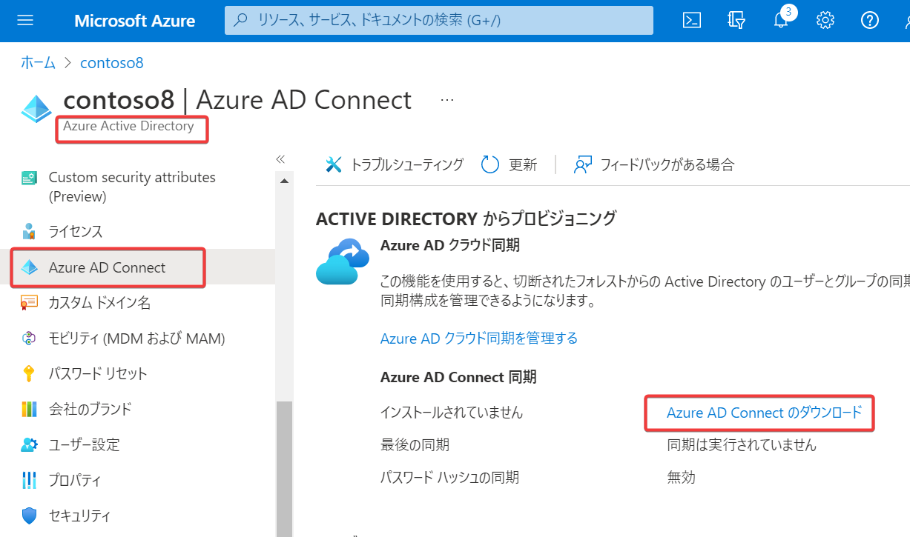
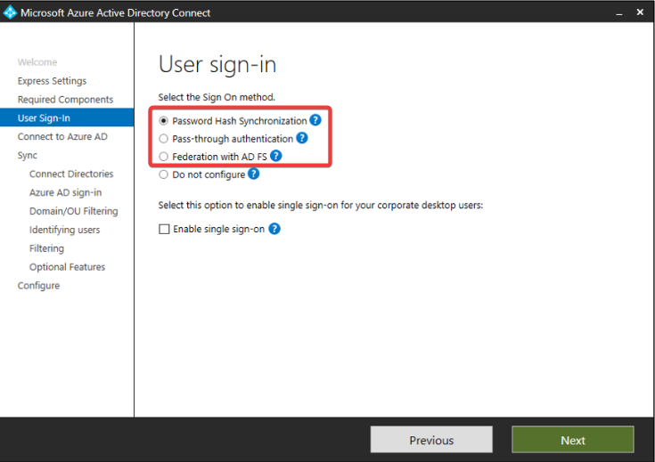
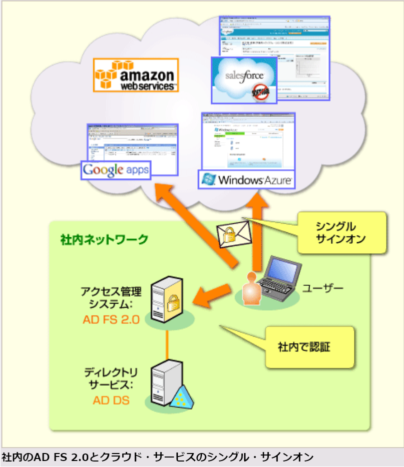
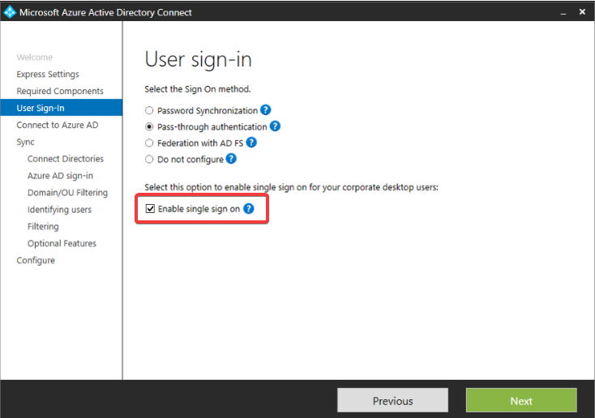

# mod1-2 ハイブリッドID (hybrid identity)

■ハイブリッドIDとは？

- 共通のIDで、オンプレミスとクラウドの両方にアクセスできるしくみ。
- Entra ID Connectを使用して実現できる。
- Freeでも利用可能。
  - テナントで扱うオブジェクト数が500000を超える場合は、P1/P2を有効化したテナントが必要
  - パスワードライトバックはユーザーごとにP1が必要

■アーキテクチャ

```
オンプレミスNW
├Windows Server
│ └AD DS機能を有効化, ユーザーIDを管理
└Windows Server
  └Entra ID Connect
    ↓ 同期
Entra IDテナント
```

■Entra ID Connect

https://docs.microsoft.com/ja-jp/azure/active-directory/hybrid/whatis-azure-ad-connect

- オンプレミスAD DSとEntra IDを同期するソフトウェア。
- 無料
- 以前DirSync や Entra ID Sync、Entra ID Connectと呼ばれていたツールの後継
- Windowsアプリケーション
- オンプレミスのWindows Server 2012,2012 R2, 2016, 2019 にインストールする
  - [インストール要件の詳細](https://learn.microsoft.com/en-us/azure/active-directory/hybrid/how-to-connect-install-prerequisites#installation-prerequisites)
  - Windows Server 2022はまだサポートされていない
  - GUI操作が必要なため、Windows Server Coreは不可
- ドメインコントローラに同居させることもできる
- 複数のEntra ID Connectをデプロイして、可用性を向上させることもできる

ダウンロード:
https://www.microsoft.com/en-us/download/details.aspx?id=47594

またはAzure portal＞Entra ID＞Entra iD Connectから:


■同期

Entra ID Connectを使用して、オンプレミス側のID情報をEntra IDへ伝達すること。

**同期は、常に、オンプレミスAD DS → Entra ID の方向で行われる**。

Entra IDに登録されたID情報が、オンプレミスAD DSに反映されることは**ない**。

※パスワード ライトバックは例外。

■パスワード ライトバック

「[パスワードライトバック](https://docs.microsoft.com/ja-jp/azure/active-directory/authentication/tutorial-enable-sspr-writeback)」を設定すると、Entra ID側のパスワード変更を行った際、オンプレミスAD DS側に反映させることができる。

使用するユーザーごとにP1またはP2ライセンスが必要。

サポートチームによる解説
https://jpazureid.github.io/blog/azure-active-directory-connect/password-writeback-overview/

■3つの認証方式

https://docs.microsoft.com/ja-jp/azure/active-directory/hybrid/whatis-hybrid-identity

Entra ID Connectのインストール中に、認証方式を選択する。

- パスワードハッシュ同期(Passsword Hash Sync: PHS)
  - Azure 側に、パスワードのハッシュ値を保存する方式。
- パススルー認証(Pass Through Auth: PTA)
  - Azure 側で入力されたID/パスワードをオンプレミスのAD DSに送信して検証する方式。
- フェデレーション統合(Federation, fed)
  - オンプレミスの「AD FS」や「PingFederate」に、認証プロセスを引き継ぐ方式。



■参考: フェデレーションとは？

ID連携の仕組み。オンプレミスでAD DSと「AD FS」（またはPingFederate）を組み合わせて、クラウドアプリへのシングルサインオンを実現する仕組み。

参考:
https://www.atmarkit.co.jp/fwin2k/operation/adfs2sso03/adfs2sso03_01.html

注意: この記事は2010/9のものであり、Entra IDの正式リリース（2013/4）以前の状況についての解説であることに注意。



- オンプレミスに 以下をデプロイ
  - AD DS
  - 「Active Directory Federation Service (AD FS) 」
  - または 「PingFederate(ピンフェデレート）」
- AD DSを使用して、IDを管理
- AD FSまたはPingFederateを使用して、クラウドアプリケーションへのシングルサインオンを実現

■参考: PingFederate(ピンフェデレート）

https://www.ntt.com/business/services/application/authentication/idf/pingfederate.html

- シングルサインオン製品
- オンプレミスのAD DSと連携できる
- Entra ID Connect でサポートされている。

■選択の目安

- Azure 側にパスワードハッシュ値を保存してもよい場合は、パスワードハッシュ同期を使用。
- Azure 側にパスワードハッシュ値を保存したくない場合は、パススルー認証 または フェデレーション統合 を使用
  - オンプレミスの AD DS のセキュリティとパスワード ポリシーを適用する必要がある場合は、パススルー認証を使用
  - オンプレミスに Active Directory Federation Service (AD FS) がデプロイされていて、引き続きそれを使用したい場合、オンプレのサードパーティMFAソリューションを使う場合、スマートカード認証をサポートするなどは、フェデレーション統合 を使用。

■認証方式1: パスワードハッシュ同期 (Password hash synchronization, PHS)

https://docs.microsoft.com/ja-jp/azure/active-directory/hybrid/whatis-phs

- パスワードのハッシュ値を同期
- ダークウェブ等に漏洩した資格情報の検出にも役立つ

※参考: ハッシュ値

```
パスワード
 ↓ ハッシュ関数
ハッシュ値
```

ハッシュ値からパスワードを逆算することはできない.

Entra ID側には、生パスワードではなく、ハッシュ値が保存される。

■認証方式2: パススルー同期 (Pass-through authentication, PTA)

https://docs.microsoft.com/ja-jp/azure/active-directory/hybrid/how-to-connect-pta

- Entra IDに送信されたパスワードを、オンプレミスAD DSに送信して検証
- オンプレミスのインフラストラクチャに障害が発生した場合に、パスワード ハッシュ同期へフェイルオーバー（切り替え）することもできる
  - 自動でフェイルオーバーはしない。手動で切り替えが必要

■認証方式3: フェデレーション (federation with AD FS)

https://docs.microsoft.com/ja-jp/azure/active-directory/hybrid/whatis-fed

- オンプレミスの「AD FS」や「PingFederate」とEntra IDでフェデレーションを構成
- オンプレミスの「AD FS」や「PingFederate」に、認証プロセスを引き継ぐ仕組み
- オンプレのサードパーティMFAソリューションを使う場合や、スマートカード認証をサポートするなど、高度な機能を利用できる
- AD FSで障害が発生した場合に備えて、PHSを組み合わせることができる

■オプション: シームレスSSO (sSSO)

https://docs.microsoft.com/ja-jp/azure/active-directory/hybrid/how-to-connect-sso

- ユーザーが企業ネットワークに接続される会社のデバイスを使用するときに、自動的にサインインを行う仕組み。
- デバイスのサインインによる認証情報を使用してクラウドアプリとオンプレミスアプリにSSOできる
- Windows 10 + Microsoft Edge 等、さまざまなOS・ブラウザーの組み合わせをサポート
- パスワードハッシュ同期(PHS) または パススルー同期(PTA)と組み合わせて利用できる
- フェデレーション統合には適用できないが、フェデレーション統合ではAD FSサーバーによるSSOを利用できる
- Entra ID Connectインストール中に、「Enable Single Sign On」にチェックを入れて有効化する。



SSO（sSSO）の利用パターン:

- PHS + sSSO
- PTA + sSSO
- フェデレーション + AD FSのSSO

■Entra ID Connect Health

https://docs.microsoft.com/ja-jp/azure/active-directory/hybrid/whatis-azure-ad-connect#why-use-azure-ad-connect-health

- Entra ID Connect, AD DS, AD FSなどを監視する仕組み。
- 「Entra ID Connect Healthエージェント」とも呼ばれる
  - Entra ID Connect Health Agent for Sync - Entra ID Connect監視用エージェント
  - Entra ID Connect Health Agent for AD DS - AD DS監視用エージェント
  - Entra ID Connect Health AD FS Agent - AD FS監視用エージェント
- Entra ID Connectの場合、Connectがインストールされたサーバーに同居できる
- ライセンス: P1(最初のエージェントに1ライセンス、追加のエージェントごとに25ライセンス)
- 監視結果は、https://aka.ms/aadconnecthealth （Entra ID Connect Healthポータル）で確認できる

<!--
# ラボ06  ディレクトリ同期の導入（非常に時間がかかるため、オプション）

- 60min
- Azure Passサブスクリプションを使用します
- 手順書: https://microsoftlearning.github.io/AZ-500JA-AzureSecurityTechnologies/
- 補足資料: https://github.com/hiryamada/notes/blob/main/AZ-500/lab/lab06.md

概要:

```
Azure VM（オンプレミスAD DSの代わり）
├ユーザー
└Entra ID Connect
 ↓ ユーザー情報を同期
Entra ID
```

-->
