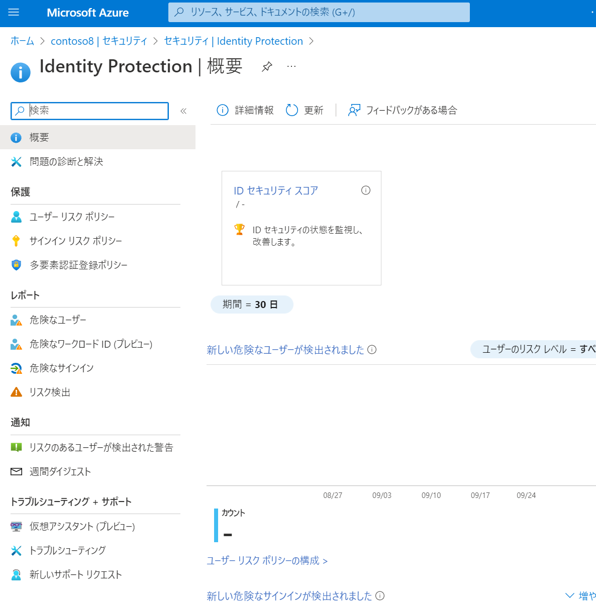
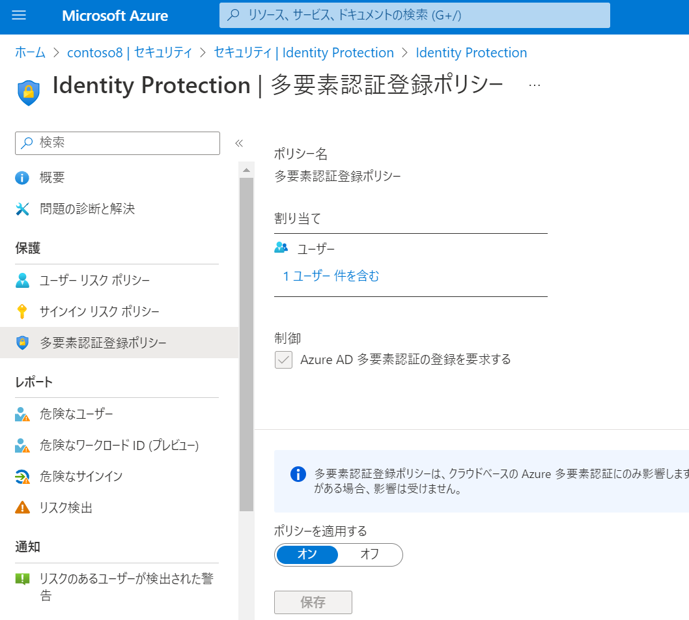
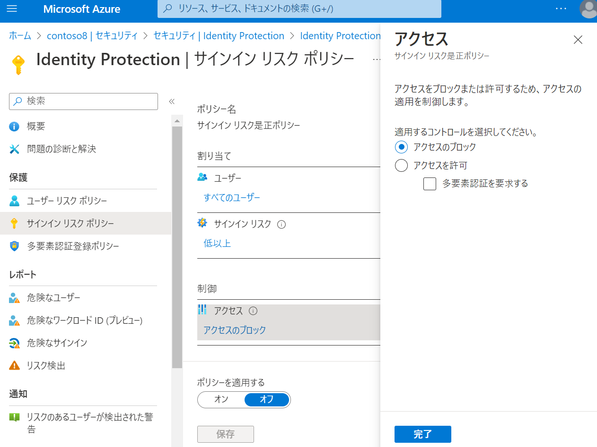
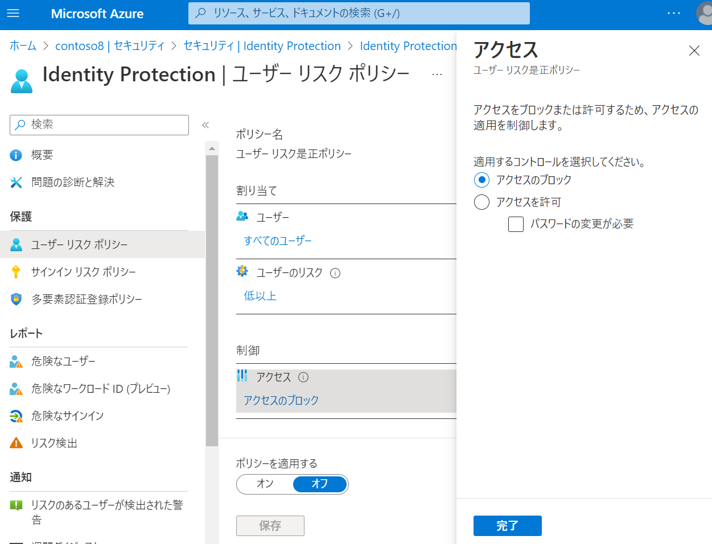
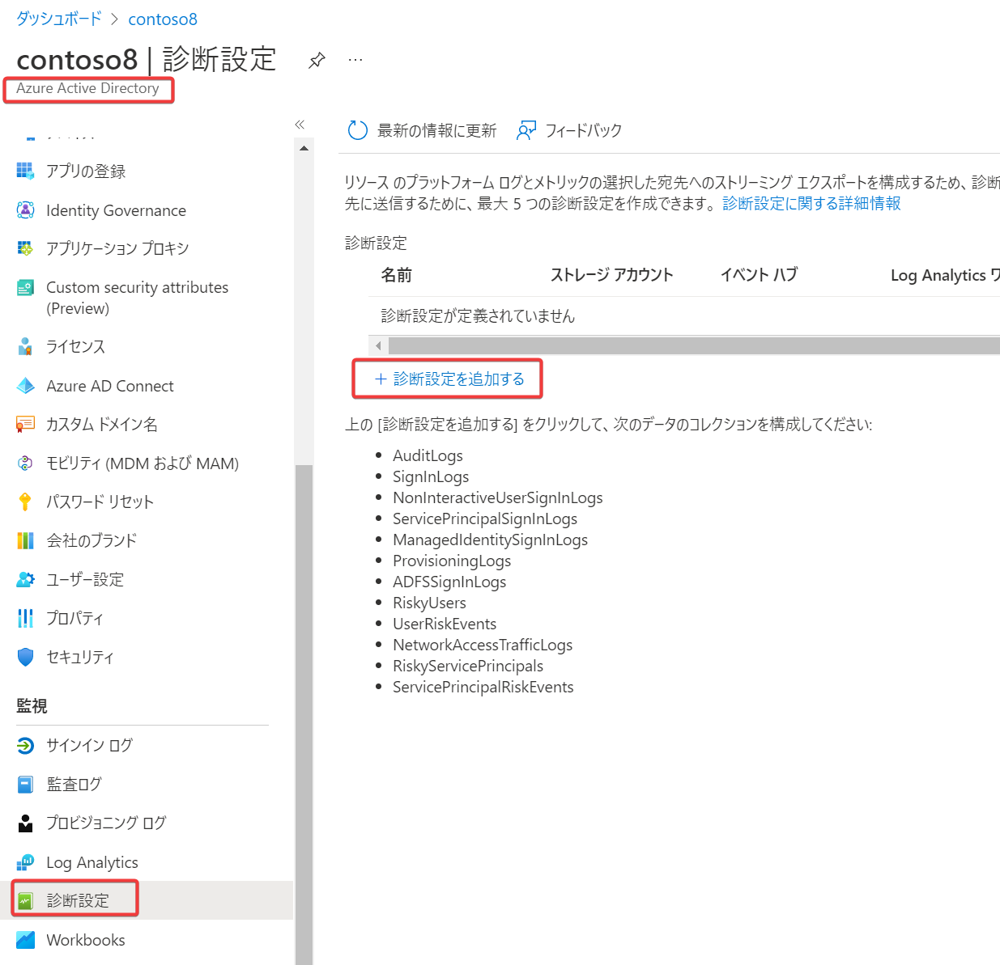

# Entra ID Identity Protection

ID（アカウント）に関する「リスク」を自動的に検出して対応する。

ドキュメント
https://docs.microsoft.com/ja-jp/azure/active-directory/identity-protection/overview-identity-protection

Entra IDサポートチームによる解説ブログ
https://jpazureid.github.io/blog/azure-active-directory/identity-protection-riskpolicy-introduction/

> Identity Protection は Microsoft が持つ脅威の検出ソリューションの一つ

> Identity Protection は Microsoft のデータセンターに蓄積された膨大なログや脅威に関するデータを基に、機械学習を用いて自動的にリスクの判定を行います

■Identity Protection （ID保護）とは？

Azure portal＞Entra ID＞セキュリティ＞Identity Protection

ID ベースのリスクの検出。以下のような「リスクのある」サインインを検出することができる。

- 匿名 IP アドレスからのサインイン
  - [Torブラウザー](https://www.torproject.org/)等によるIPアドレス匿名化を行った状態でのサインイン
- ユーザーの最近のサインインに基づき特殊と判断された場所からのサインイン
  - 過去にアクセスされたことがない国からのサインインなど
- 指定されたユーザーで最近観察されていないプロパティを使用したサインイン
  - ユーザーが使用するIPアドレスなどを自動で学習し、そこから逸脱したプロパティを検出
- パスワードスプレー
  - よく使われるパスワードを多数のユーザーIDに対して試行する攻撃

■修復作業

リスクが検出された場合に、以下の「修復作業」をトリガーすることができる。

- 多要素認証(MFA)を要求する
- セルフサービス パスワード リセット(SSPR)を使用したパスワードのリセットを要求する
- 管理者がアクションを実行するまで、サインインをブロックする

■レポート

管理者は、ポータルの「レポート」を使用してリスクを調査することができる。

- 検出内容を確認
- 必要に応じて手動で操作(ブロック等)

使用できるレポート（ビュー）:

- 「危険なユーザー」のビューには、すべての過去のサインインに基づくユーザーのリスク期間が表示されます。
- 「危険なサインイン」のビューには、過去 30 日間のリスクの高いサインインが表示されます。
- 「リスク検出」のビューには、過去 90 日間に見つかったリスクの検出が表示されます。

■データのエクスポート

詳細な分析のために、サードパーティ製ユーティリティにリスク検出データをエクスポートすることができる。

- セキュリティ情報とイベント管理 (SIEM) ツールに送り戻して、組織の適用するポリシーに基づく詳細な調査を行う
- 例: Identity Protection からMicrosoft Sentinelへのデータ接続
https://docs.microsoft.com/ja-jp/azure/sentinel/connect-azure-ad-identity-protection
  - Entra ID Identity Protection から Microsoft Sentinel にログをストリーミングし、Microsoft Sentinel にストリーミングしたアラームのダッシュボードに表示し、カスタム アラームを作成し、調査を改善できます。
  - PDF資料: [Microsoft Sentinelまとめ](../pdf/mod4/Microsoft%20Sentinel%20まとめ.pdf)

■通知

ユーザーのリスクとリスク検出の管理に役立つ 2 種類の電子メールが送信されます。

- 危険な状態のユーザーが検出された電子メール
- 週間ダイジェスト電子メール

Identity Protectionからメールが届いた際の対応方法:
https://jpazureid.github.io/blog/azure-active-directory/howto-deal-with-user-at-risk-detected-email/

■ポリシー

3種類の「ポリシー」を設定できる。

- 多要素認証（MFA）登録ポリシー
  - 新しいユーザーにMFAを登録させるかどうかの設定
  - ユーザー全体、または、特定のユーザーやグループを指定できる
  - 
- サインインリスクポリシー
  - 正規のユーザーによるサインインが行われていない確率をスコア化
    - スコアに基づいて、アクセスのブロック、追加のMFA要求などを発動
  - 例
    - 匿名IPからのアクセス
    - ありえない移動
      - 2つのサインインの間隔が、これらの場所を物理的に移動する最短時間よりも短い場合
  - 
- ユーザーリスクポリシー
  - IDが侵害されている（パスワードが流出している等）確率をスコア化
    - スコアに基づいて、アクセスのブロック、パスワードの変更などを発動
  - 例
    - ユーザーのID・パスワードがダークウェブに流出している場合、アクセスをブロックする
  - 

■「ユーザー リスク ポリシー」と「サインイン リスク ポリシー」のちがい

https://jpazureid.github.io/blog/azure-active-directory/identity-protection-riskpolicy-introduction/

サインイン リスク ポリシー:

- 「リアルタイム」のリスクを検知し、「サインイン リスク ポリシー」の定義に従った制御を行います。
- 例えば、ユーザーが Tor ブラウザーなどを利用してアクセス元の IP アドレスを隠してアクセスを試行したサインインに対して Identity Protection による制御を行えます。
- ここで行える制御は、対象のユーザーのサインインを「ブロック」するか「多要素認証」 (MFA) を要求させることです。
- 攻撃者がサインインを試行した際に MFA を強制することで、攻撃者が MFA を突破することは難しいためサインインを自動的に防ぐことができます。

ユーザー リスク ポリシー:

- リアルタイムの情報に加えて、「オフライン」のリスクと呼ばれるリスク情報を利用して、ユーザー アカウント単位でリスクを判定したうえで「ユーザー リスク ポリシー」の定義の制御を行います。
- 例えば Entra ID テナントに登録されているアプリケーションにサインインした後に、何らかの理由で該当ユーザーの ID とパスワードがダークウェブ上に流出したとします。
- Identity Protection は、ダークウェブ上の資格情報を監視しており、当該ユーザーのパスワードがダークウェブ上でやり取りされていることを確認すると、オフライン リスクである「漏洩した資格情報」を検出します。
- Identity Protection はこの一連のオペレーションを自動的に行います。
- ユーザー リスク ポリシーの制御方法としてはユーザー リスクを検知した際に対象のユーザーのアクセスを「ブロック」するか「パスワードの変更」を要求させることが可能です。

■実際にIdentity Protectionの機能をシミュレーションしてみるには

https://learn.microsoft.com/ja-jp/entra/id-protection/howto-identity-protection-simulate-risk

このドキュメントに、リスクをシミュレーションするための方法が記載されている。

たとえば「匿名IPアドレスからのサインイン」を検出するには、[Torブラウザー](https://ja.wikipedia.org/wiki/Tor_Browser)を使用する。

■ご参考: リスク データのエクスポート

https://learn.microsoft.com/ja-jp/azure/active-directory/identity-protection/howto-export-risk-data

Entra IDの「診断設定」を使用して、Log Analyticsやストレージアカウントに、リスクデータをエクスポートすることもできる。

■ご参考: Microsoft Graph API

https://learn.microsoft.com/ja-jp/graph/api/resources/identityprotection-overview

Microsoft Graph APIを使用して、Identity Protectionのデータを取得することもできる。

https://learn.microsoft.com/ja-jp/graph/azuread-identity-access-management-concept-overview

> Microsoft Graph では、Entra ID Premium P2 のお客様が Identity Protection によって検出されたリスク イベントのクエリを行って、リスク イベントの種類、重大度、発生した日時、場所、影響を受けたユーザーなどの情報を簡単に取得できるようになっています。

■ご参考: JBS様のマネージド型サービス

https://www.jbs.co.jp/solution/list/managedsecurity_idp

> Identity Protection は、攻撃の糸口である ID に対してセキュリティ強化を実現します。JBS がお客さまにかわり本製品の運用を行い、お客さま資産のセキュリティ強化と被害の低減をサポートします。
