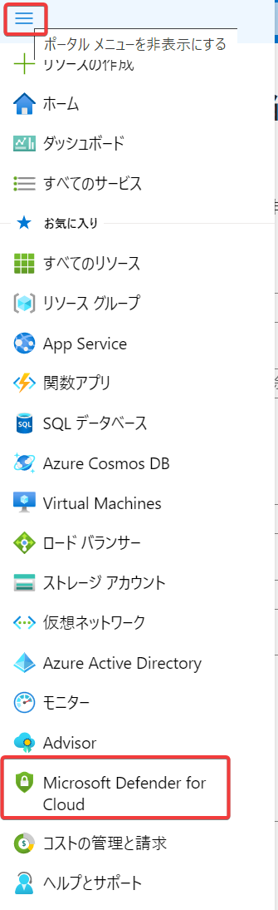
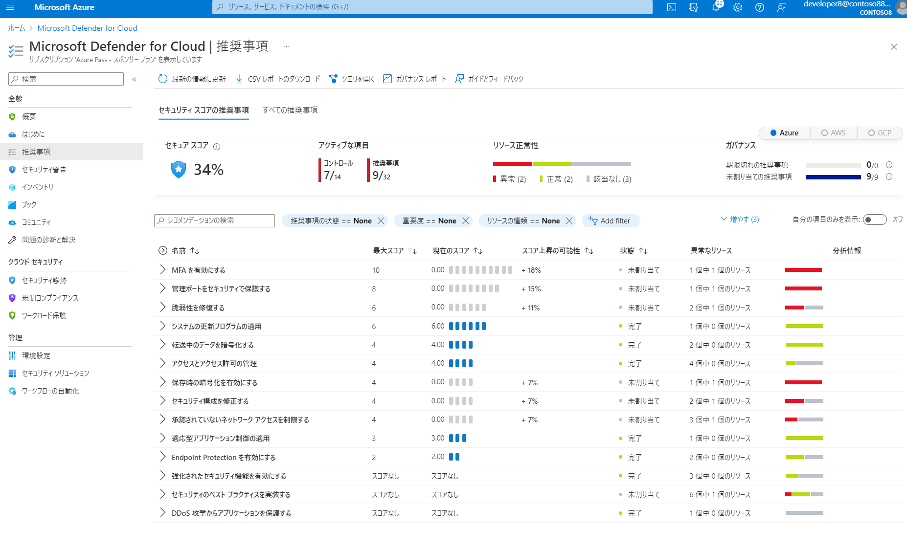

■Microsoft Defender for Cloud

Azure、オンプレミス、マルチクラウド (Amazon AWS および Google GCP) のすべてのリソース用のクラウド セキュリティ態勢管理 (CSPM) と クラウド ワークロード保護プラットフォーム (CWPP) 。





まとめ資料(PDF):
- [Microsoft Defender for Cloud (1枚スライド、Microsoft Defender for servers / Microsoft Defender for Endpointとの関係)](../pdf/mod2/Microsoft%20Defender%20for%20Cloud%20概要.pdf)
- [Microsoft Defender for Cloud (全体)](../pdf/mod4/Microsoft%20Defender%20for%20Cloud%20まとめ.pdf)

```
Microsoft Defender for Cloud: CSPM
└「強化されたセキュリティ機能 enhanced security features」: CWPP
```

※CSPM (Cloud Security Posture Management): クラウドセキュリティ態勢管理。クラウドの「設定ミス」を発見。

※CWPP (Cloud Workload Protection Platform): クラウド ワークロード保護プラットフォーム。クラウドの「ワークロード」（VM、コンテナー、サーバーレスのサービス等。Kubernetesクラスター等）を保護。

CSPMは無料。CWPP（「強化されたセキュリティ機能 enhanced security features」）は有料。

■参考: Azure Security CenterとAzure Defender

2021年11月2日に名称が変更されている。

CSPM: Azure Security Center → Microsoft Defender for Cloud

CWPP: Azure Defender (Azure Defender for ...) → Microsoft Defender for Cloudの「強化されたセキュリティ機能」(enhanced security features)

■Microsoft Defender for Servers

Microsoft Defender for Servers は、Microsoft Defender for Cloud の強化セキュリティ機能によって提供されるプランの 1 つです。 Defender for Servers によって、Azure、AWS、GCP、オンプレミスの Windows と Linux マシンが保護されます。

Microsoft Defender for Servers には、包括的なエンドポイントの検出と応答 (EDR) のために、Microsoft Defender for Endpoint が含まれています。

■Microsoft Defender for Serversのプラン

https://learn.microsoft.com/ja-jp/azure/defender-for-cloud/defender-for-servers-introduction#defender-for-servers-plans

- プラン1
- プラン2

■Microsoft Defender for Endpoint

Azure、ハイブリッド クラウド (オンプレミス)、マルチクラウドのいずれでホストされているかにかかわらず、Windows および Linux マシンを保護。

