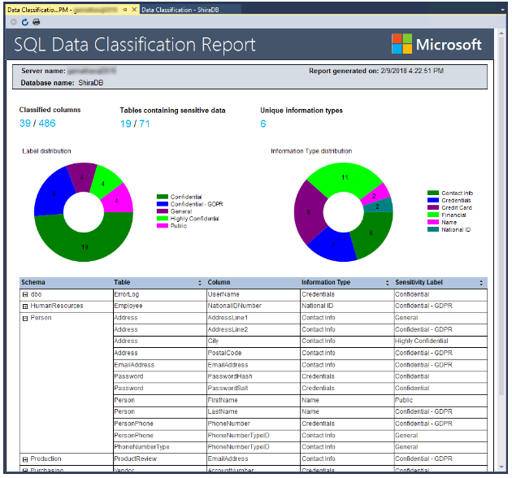
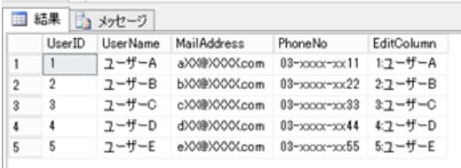

データベース セキュリティ

■Azure SQLのファミリー

比較表
https://docs.microsoft.com/ja-jp/azure/azure-sql/azure-sql-iaas-vs-paas-what-is-overview#comparison-table

- Azure SQL Database
  - PaaS (DBaaS)
  - 99.995% 可用性
  - 最もよく使用されるSQL Server機能を利用できる（＝互換性は高くない）
- Azure SQL Managed Instance
  - PaaS
  - SQL Serverとの高い互換性
  - 99.99% 可用性
- SQL server on Virtual Machines
  - IaaS
  - 最大 99.99% の可用性
  - オンプレミスの SQL Serverとの完全な互換性

# SQL Database 認証

https://docs.microsoft.com/ja-jp/azure/azure-sql/database/security-overview#authentication

- 認証
  - SQL認証
    - 「サーバー管理者」のユーザー名とパスワードを使った認証
    - 「サーバー」作成時に指定
  - Azure Active Directory認証
    - Azure ADのIDを使用した認証
- 承認
  - [データベース レベルのロール](https://docs.microsoft.com/ja-jp/sql/relational-databases/security/authentication-access/database-level-roles?view=sql-server-ver15) を、ユーザーに割り当てる。
  - ALTER ROLE文を使用
  - 注: SQL Serverで使用される [サーバーレベルのロール](https://docs.microsoft.com/ja-jp/sql/relational-databases/security/authentication-access/server-level-roles?view=sql-server-ver15)は、SQL DatabaseやAzure Synapse Analyticsでは使用できない。

# SQL Database ファイアウォール

https://docs.microsoft.com/ja-jp/azure/azure-sql/database/security-overview#network-security

■ファイアウォールの種類

- [IP ファイアウォール規則](https://docs.microsoft.com/ja-jp/azure/azure-sql/database/firewall-configure)
  - 各要求の送信元 IP アドレスに基づいてデータベースへのアクセス権を付与
  - データベース レベルの IP ファイアウォール規則
  - サーバーレベルの IP ファイアウォール規則
- [仮想ネットワーク ファイアウォールの規則](https://docs.microsoft.com/ja-jp/azure/azure-sql/database/vnet-service-endpoint-rule-overview)
  - 仮想ネットワーク内の特定のサブネットから送信される通信を許可するかどうかを制御
  - サーバー レベルにのみ適用

■[IPファイアウォールの評価の順序](https://docs.microsoft.com/ja-jp/azure/azure-sql/database/firewall-configure#how-the-firewall-works)

- データベース レベルの IP ファイアウォール規則で許可されたIPからのアクセスであれば、そのデータベースに接続可能
- サーバーレベルの IP ファイアウォール規則で許可されたIPからのアクセスであれば、サーバーに接続可能
- いずれでもない場合は接続が不可能

可能な限り、データベース レベルの IP ファイアウォール規則を使用することが推奨されている。

# Elastic Pool

[PDF資料](../pdf/mod3/Elastic%20Pool.pdf)

- 予期できない多様な使用ニーズを持つ複数のデータベースを管理しスケーリングするための、シンプルでコスト効率の高いソリューション
- エラスティック プール内のデータベースは、単一のサーバー上にあり、プールのリソースを共有

**Azure SQL Databaseでのみサポート**

# 購入モデル

https://docs.microsoft.com/ja-jp/azure/azure-sql/database/purchasing-models

- [仮想コアベース](https://docs.microsoft.com/ja-jp/azure/azure-sql/database/service-tiers-sql-database-vcore)
  - 推奨
- [DTU ベース](https://docs.microsoft.com/ja-jp/azure/azure-sql/database/service-tiers-dtu)
  - **Azure SQL Databaseでのみサポート。Azure SQL Managed Instancesではサポートされない**

# DTUとは

https://docs.microsoft.com/ja-jp/azure/azure-sql/database/purchasing-models#dtu-based-purchasing-model

- データベース トランザクション ユニット (DTU) 
- CPU、メモリ、読み取り、書き込みを組み合わせた測定値
- DTUを2倍にすると、利用できるリソースが2倍になる

# DTU ベースのサービス レベル

https://docs.microsoft.com/ja-jp/azure/azure-sql/database/service-tiers-dtu

- Basic
  - バックアップ: 最大7日間保有
- Standard
  - バックアップ: 最大35日間保有
  - 列ストアインデックス作成をサポート(S3以上)
- Premium
  - バックアップ: 最大35日間保有
  - インメモリOLTPをサポート
  - 列ストアインデックス作成をサポート

# データの検出と分類

https://docs.microsoft.com/ja-jp/azure/azure-sql/database/data-discovery-and-classification-overview

- データベースをスキャンして、データベース内の機密データの検出、分類、ラベル付け、およびレポート作成を行う
- ビジネス、財務、医療、個人情報など

# TLS

※TLS=Transport Layer Security. SSLの後継規格。データを暗号化して送受信するプロトコル。
https://e-words.jp/w/TLS.html

- SQL Database、SQL Managed Instance、Azure Synapse Analytics では、すべての接続に対して **常に** 暗号化 (SSL/TLS) が適用される。
- 接続文字列での Encrypt または TrustServerCertificate の設定に**関係なく**、すべてのデータがクライアントとサーバー間の "移動中" に暗号化されることが保証される。

# 動的なデータ マスキング(DDM)

https://docs.microsoft.com/ja-jp/sql/relational-databases/security/dynamic-data-masking

- データが表示される際にマスクをかける。090-1234-5678 → 090-XXXX-XXXX 等
- 特権のないユーザーに対してデリケートなデータをマスクし、データの公開を制限する
- DDM によって、データベース内のデータが変更されることはない。

https://blog.engineer-memo.com/2015/05/16/sql-database-%E3%81%AE%E5%8B%95%E7%9A%84%E3%83%87%E3%83%BC%E3%82%BF%E3%83%9E%E3%82%B9%E3%82%AF%E3%81%AE%E3%80%8C%E6%8B%A1%E5%BC%B5%E5%88%B6%E9%99%90%E3%81%AE%E4%BD%BF%E7%94%A8%E3%80%8D%E3%81%AB/

# Always Encrypted

https://docs.microsoft.com/ja-jp/sql/relational-databases/security/encryption/always-encrypted-database-engine

- クライアント コンピューターにインストールされている、Always Encrypted が有効のドライバーは、クライアント アプリケーション内の機微なデータを自動的に暗号化および暗号化解除する
- クライアントは データベース エンジン (SQL Database または SQL Server) に暗号化キーを開示することなく、クライアント アプリケーション内の機微なデータを暗号化することができる。
- 暗号化されたデータに対する一部のクエリを データベース エンジンで処理できる
- オンプレミスのデータベース管理者、クラウド データベース オペレーターなどを含む、高い特権を持つものの無許可のユーザーが暗号化データにアクセスできないようにすることができる。

https://docs.microsoft.com/ja-jp/sql/relational-databases/security/encryption/overview-of-key-management-for-always-encrypted

- 列暗号化キー
  - データを暗号化するために使用される内容暗号化キー
  - 列暗号化キー自体は、暗号化され、データベースに格納される
- 列マスターキー
  - 列暗号化キーの暗号化に使用される保護キー
  - **Windows 証明書ストア**、**Azure Key Vault**、または**ハードウェア セキュリティ モジュール** などの**信頼できるキー ストア**に格納する

# Transparent Data Encryption（TDE）

https://docs.microsoft.com/ja-jp/sql/relational-databases/security/encryption/transparent-data-encryption

- データを透過的に暗号化する
- データ ファイルを暗号化
- 保存データの暗号化
- Azure SQL Database / Azure SQL Managed Instanceではデフォルトで有効
- SQLを使用して有効化する. [手順](https://docs.microsoft.com/ja-jp/sql/relational-databases/security/encryption/transparent-data-encryption#enable-tde)

# Microsoft Defender for SQL

https://docs.microsoft.com/ja-jp/azure/azure-sql/database/azure-defender-for-sql

- 概要
  - 高度な SQL セキュリティ機能のための統合パッケージ
- 機能
  - [脆弱性評価](https://docs.microsoft.com/ja-jp/azure/azure-sql/database/sql-vulnerability-assessment?tabs=azure-powershell)
    - データベースの潜在的な脆弱性を検出
  - [Advanced Threat Protection](https://docs.microsoft.com/ja-jp/azure/azure-sql/database/threat-detection-overview): データベースに対する脅威を示す異常な行動を検出
- 対象サービス
  - Azure SQL Database
  - Azure SQL Managed Instance
  - Azure Synapse Analytics
- 有効化方法
  - サブスクリプション レベル
  - リソース レベル

# ラボ 11: Azure SQL データベースのセキュリティ保護

- 60min
- Azure Passサブスクリプションを使用します
- 手順書: https://microsoftlearning.github.io/AZ-500JA-AzureSecurityTechnologies/
- 補足資料: https://github.com/hiryamada/notes/blob/main/AZ-500/lab/lab11.md
