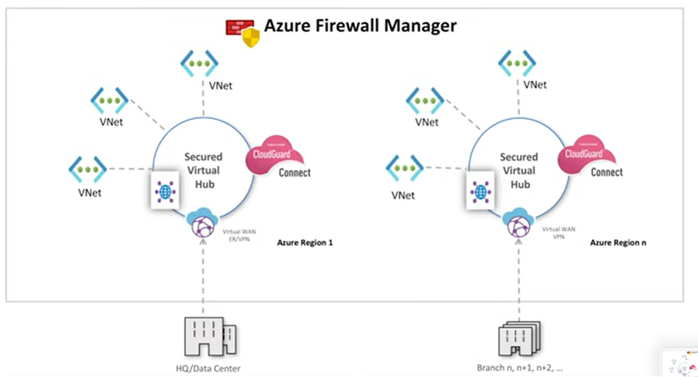

# Azure Firewall Manager

クラウドベースのセキュリティ境界に対して一元的なセキュリティ ポリシーとルート管理を提供するセキュリティ管理サービス。

Azure Firewall Managerを使用して以下の構成を管理できる。
- Azure Virtual WANの「仮想ハブ」にAzure Firewall（など）をくっつけた構成(セキュリティ保護付き仮想ハブ)
- ピアリングで構成された「ハブ&スポーク」トポロジーの「ハブ」仮想ネットワークに、Azure Firewall Managerで作成した「セキュリティポリシー」を関連付けて、Firewall Managerをデプロイする(ハブ仮想ネットワーク)

ドキュメント
https://docs.microsoft.com/ja-jp/azure/firewall-manager/overview

料金
https://azure.microsoft.com/ja-jp/pricing/details/firewall-manager/

わかりやすい解説
https://cloudsteady.jp/post/10089/

■歴史

2019/11/5 Azure Firewall Manager is now in preview
https://azure.microsoft.com/en-us/updates/azure-firewall-manager-is-now-in-preview/

2020/2/19 Azure Firewall Manager プレビューの更新
https://azure.microsoft.com/ja-jp/updates/azure-firewall-manager-preview-refresh/

2020/7/1 Azure Firewall Manager の一般提供を開始
https://azure.microsoft.com/ja-jp/blog/azure-firewall-manager-is-now-generally-available/

2022/6/1 Public preview: Manage Azure Web Application Firewall policies in Azure Firewall Manager
https://azure.microsoft.com/en-us/updates/public-preview-manage-azure-waf-policies-in-azure-firewall-manager/

■参考: Azure Virtual WAN

https://learn.microsoft.com/ja-jp/azure/virtual-wan/virtual-wan-about

「仮想WAN(vWAN)」と「仮想ハブ」により、多数のVNetの相互接続がシンプルになる。

仮想WAN、仮想ハブ、VNetの接続例:
```
仮想WAN(vWAN)
├仮想ハブ(vHub) - 東日本
│├VNet1
│└VNet2
└仮想ハブ(vHub) - 西日本
  ├VNet3
  └VNet4
```

仮想ハブ(vHub)でのVPN, ExpressRoute接続例:
```
仮想WAN(vWAN)
└仮想ハブ(vHub)
  ├VNet
  ├P2S VPNゲートウェイ - VPN接続 - ブランチ1(ノートPC等)
  ├S2S VPNゲートウェイ - VPN接続 - ブランチ2(オンプレミス拠点)
  └ExpressRouteゲートウェイ - 専用線接続 - ブランチ3(オンプレミス拠点)
```
■Azure Firewall Managerを使用した構成(1)セキュリティ保護付き仮想ハブ

「Azure Firewall Manager」の管理画面から、以下のような構成を作ることができる。

```
仮想WAN(vWAN)
├セキュリティ保護付き仮想ハブ(Secured vHub) - 東日本
│├VNet1
│└VNet2
└セキュリティ保護付き仮想ハブ(Secured vHub) - 西日本
  ├VNet3
  └VNet4
```

※既存の仮想WAN(vWAN)の仮想ハブ(vHub)を、セキュリティ保護付き仮想ハブ(Secured vHub)に変換することもできる。

■セキュリティ プロバイダー

「セキュリティ保護付き仮想ハブ(Secured vHub)」には、以下の「セキュリティ プロバイダー」から1～2個を関連付けする。
- [Azure Firewall](../AZ-104/mod04-04-firewall.md)
- 「セキュリティ パートナー プロバイダー」が提供するセキュリティ製品
  - [Zscaler](https://help.zscaler.com/zia/integrating-microsoft-azure-virtual-wan)
  - [Check Point](https://www.checkpoint.com/jp/cloudguard/microsoft-azure-security/wan/) CloudGuard Connect
  - [iboss](https://www.iboss.com/blog/securing-microsoft-azure-with-iboss-saas-network-security)

可能な組み合わせ:
- 「Azure Firewall」だけ
- 「Zscaler」だけ
- 「Check Point」だけ
- 「iboss」だけ
- 「Azure Firewall」と「Zscaler」
- 「Azure Firewall」と「Check Point」
- 「Azure Firewall」と「iboss」

※「セキュリティ パートナー プロバイダー」が提供するセキュリティ製品2つをvHubで有効化することはできない

これらを使用して、フィルタリングなどのセキュリティ管理を設定できる。

- Azure Firewallは、プライベート トラフィックのフィルタリングを担当する。
- 「セキュリティ パートナー プロバイダー」が提供するセキュリティ製品は、インターネット フィルタリングを担当する。

動画解説（Check Point CloudGuard Connectとの組み合わせ）
https://www.youtube.com/watch?v=TuuHytxx58I



■Azure Firewall Managerを使用した構成(2)ハブ仮想ネットワーク

https://learn.microsoft.com/ja-jp/azure/firewall-manager/secure-hybrid-network

仮想WAN(vWAN) を使わず、ピアリングで構成された「ハブ&スポーク」トポロジーの「ハブ」仮想ネットワークに、Azure Firewall Managerで作成した「ファイアウォール ポリシー」(セキュリティポリシーとも)を関連付けて、Firewall Managerをデプロイする方式。

■「ファイアウォール ポリシー」(セキュリティポリシーとも)

https://learn.microsoft.com/ja-jp/azure/firewall-manager/policy-overview

Azure Firewall Managerで、「ファイアウォール ポリシー」を作成し、「セキュリティ保護付き仮想ハブ(Secured vHub)」または「ハブ仮想ネットワーク」に関連付ける。

作成手順例:
https://learn.microsoft.com/ja-jp/azure/firewall-manager/secure-cloud-network#create-a-firewall-policy-and-secure-your-hub

設定できる項目:

- [DNS設定](https://learn.microsoft.com/ja-jp/azure/firewall-manager/dns-settings)
- [TLS検査](https://learn.microsoft.com/ja-jp/azure/firewall/premium-features#tls-inspection)
  - アウトバウンド トラフィックを復号化し、データを処理し、その後にデータを暗号化して宛先に送信
- 規則コレクション
  - アプリケーション規則
  - NAT規則
  - ネットワーク規則
- [IDPS（侵入検知）](https://learn.microsoft.com/ja-jp/azure/firewall/premium-features#idps)
  - シグネチャベースの IDPS
  - ネットワーク トラフィック内のバイト シーケンスやマルウェアによって使用される既知の悪意のある命令シーケンスなど、特定のパターンを探すことによって攻撃を迅速に検出
- [Webカテゴリー](https://learn.microsoft.com/ja-jp/azure/firewall/premium-features#web-categories)
- [URLフィルタリング](https://learn.microsoft.com/ja-jp/azure/firewall/premium-features#url-filtering)
- [脅威インテリジェンス ベース フィルター](https://learn.microsoft.com/ja-jp/azure/firewall/threat-intel)
  - 既知の悪意のある IP アドレス、FQDN、URL との間のトラフィックを警告・拒否

■比較

「セキュリティ保護付き仮想ハブ」構成と「ハブ仮想ネットワーク」構成の比較

https://learn.microsoft.com/ja-jp/azure/firewall-manager/vhubs-and-vnets#comparison
