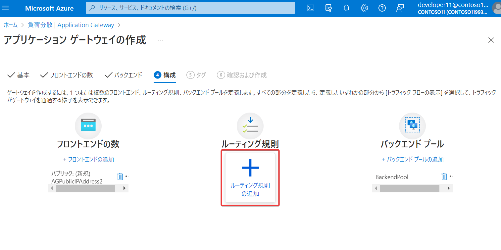
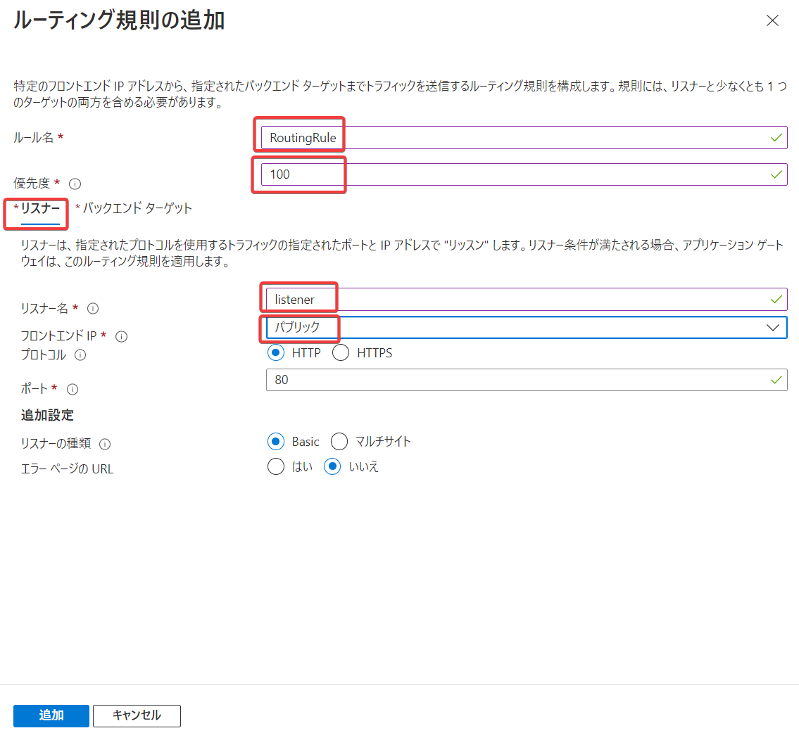
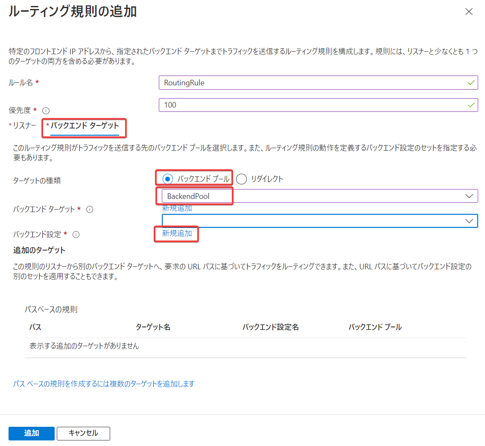
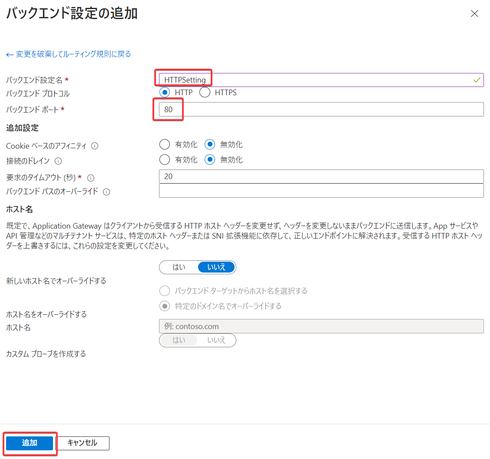
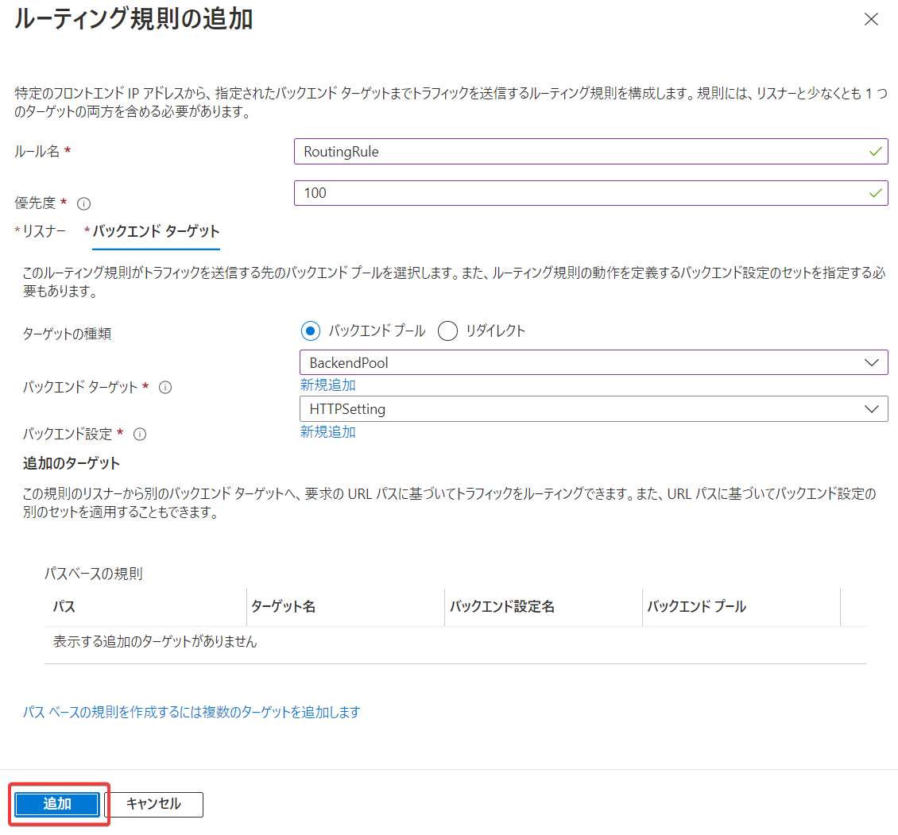

# ラボ (ハンズオン)

手順書: [M05-ユニット 4 Azure Application Gateway をデプロイする](https://github.com/MicrosoftLearning/AZ-700-Designing-and-Implementing-Microsoft-Azure-Networking-Solutions.ja-jp/blob/main/Instructions/Exercises/M05-Unit%204%20Deploy%20Azure%20application%20gateway.md)

概要:
- Application Gatewayを作成します
- VM（Webサーバー）を作成します
- Application GatewayのバックエンドとしてVMを追加します
- Application GatewayのIPアドレスにアクセスし、動作を確認します

時間: 25 分

はじめにお読みください: [全般的なラボの注意](lab.md)

このラボの注意:
- タスク1: 手順 15～24（ルーティング規則の追加）は以下のように設定します
  - 手順 15-16: 
  - 手順 17-19: 
  - 手順 20-21: 
  - ※手順書の「HTTP 設定」は「バックエンド設定」と読み替えます
  - 手順 22-23: 
  - 手順 24: 
  - 手順 27: Application Gatewayの作成に15分ほどかかります。作成が始まったら、（手順書には待つように指示がありますが）待たずに、タスク2を開始できます。
- タスク2: VMの作成に10分ほどかかります。ここでいったん休憩を取ることをおすすめします。
