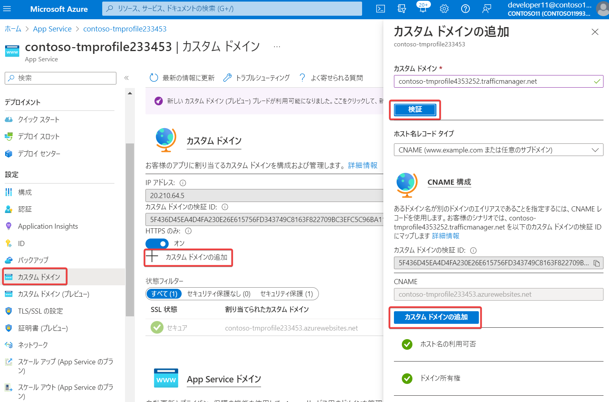
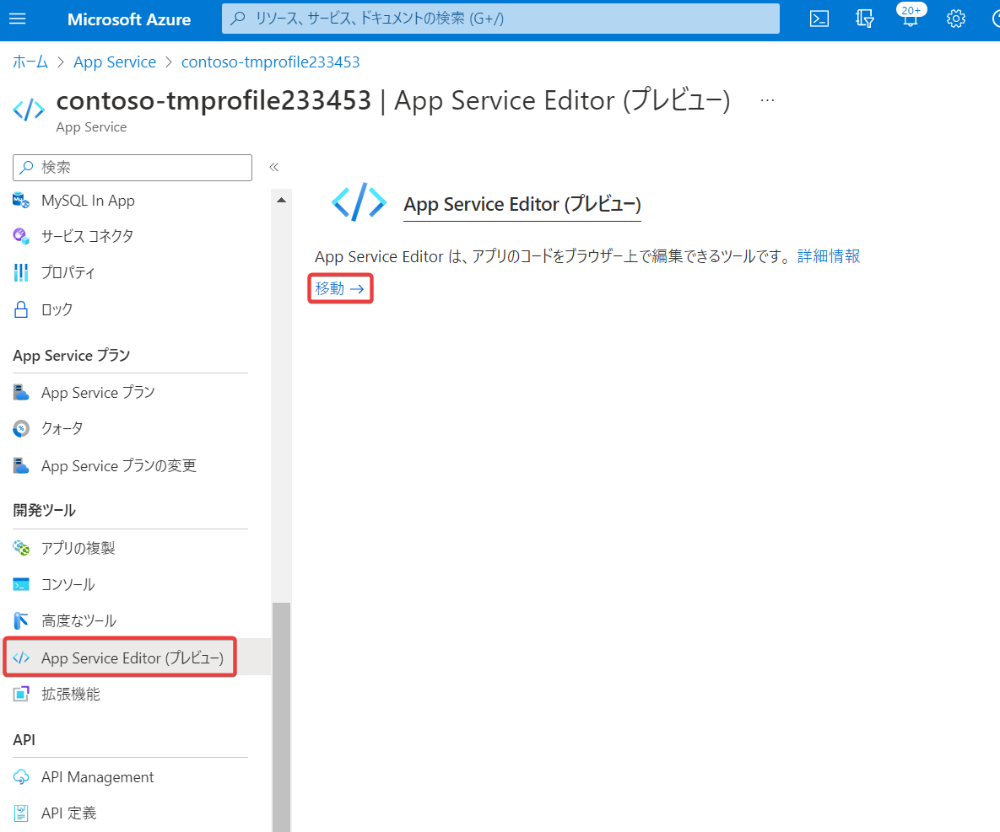
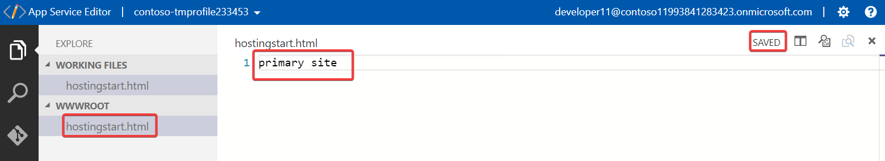
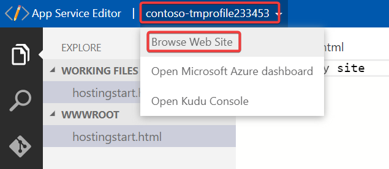
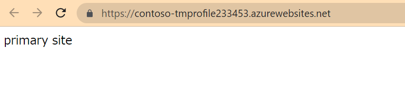
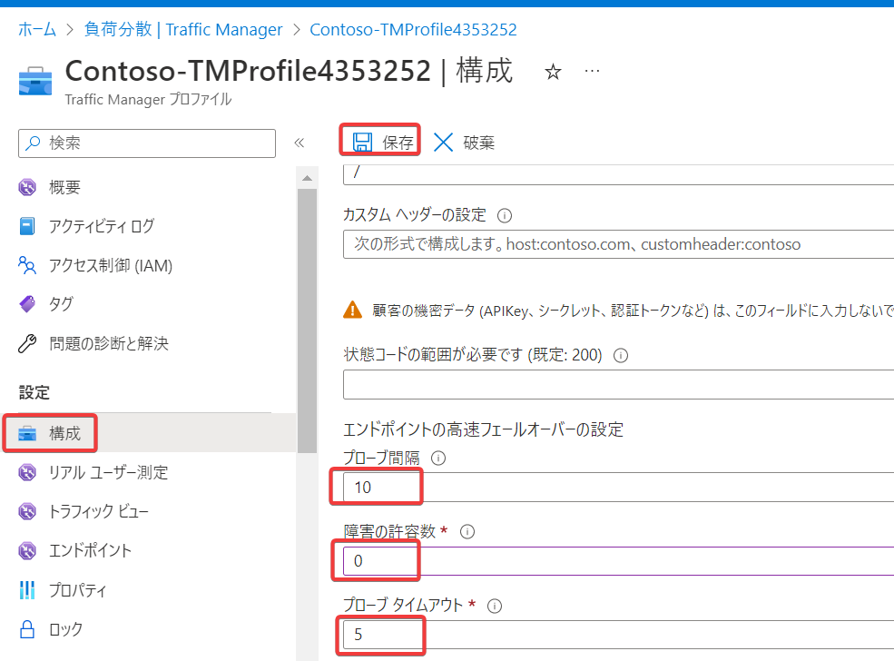

# ラボ (ハンズオン)

手順書: [M04-ユニット 6 Azure portal を使用して Traffic Manager プロファイルを作成する](https://github.com/MicrosoftLearning/AZ-700-Designing-and-Implementing-Microsoft-Azure-Networking-Solutions.ja-jp/blob/main/Instructions/Exercises/M04-Unit%206%20Create%20a%20Traffic%20Manager%20profile%20using%20the%20Azure%20portal.md)

概要:
- Traffic Managerを作成します
- 2 つの異なる Azure リージョンにデプロイされた Web アプリケーションにTraffic Managerで接続します。

時間: 35 分

はじめにお読みください: [全般的なラボの注意](lab.md)

このラボの注意:

■全体的

- App ServiceとTraffic Managerの組み合わせる場合、App Serviceは「Standard」あるいはそれ以上の価格レベルを使用する必要がある。
- 本ラボ手順ではSSL（TLS）の設定は行わないので、HTTPSや証明書に関連する問題は無視する。

■問題1: モニターの状態が「低下」となったままとなる（「オンライン」にならない）

※再現性が低い。必ず起こる問題ではないもよう。

Traffic Managerプロファイルの概要画面下部に表示されるエンドポイントの一覧で、「モニターの状態」列の値が「オンライン」にならず、「低下」のままとなる場合がある。


→解決方法: 以下の「問題2」と同様。

■問題2: Traffic Managerを使ったApp Serviceへのアクセスができない

※再現性が低い。必ず起こる問題ではないもよう。

App Service（～.azurewebsites.net）に直接アクセスした場合は「Your web app is running and waiting for your content」という文言を含むページが表示されるが、Traffic ManagerプロファイルのDNS名（～.trafficmanager.net）にアクセスすると「404 Web Site not found」という青いエラー画面が表示される。


→解決方法: App Serviceに「カスタム ドメイン」を追加する。Traffic ManagerプロファイルのDNS名（`～.trafficmanager.net`といった文字列。`http://`、 `https://`や、末尾の `/` は含めない ）をコピーし、それぞれのApp Serviceの「カスタム ドメイン」に割り当てる。



■問題3: どのエンドポイントにアクセスしているのかわからない

App Service（ASP.NET 4.8) のデフォルトページでは「Your web app is running and waiting for your content」という文言を含むページが表示される。

Traffic Managerに追加した2つのApp Service（プライマリとセカンダリ）がどちらも同じページを出力するため、Traffic Managerでプライマリとセカンダリのどちらに誘導されているのか、わからない。


→解決方法: 「App Service Editor」を使用して、それぞれの App Service の「hostingstart.html」ファイルの内容を変更する。





※自動で保存される





※セカンダリのApp Serviceも同様に「Secondary site」と設定

■問題4: フェールオーバー・フェールバックがWebブラウザーで確認できない（表示が切り替わらない・切り替わりに時間がかかる）

→原因: いくつか考えられる。単に Traffic Managerの正常性プローブに時間がかかっている、Webブラウザーのキャッシュが影響している、WebブラウザーまたはOSのDNSキャッシュが影響している、など。

→解決方法(1): Traffic Managerのプローブ間隔を短くする（より頻繁にプローブする）。「障害の許容数」を0にする（障害検出時にすぐにフェールオーバーする）。「プローブ タイムアウト」を短くする（レスポンスを待つ時間を短くする）。



→解決方法(2): OSやブラウザーのキャッシュの影響を避けるため、Cloud Shell のコマンドを使用して動作確認する

以下はBashでの操作例。

・2つのエンドポイントがどちらもオンラインの場合

nslookupコマンドで名前解決を行うと、プライマリ（East US）の情報が表示される。

```
$ nslookup contoso-tmprofile4353252.trafficmanager.net

(略)
contoso-tmprofile4353252.trafficmanager.net     canonical name = contosowebappeastus65746.azurewebsites.net.
(略)
```

curlコマンドでページを取得すると、プライマリ（East US）のコンテンツが表示される。`-L`: リダイレクトに従う。`-k`: 証明書のエラーを無視する。

```
curl -Lk http://contoso-tmprofile4353252.trafficmanager.net
Primary site
```

・プライマリのエンドポイントを「無効」に設定。

※設定後、切り替わるまで数分かかる場合がある

nslookupコマンドで名前解決を行うと、セカンダリ（West Europe）の情報が表示される。

```
$ nslookup contoso-tmprofile4353252.trafficmanager.net

(略)
contoso-tmprofile4353252.trafficmanager.net     canonical name = contosowebappwesteurope2343767999.azurewebsites.net.
(略)
```

curlコマンドでページを取得すると、セカンダリ（West Europe）のコンテンツが表示される。

```
$ curl -Lk http://contoso-tmprofile4353252.trafficmanager.net
Secondary site
```

・プライマリのエンドポイントを「有効」に戻す。

※設定後、切り替わるまで数分かかる場合がある

nslookupコマンドで名前解決を行うと、プライマリ（East US）の情報が表示される。

```
$ nslookup contoso-tmprofile4353252.trafficmanager.net

(略)
contoso-tmprofile4353252.trafficmanager.net     canonical name = contosowebappeastus65746.azurewebsites.net.
(略)
```

curlコマンドでページを取得すると、プライマリ（East US）のコンテンツが表示される。

```
$ curl -Lk http://contoso-tmprofile4353252.trafficmanager.net
Primary site
```

