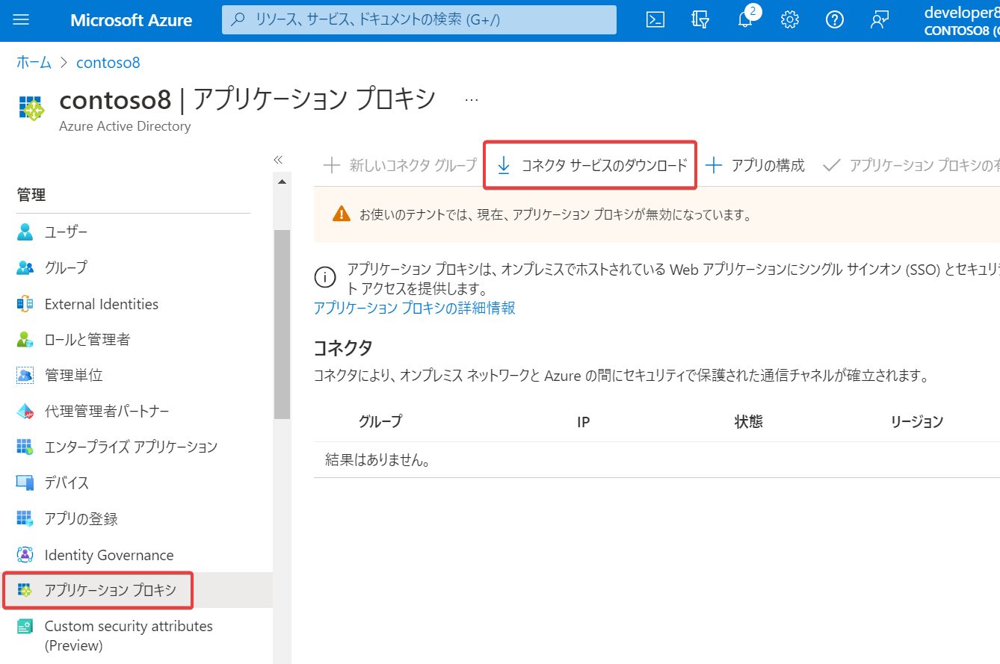

# Azure AD アプリケーション プロキシ



https://learn.microsoft.com/ja-jp/azure/active-directory/app-proxy/application-proxy

Azure Active Directory アプリケーション プロキシを使用すると、オンプレミスで稼働している社内のアプリ（社内業務システム等）に、社外からもアクセスできるようになる。

```
エンドユーザー
↓ Azure ADでサインインし、「アプリポータル」からオンプレミスの業務システムにアクセス
Azure AD
| インターネット
オンプレミスNW
├アプリケーションプロキシ コネクタ on Windows Server
└業務システム on Windows Server
```

- オンプレミス Web アプリへのセキュアなリモート アクセスを提供
- VPNや専用線接続は不要
- シングル サインオンをサポート
- オンプレ側のファイアウォールの設定変更が不要
  - オンプレからインターネットへのTCP 443(HTTPS)接続ができればOK

アプリケーション プロキシを使用するには、オンプレ側に、Windows Server 2012 R2 以降を実行しているサーバーが必要。「アプリケーション プロキシ コネクタ」をインストールする。コネクタにより、オンプレミス ネットワークと Azure の間にセキュリティで保護された通信チャネルが確立される。

Azure AD Premium P1ライセンスが必要。

https://solution.kamome-e.com/blog-sso-idm-20221221/

> 境界防御型のVPNから、ゼロトラスト型のアプリケーション プロキシに移行することで、オンプレシステムのセキュリティを引き上げることができる。

https://www.softbanktech.co.jp/special/blog/cloud_blog/2018/0040/

> DMZ に配置をせずとも社内の Web アプリケーションを公開することが可能

https://azuread.net/archives/9955

> インストールしたサーバー(下の図で言うとProxyコネクタ)がAzure ADとの間でセッションを確立し、クライアントからの接続待ち受けをします。

> そして実際にクライアントからの接続要求があると、Azure AD App Proxy → Azure AD → コネクタ → Webアプリケーションのルートでアクセスを実現します。

> コネクタからAzure ADへの接続になるので、アウトバウンドTCP443の通信だけを行うため、ファイアウォールに特別な設定を行うことなく通信が実現できるというメリットがあります。