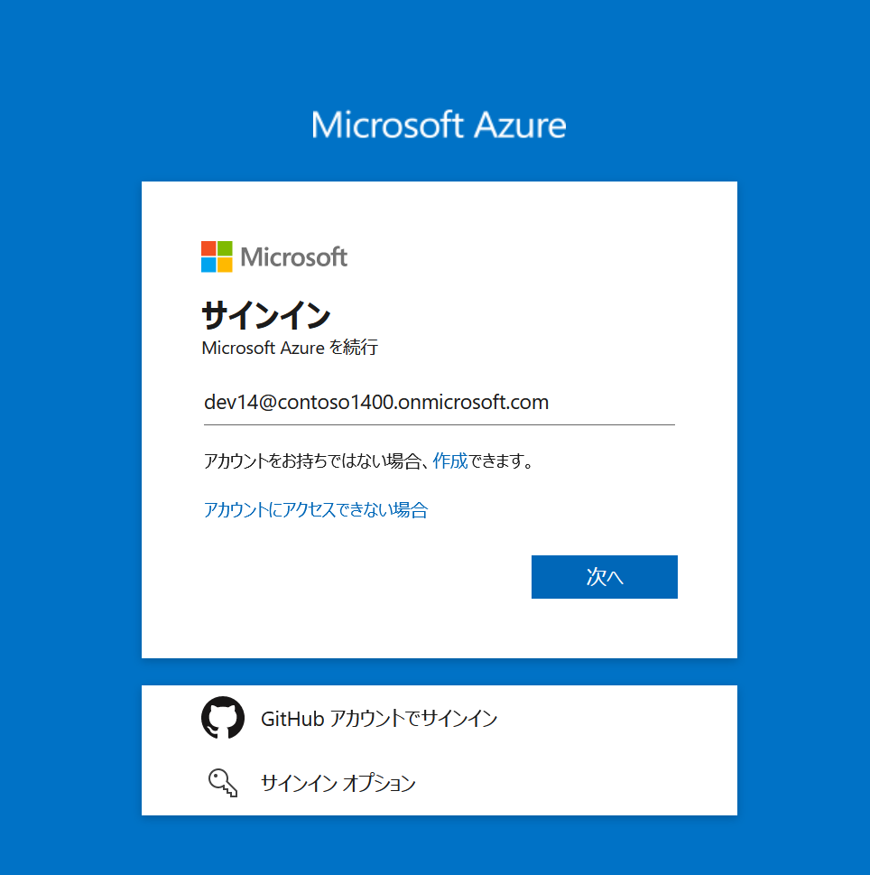
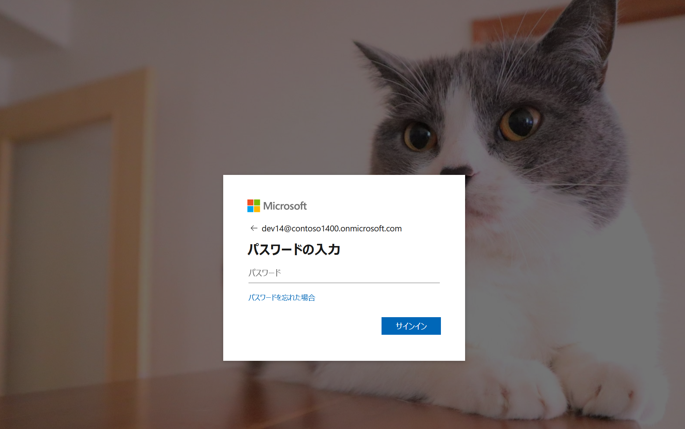

# Azure AD ブランドの変更

https://learn.microsoft.com/ja-jp/azure/active-directory/fundamentals/how-to-customize-branding

https://jpazureid.github.io/blog/azure-active-directory/introducing-enhanced-company-branding-for-sign-in-experiences/

https://level69.net/archives/29831

サインインページに、独自のロゴや文言を表示したり、背景画像を変更したりすることができる。

ユーザーエクスペリエンス（インターフェース）を改善できる。

カスタマイズされたサインイン ページは、ユーザーがE メールまたは電話を入力して [次へ] を選択した後にのみ表示される。

※反映されるまで少し時間がかかります。

一部の Microsoft アプリケーションでは、`whr` クエリ文字列パラメーターがサポートされている。

https://learn.microsoft.com/ja-jp/azure/active-directory/fundamentals/how-to-customize-branding#user-experience

例:
- https://myapps.microsoft.com/?whr=自組織のテナント名
- https://myapps.microsoft.com/?whr=contoso1400.onmicrosoft.com

※「自組織のテナント名」の調べ方

※「マイ アプリ ポータル」のアドレス「myapps.microsoft.com」は、現在は「myapplications.microsoft.com」となっている。

https://azuread.net/archives/9380

「myapplications.microsoft.com」では「tenantId」または「tenant」パラメータを使用する。

https://support.microsoft.com/ja-jp/account-billing/%E3%83%9E%E3%82%A4-%E3%82%A2%E3%83%97%E3%83%AA-%E3%83%9D%E3%83%BC%E3%82%BF%E3%83%AB%E3%81%AB%E9%96%A2%E3%81%99%E3%82%8B%E5%95%8F%E9%A1%8C%E3%81%AE%E3%83%88%E3%83%A9%E3%83%96%E3%83%AB%E3%82%B7%E3%83%A5%E3%83%BC%E3%83%86%E3%82%A3%E3%83%B3%E3%82%B0-d228da80-fcb7-479c-b960-a1e2535cbdff

- https://myapplications.microsoft.com?tenantId=your_domain_name
- https://myapplications.microsoft.com?tenant=your_tenant_ID
