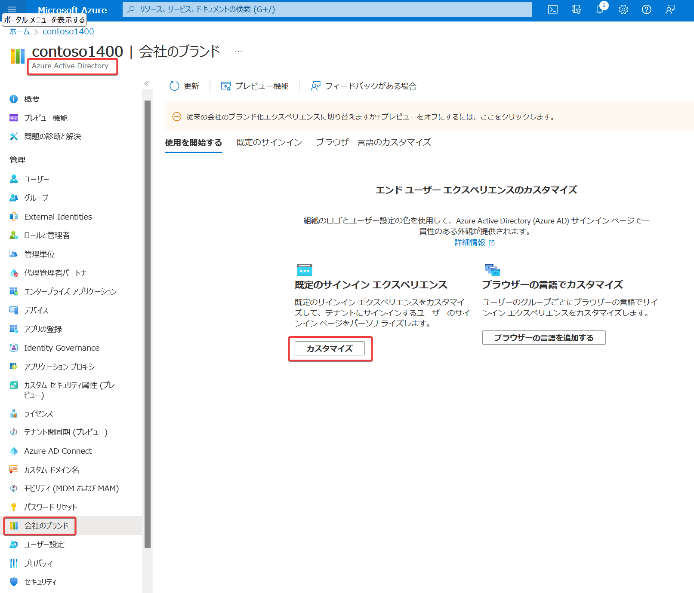
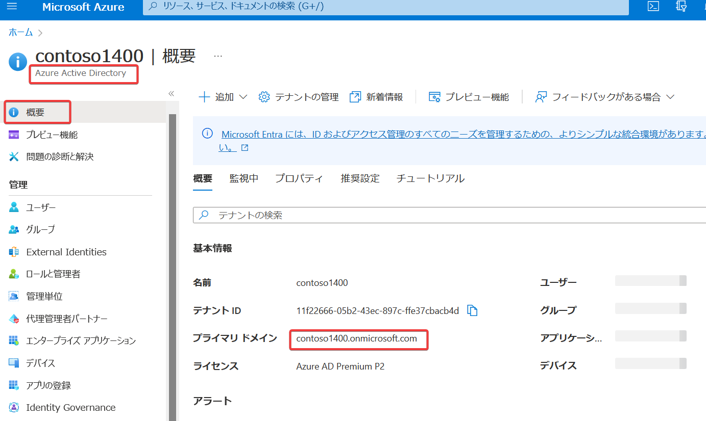

# Azure AD ブランドの変更

https://learn.microsoft.com/ja-jp/azure/active-directory/fundamentals/how-to-customize-branding

https://jpazureid.github.io/blog/azure-active-directory/introducing-enhanced-company-branding-for-sign-in-experiences/

https://level69.net/archives/29831

サインインページに、独自のロゴや文言を表示したり、背景画像を変更したりすることができる。

ユーザーエクスペリエンス（インターフェース）を改善できる。

カスタマイズされたサインイン ページは、ユーザーがE メールまたは電話を入力して [次へ] を選択した後にのみ表示される。※反映されるまで時間がかかるようです。

一部の Microsoft アプリケーションでは、`whr` クエリ文字列パラメーターがサポートされている。

例:
- https://myapps.microsoft.com/?whr=自組織のテナント名
- https://myapps.microsoft.com/?whr=contoso1400.onmicrosoft.com

※「自組織のテナント名」の調べ方

