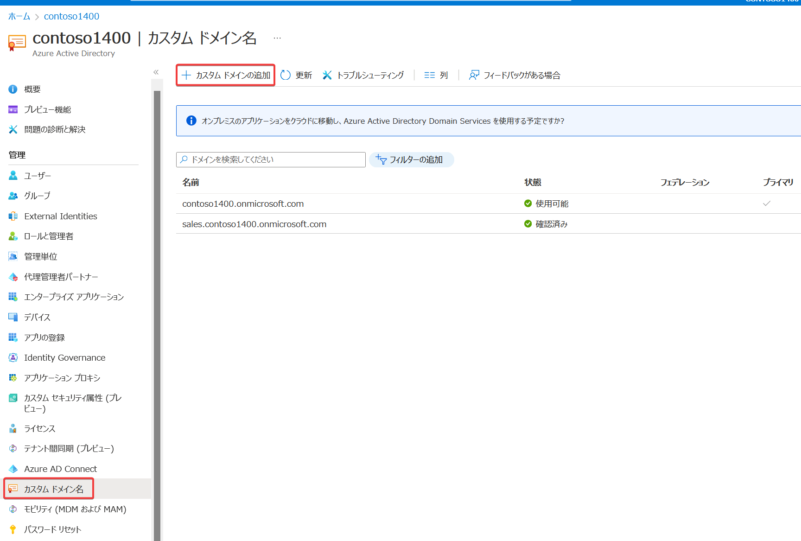
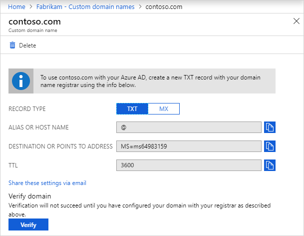

# Azure ADテナントへのカスタムドメインの割り当て

https://learn.microsoft.com/ja-jp/azure/active-directory/fundamentals/add-custom-domain

テナントのドメイン:

- 初期ドメイン
  - テナントには、初期ドメイン名 <domainname>.onmicrosoft.com が付与される。
  - 初期ドメイン名は変更したり削除したりできない。
- カスタム ドメイン
  - カスタム ドメイン名を追加すると、user1@contoso.com など、ユーザーになじみのあるユーザー名を作成するのに役立つ。
  - 通常、組織ですでに所有しているドメイン名を割り当てる。
  - 設定すると、DNSのTXTまたはMXレコードが表示されるので、これを、所有しているドメインのDNSサーバーに設定する。
  - 設定したら「確認」（veryfy）ボタンをクリック。
  - Azure ADによって、そのTXTまたはMXレコードが検証されてから、カスタム ドメインが有効となる。
  - たとえば contoso.com をカスタムドメインとして

