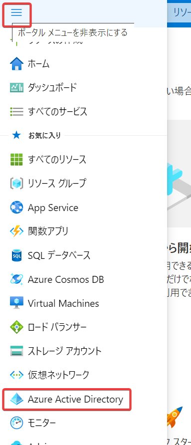
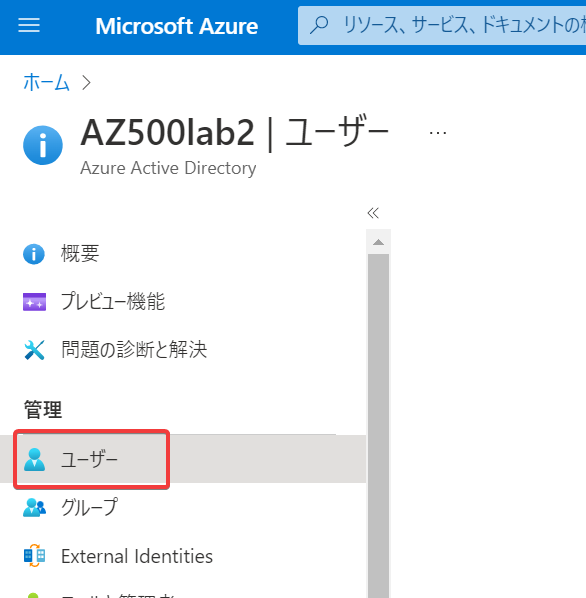
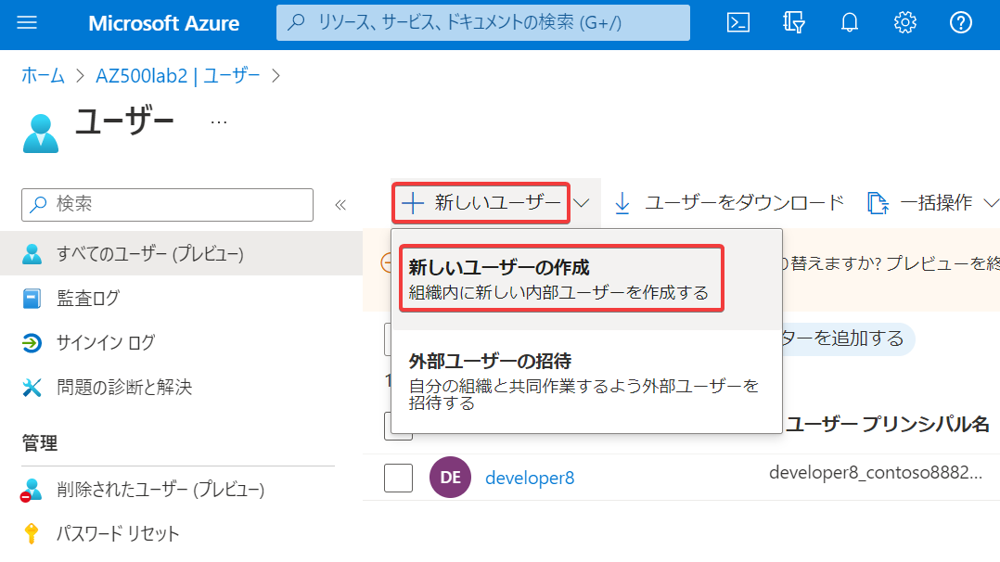
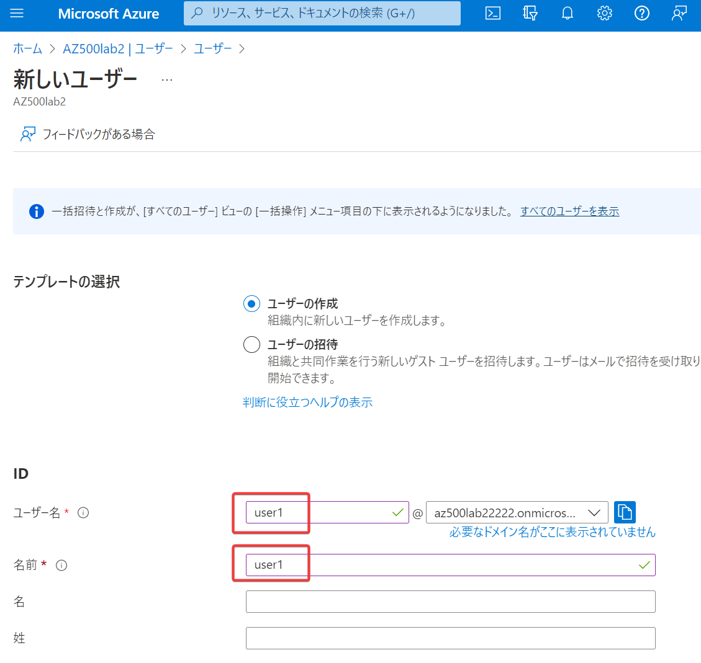
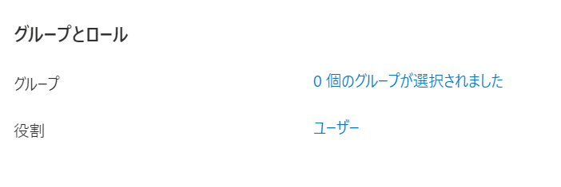
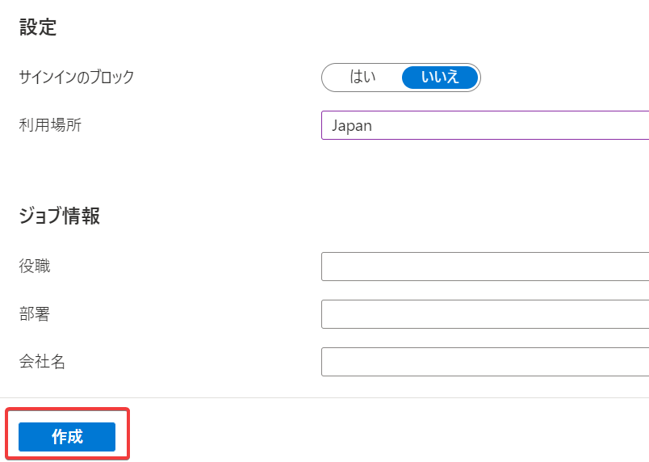
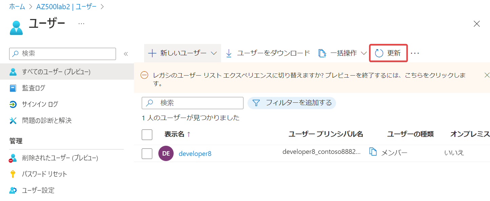
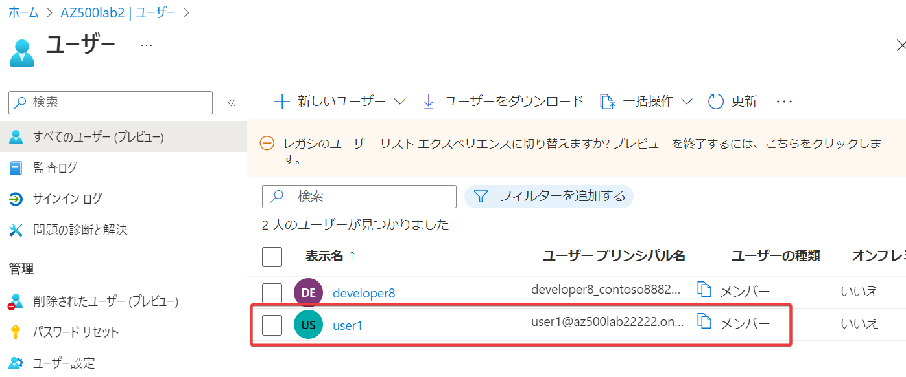

# ハンズオン: ユーザーの追加

ここでは新しいグローバル管理者であるユーザー「user1」を作成します。

- Azure portal にアクセス https://portal.azure.com/
- Azure ADの画面に移動
- ユーザー へ移動 
- ＋新しいユーザー＞新しいユーザーの作成 
- ユーザー名と名前に「user1」と入力 
- ユーザー名の右側のコピーボタンをクリックして、ユーザーのUPN（ユーザープリンシパル名、ユーザー名@ドメイン名）をコピーし、テキストエディタ等に記録しておく
- パスワードを表示 にチェックし、表示された初期パスワードをコピーし、テキストエディタ等に記録しておく
- 利用場所 で「Japan」を選択。
  - ※ユーザーにAzure AD Premium P2ライセンスの割り当てを行うには利用場所の設定が必要。
- 役割 で「ユーザー」をクリック
  - 「グローバル管理者」にチェックし、「選択」をクリック
- 作成 をクリック
- ユーザーの作成直後は、一覧画面にそれが反映されない場合が多い。「更新」を何度かクリック。
- すると作成したユーザーが表示される。

コピーしておいたユーザー名・初期パスワードは別のハンズオンで使用します。

