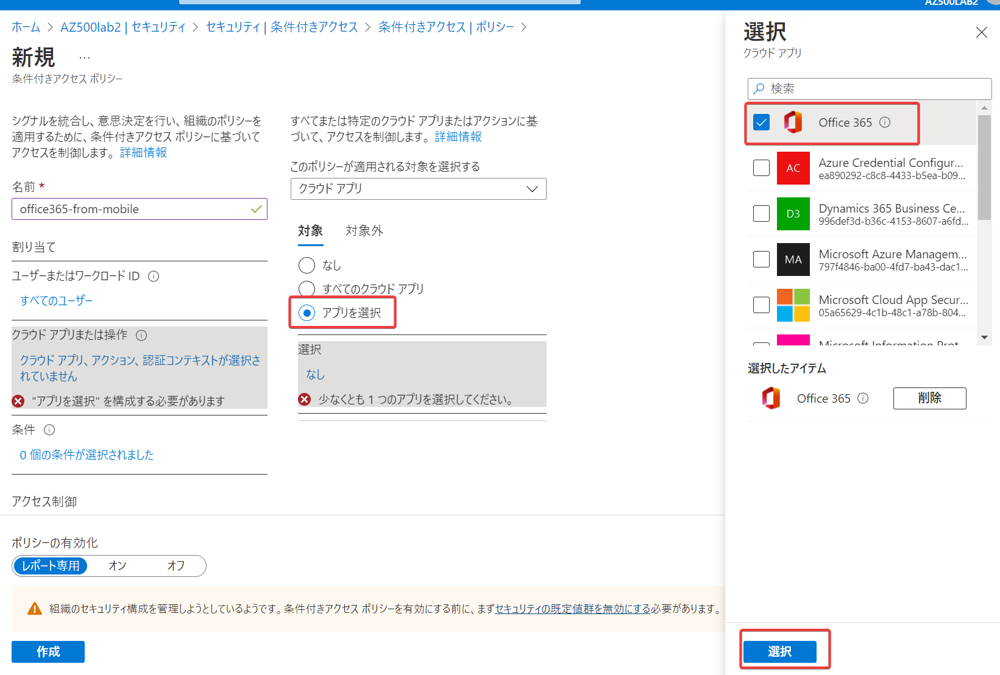
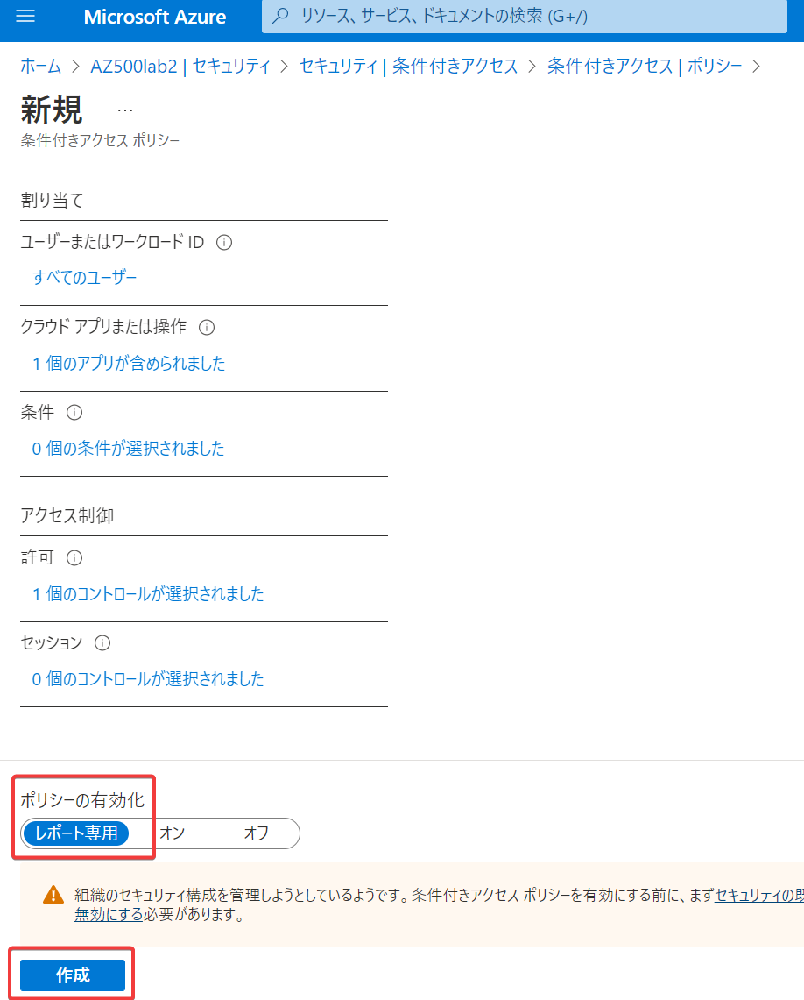

# ハンズオン: Azure AD 条件付きアクセス

Office 365 (Microsoft 365)にアクセスする際に多要素認証を要求する、という「条件付きアクセスポリシー」を作成します。

- Azure portal にアクセス https://portal.azure.com/#home
- Azure ADに移動
- セキュリティに移動
- 条件付きアクセスに移動。  
- 左メニュー「ポリシー」をクリック、「＋新しいポリシー」をクリック
- 名前: office365-from-mobile
- 「割り当て」の「ユーザーまたはワークロードIDが選択されていません」をクリック
  - 「すべてのユーザー」をクリック
- クラウドアプリまたは操作＞「クラウドアプリ、アクション、認証コンテキストが選択されていません」をクリック
  - 「アプリを選択」をクリック、Office 365にチェックして「選択」をクリック
- 「許可」の「0個のコントロールが選択されました」をクリック
  - 「アクセス権の付与」を選択、「多要素認証を要求する」にチェック、「選択」をクリック
- 「ポリシーの有効化」で「レポート専用」を選択、「作成」をクリック
- 新しい「条件付きアクセスポリシー」が作成された。

「レポート専用」ではなく「オン」で作成すると、実際にこのテナントのユーザーがOffice 365にアクセスする際に多要素認証が求められるようになります。
