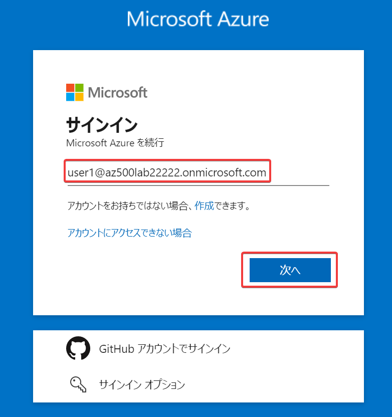

# ハンズオン: ユーザーの初回サインイン・初期パスワード変更

前のハンズオンで作成したユーザーのUPN（ユーザー名@ドメイン名）と初期パスワードが必要です。

- Ctrl + Shift + Nを押して、新しいWebブラウザーウィンドウ（シークレットモード、InPrivateウィンドウ）を開く
- Azure portal を開く https://portal.azure.com/
- 「サインイン」が表示されればOK 
  - ここで「アカウントを選択する」が表示された場合は「別のアカウントを使用する」をクリック
  - ここで「パスワードの入力」が表示された場合は、ユーザー名の左の矢印をクリックして「アカウントを選択する」に移動してから「別のアカウントを使用する」をクリック
  - ここでAzure portalが表示された場合は、画面右上のユーザーアイコンをクリックして「サインアウト」をクリック 
- 前のハンズオンで作成したユーザーのUPN（ユーザー名@ドメイン名）を貼り付けて「次へ」をクリック
- 前のハンズオンで作成したユーザーの初期パスワードを貼り付けて「サインイン」をクリック
- 「パスワードの更新」画面:
  - 「現在のパスワード」に初期パスワードを貼り付ける。
  - 「新しいパスワード」と「パスワードの確認入力」には、新しいパスワードを適当に決めて入力する。
  - パスワードは12文字以上、英大文字・小文字・数字・記号が混じったものとする。簡単なパスワードはすぐ突破される危険があるため十分複雑なものとすること。`Passw0rd123!` などは突破される危険性がある。例としては `Jg,weMG9__23jagm!)#` といったものがよい。この例のパスワードはそのまま使わないこと。
  - 適当に決めた新しいパスワードはメモ帳などに記録しておく。
  - 「サインイン」をクリック。
- 「サインインの状態を維持しますか？」が表示された場合は「いいえ」をクリック 
- 「Microsoft Azureへようこそ」が表示されたら「後で行う」をクリック 

※この時点で、初期パスワードは無効となる。これ以降は、上記の手順で決めたパスワードでサインインする。
