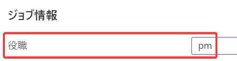
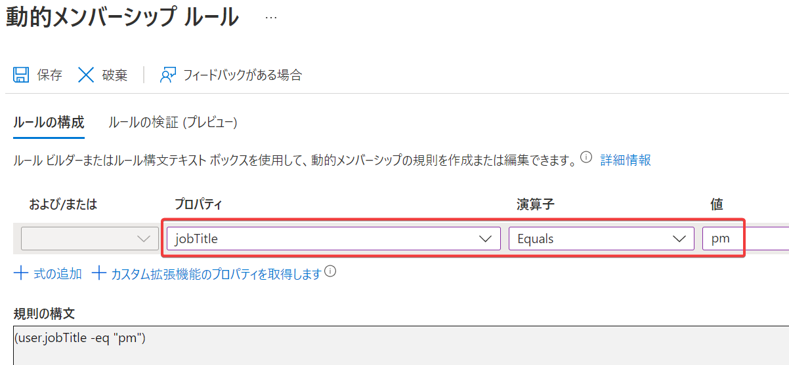
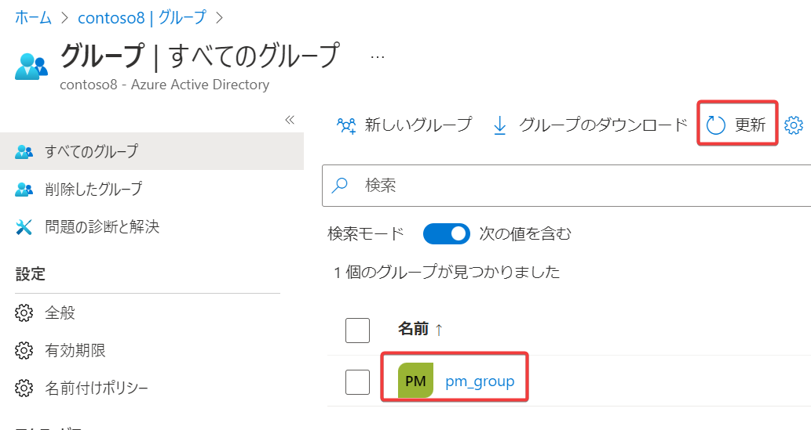
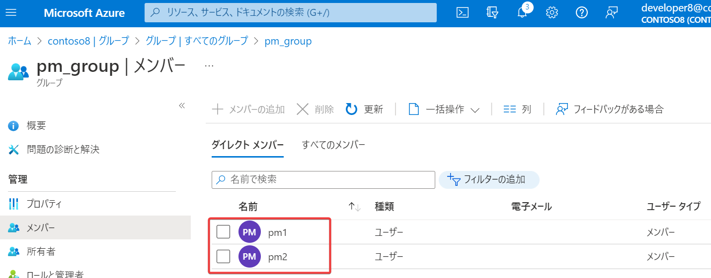

# ハンズオン: 動的グループ

条件（動的クエリ）を指定して、条件に一致するユーザーを自動的にグループに含める機能。

例: 役職=「pm」(Project Manager) である複数のユーザーを自動的に pm_group グループに入れる例

- ユーザー作成
  - ユーザー名:  pm1
  - 名前:  pm1
  - 役職:  pm
- ユーザー作成
  - ユーザー名:  pm2
  - 名前:  pm2
  - 役職:  pm
- グループ作成
  - グループの種類 セキュリティ
  - グループ名 pm_group
  - メンバーシップの種類: 動的ユーザー
  - 「動的クエリの追加」をクリック
    - 「＜プロパティを選択してください＞」: jobTitle (役職)
    - 「演算子を選択してください」: Equals
    - 「値を追加」: pm
    - 保存
  - 作成
  - 3分ほど待つ
  - 「更新」をクリックして、作成したグループ pm_group を表示
  - pm_groupをクリック
  - メンバー
  - pm1とpm2が一覧に含まれることを確認 