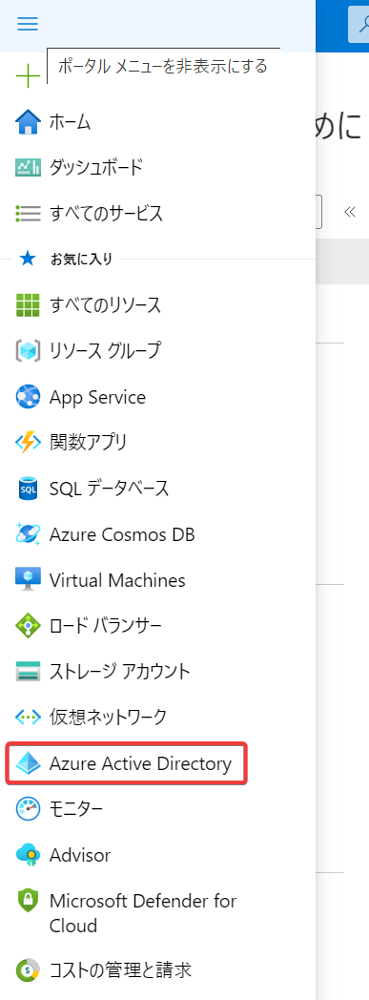
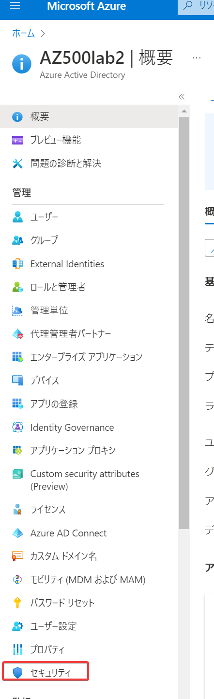
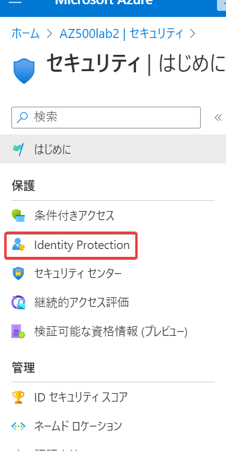
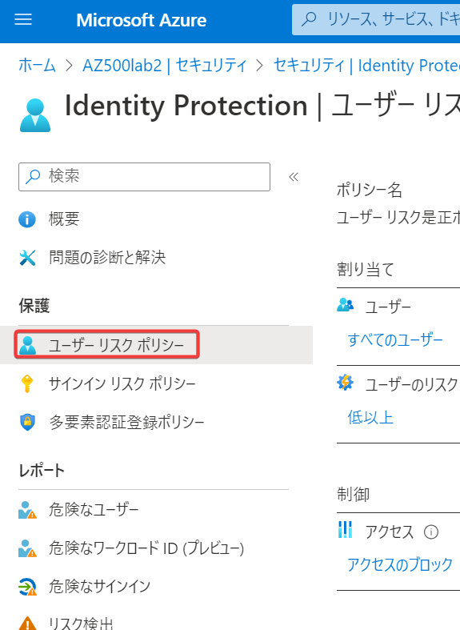
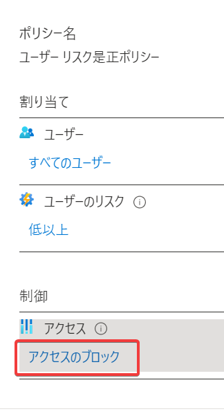
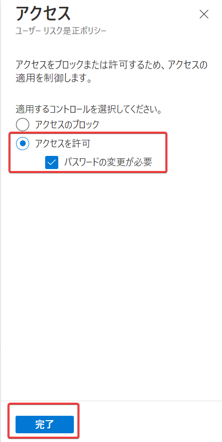
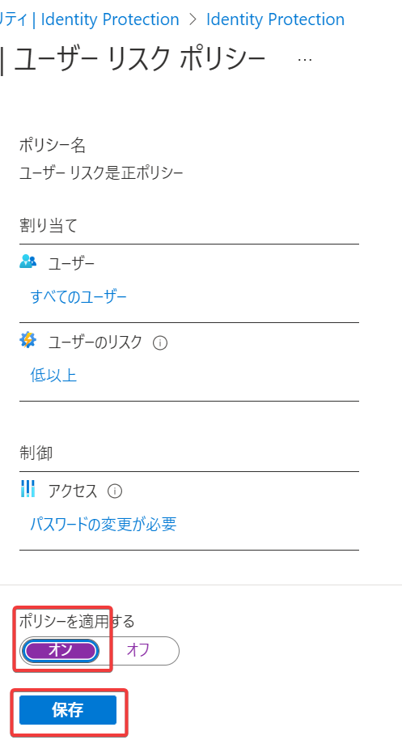

# ハンズオン: Azure AD Identity Protection

Identity Protectionの「ユーザーリスクポリシー」を設定し、オンにします。これにより、ユーザーのパスワードがダークウェブ等に流出していることが検出された場合に、ユーザーにパスワードの変更を要求します。

- Azure portal にアクセス https://portal.azure.com/#home
- Azure ADに移動
- セキュリティに移動
- Identity Protectionに移動
- 「ユーザーリスクポリシー」に移動
- 「制御」の「アクセスのブロック」をクリック
  - 「アクセスの許可」を選択（「パスワードの変更が必要」にチェック）、「完了」をクリック
- 「ポリシーを適用する」を「オン」に設定し「保存」をクリック 

