# ハンズオン: ユーザーのMFA設定

お手元にスマホかタブレットを準備します。途中アプリのインストールが必要となります。

- https://aka.ms/mfasetup に移動
- 前のハンズオンで作成したユーザーのUPN（ユーザー名@ドメイン名）を貼り付けて「次へ」をクリック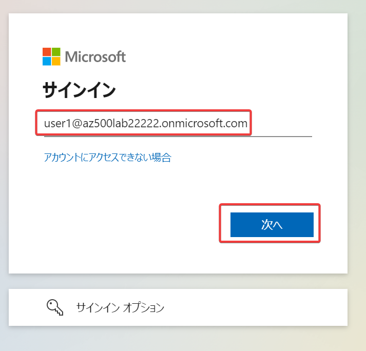
- 上記の手順で決めたパスワードを入力 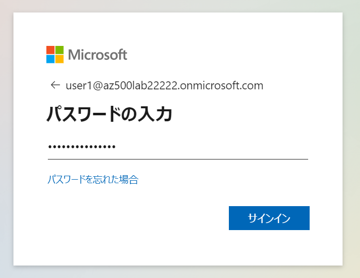
- 「サインインの状態を維持しますか？」が表示された場合は「いいえ」をクリック 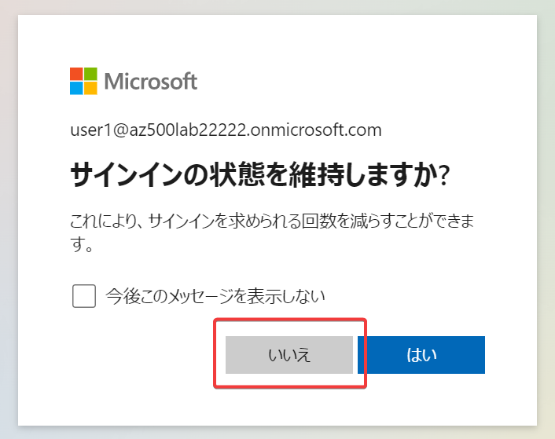
- 「アカウントの保護にご協力ください」で「次へ」をクリック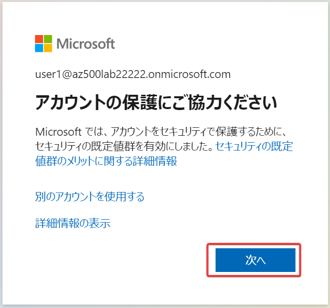
- 「アカウントのセキュリティ保護」:
- まだスマホに「Microsoft Authenticatorアプリ」がインストールされていない場合は「今すぐダウンロード」をクリック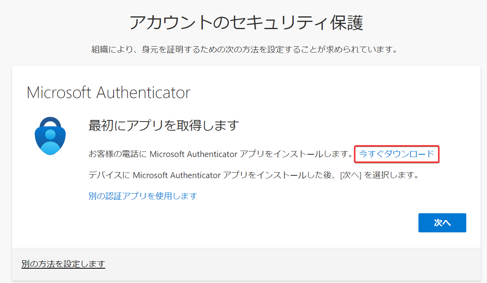
  - ページ内のQRコードをスマホのカメラでスキャンし、対応するストアに移動して、「Microsoft Authenticatorアプリ」をインストールする。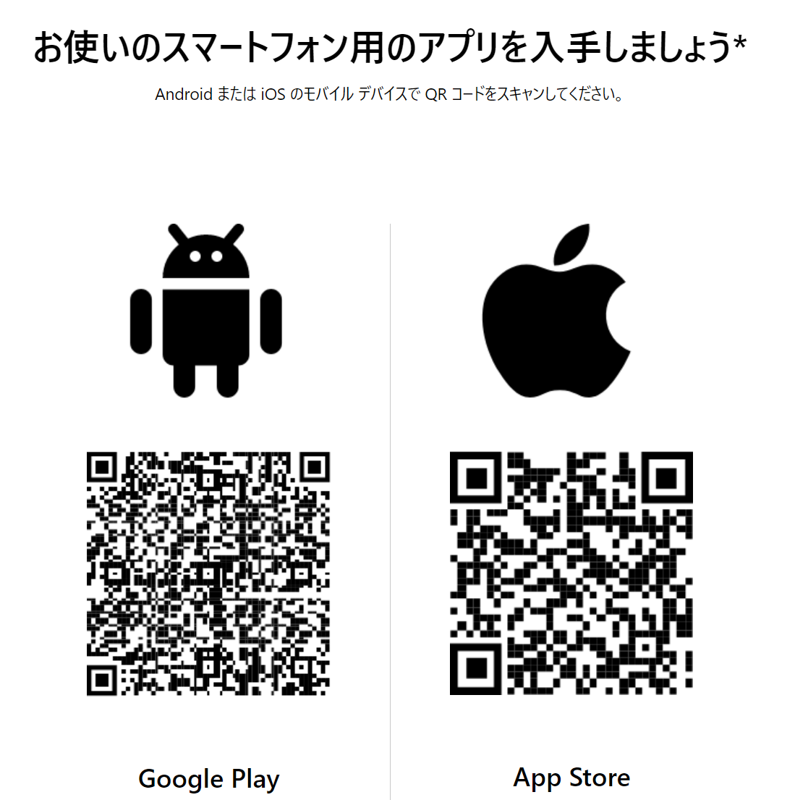
- すでにスマホに「Microsoft Authenticatorアプリ」がインストールされている場合、またはインストールが完了した場合は「次へ」をクリック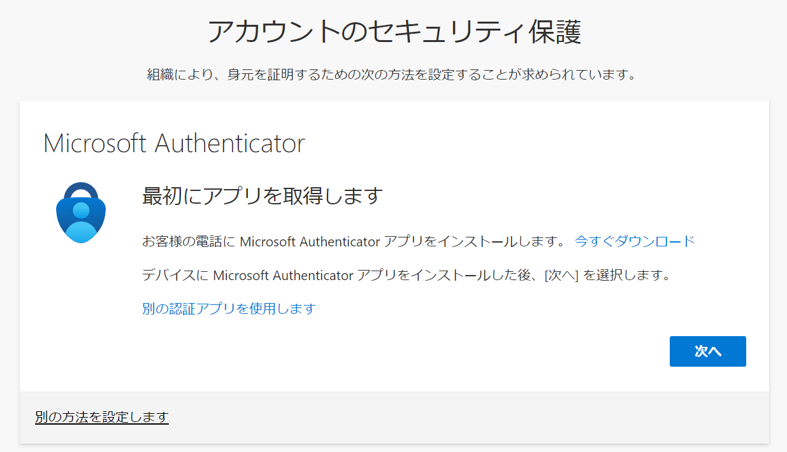
- 「アカウントのセットアップ」で「次へ」をクリック 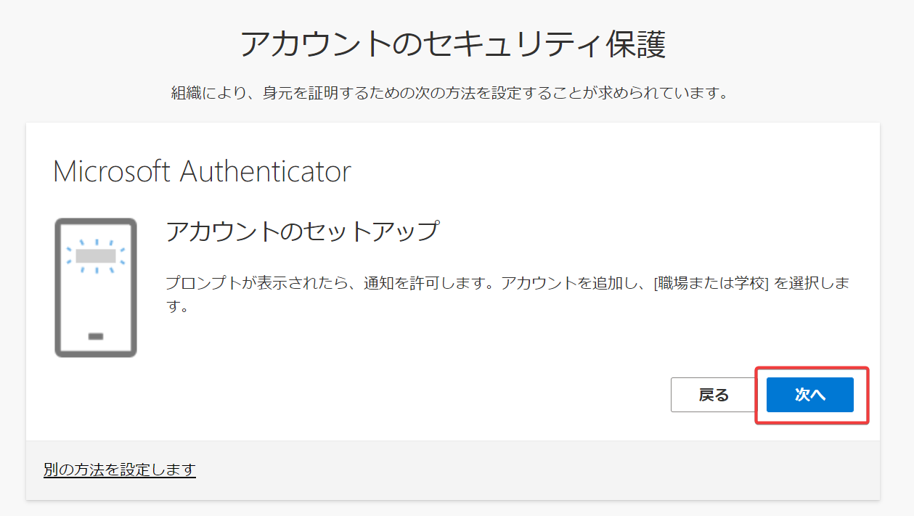
- Webブラウザーの「QRコードをスキャンします」ページにQRコードが表示される（各ユーザーにより異なります）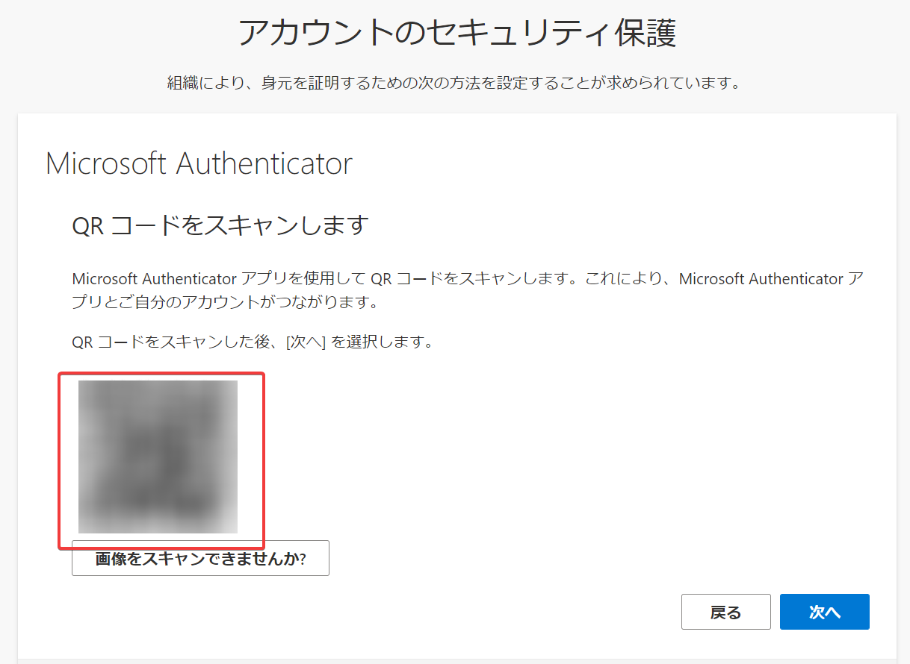
- スマホで「Microsoft Authenticatorアプリ」を起動し、右上の「＋」をタップし、「アカウントの追加」で「職場または学校アカウント」をタップ、「QRコードをスキャン」をタップ。カメラが起動する。画面に表示されているQRコードをスキャンする。「次へ」をクリック
- スマホで「サインインを承認しますか？」が表示されるので「承認」をタップ。（ここで追加の指紋認証などが求められる場合がある）
- Webブラウザーで「通知が承認されました」と表示される。「次へ」をクリック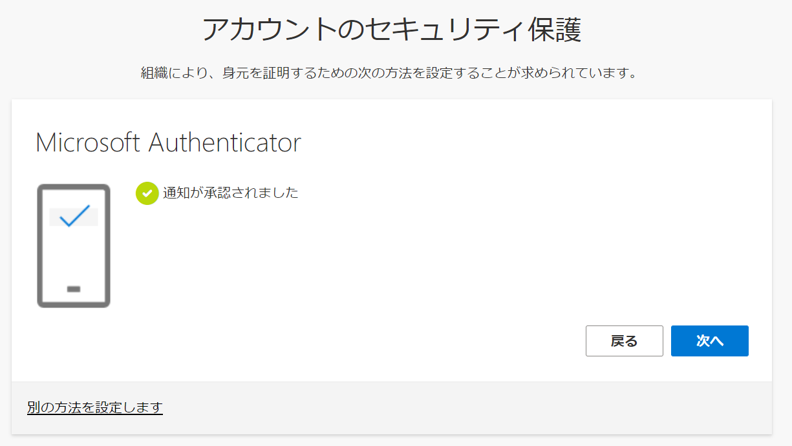
- 「完了」をクリック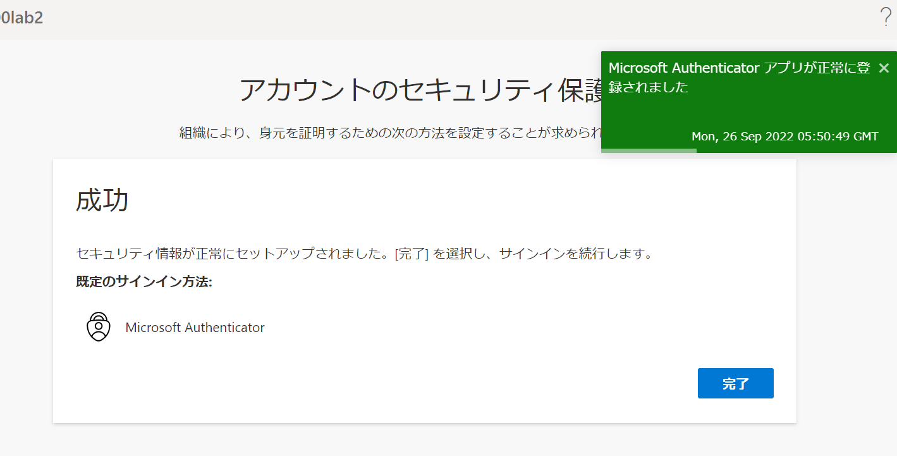

以上で、「Microsoft Authenticatorアプリ」のセットアップが完了した。次回以降のサインイン時（ユーザーID＋パスワード入力後）、「Microsoft Authenticatorアプリ」に通知が送信されるので、それをタップすることでサインインが完了するようになる。

