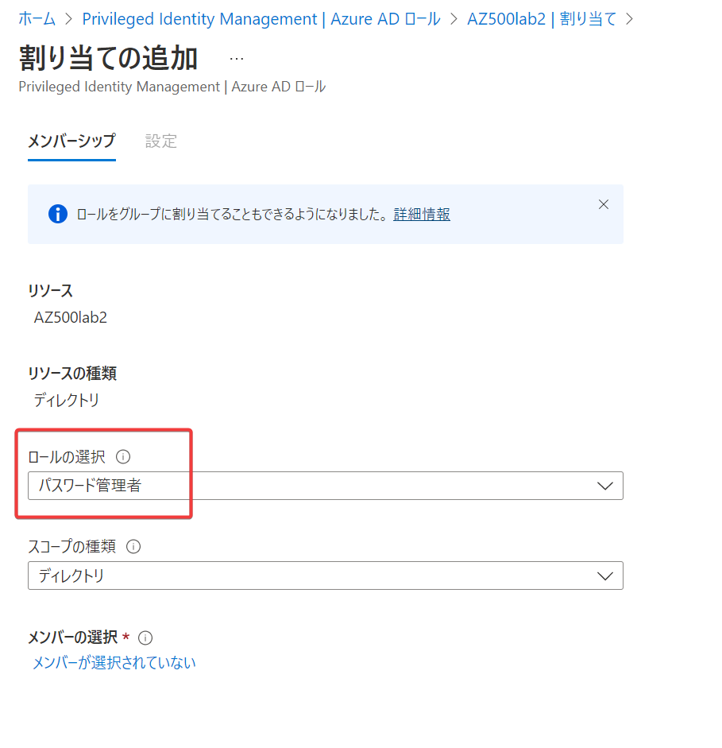
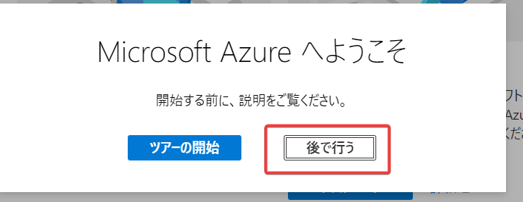

# ハンズオン: Azure AD Privileged Identity Management (PIM)

■このハンズオンの概要

user1 と user2 の二人のユーザーを使用します。user1がロールの使用を申請し、user2 が承認します。

- user1 の作業
  - user2 を作成
  - 「パスワード管理者」のロールの設定を変更する（アクティブ化時に user2 による承認を必要とするようにする）
  - 自分自身を「パスワード管理者」に割り当てる
  - 「パスワード管理者」の「アクティブ化」を要求する（承認待ちとなる）
- user2 の作業
  - user1 の要求を承認する

※ user1 は「グローバル管理者」であるため、「パスワード管理者」にならなくともパスワードの管理操作も行うことができますが、このハンズオンはPIMによるロールのアクティブ化の手順を確認することが目的であるため、それは無視してください。

■ user1 でサインインします

- 画面右上のユーザー表示が user1 （前のハンズオンで作成した、グローバル管理者ユーザー）であることを確認。
  - それ以外のユーザーが表示されている場合は、ユーザーアイコンをクリックしてサインアウトし、前のハンズオンで作成した user1 でサインインし直す。 

■ user2 を作成します。このユーザーは、ロールを「アクティブ化」する際の承認者として使用します。

- Azure ADの画面に移動
- ユーザーの画面に移動
- ＋新しいユーザー、「新しいユーザーの作成」をクリック
- ユーザー名 「user2」、名前「user2」を入力。
- ユーザー名の右側のコピーボタンを押してUPN（ユーザー名@ドメイン名）をコピーする。メモ帳等に記録しておく。
- 「初期パスワード」の「パスワードの表示」をクリックして、初期パスワードを表示し、コピーする。メモ帳等に記録しておく。
- 利用場所「Japan」として、「作成」をクリック

■「パスワード管理者」ロールの設定を変更して、このロールを「アクティブ化」するために user2 の承認が必要であるようにします。

- 画面上部の検索で「pim」または「Privileged Identity Management」と入力して検索し、Azure AD Privileged Identity Managementをクリック。
- 管理＞Azure ADロール をクリック
- 設定 をクリック
- 検索で「パスワード」と入力して検索し、「パスワード管理者」をクリック
- 「編集」をクリック
- 「アクティブ化するには承認が必要です」にチェック
  - 「承認者が選択されていません」をクリック
  - user2を検索してクリック
  - （「選択したアイテム」にuser2が入る）
  - 「選択」をクリック
- 「更新」をクリック

■ 「資格のある割り当て」で、user1 に「パスワード管理者」の割り当てを行います。 これにより、user1は、必要な際にこのロールを「アクティブ化」して使用できるようになります。

- 画面上部の検索で「pim」または「Privileged Identity Management」と入力して検索し、Azure AD Privileged Identity Managementをクリック。
- 管理＞Azure ADロール をクリック
- 画面左「割り当て」メニューをクリック。「資格のある割り当て」が選択されている状態にする（デフォルト）
- 「割り当ての追加」をクリック
- 「ロールの選択」で、「パスワード管理者」を選択。
- 「メンバーの選択」で「メンバーが選択されていない」をクリック。
- 「user1」 を検索して、検索結果のuser1をクリック
- （「選択したアイテム」にuser1が入る）
- 「選択」をクリック
- 「次へ」をクリック
- （「割り当ての種類」が「対象」となっていることを確認（デフォルト）。「対象」＝「資格のある」と同じ意味）
- 「割り当て」をクリック
- 以上で、「資格のある割り当て」一覧にて、user1が「パスワード管理者」として表示される。（表示されない場合は「最新の情報に更新」を何度かクリック） 

■ user1 がこれからパスワード管理者として作業をする必要が出てきたとします（他の人のパスワードをリセットするなど）。user1は、「パスワード管理者」の資格があるため、このロールを「アクティブ化」します。

- 画面上部の検索で「pim」または「Privileged Identity Management」と入力して検索し、Azure AD Privileged Identity Managementをクリック。
- 管理＞Azure ADロール をクリック
- 「自分のロール」をクリック
- 「資格のある割り当て」一覧の「パスワード管理者」の「アクティブ化」をクリック
- 「理由」に「test」と入力して「アクティブ化」をクリック
- 画面の右上に「要求の承認は保留中です」と表示される（この表示はすぐに消える） 
  - 消えてしまった通知は、画面上部のベルマークをクリックすると再度表示できる

■ user2 としてサインインし、この要求を「承認」します。

- user1 をサインアウト 
- user2 でサインインする。  
- 初期パスワードを別のパスワードに変更する。
- 
- Privileged Identity Managementの画面に移動する 
- 「申請の承認」に移動する
- 「ロールのアクティブ化に関する要求」で、要求元が user1 となっている要求の行にチェックを入れ、「承認」
- 理由に「test」と入力して「確認」

■以上で、user1 は パスワード管理者として一定時間（デフォルト: 8時間）だけ作業を行うことができます（他の人のパスワードをリセットするなど）。

user1 でサインインし、PIM＞自分のロール＞アクティブな割り当て に移動すると、「パスワード管理者」がアクティブとなっていることが確認できます。 

