# Entra ID の Multi-Factor Authentication (多要素認証, MFA)

https://docs.microsoft.com/ja-jp/azure/active-directory/authentication/concept-mfa-howitworks

■多要素認証 MFA(Multi-Factor Authentication)とは？

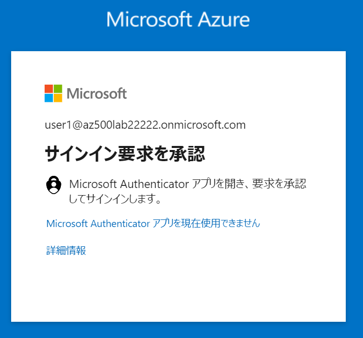

- サインインの際、（ユーザーID＋パスワードによる認証に加えて）追加の認証を要求するしくみ
- 例
  - [スマホアプリ Microsoft Authenticator の通知をタップする](https://kiritsume.com/microsoft-authenticator/)
  - [生体認証（指紋認証）を行う](https://www.google.com/search?q=windows+hello+%E7%94%9F%E4%BD%93%E8%AA%8D%E8%A8%BC&tbm=isch)
  - [USBキーにタッチする](https://alven.tech/yubico-with-azure-ad-mfa/)
  - [ハードウェアトークンに表示される番号を入力する](https://www.cloudou.net/azure-active-directory/mfa005/)

※最初の認証（通常、ユーザーID＋パスワードを使用）を「プライマリ認証」、追加の認証(MFA)を「セカンダリ認証」という。

■Entra ID MFAで使用できる検証方法は？

Entra ID Multi-Factor Authentication では、次のような追加の検証形式を使用できる。

※リンク先にイメージあり

- Microsoft Authenticator アプリ ([Android](https://play.google.com/store/apps/details?id=com.azure.authenticator&hl=ja&gl=US) / [iOS](https://apps.apple.com/jp/app/microsoft-authenticator/id983156458))
- Windows Hello for Business
- [FIDO2 セキュリティ キー](https://learn.microsoft.com/ja-JP/azure/active-directory/authentication/concept-authentication-passwordless#fido2-security-keys)
- [OATH (Time-based One Time Password) ハードウェア トークン](https://learn.microsoft.com/ja-jp/azure/active-directory/authentication/concept-authentication-oath-tokens#oath-hardware-tokens-preview)
- [OATH ソフトウェア トークン](https://learn.microsoft.com/ja-jp/azure/active-directory/authentication/concept-authentication-oath-tokens#oath-software-tokens)
- SMS(登録された電話番号にショートメールで秘密の番号を通知する)
- 音声通話(登録された電話番号に機械音声で秘密の番号を通知する)

■ユーザーがMFAを登録するには？

いくつかの方法がある。

- ユーザーがEntra IDにサインインするのと同時にMFA登録を行う
  - ユーザーは、初回のサインインから14日以内にMFA登録を完了させる必要がある
  - テナント側の設定
    - 「セキュリティの既定値(群)」を有効化する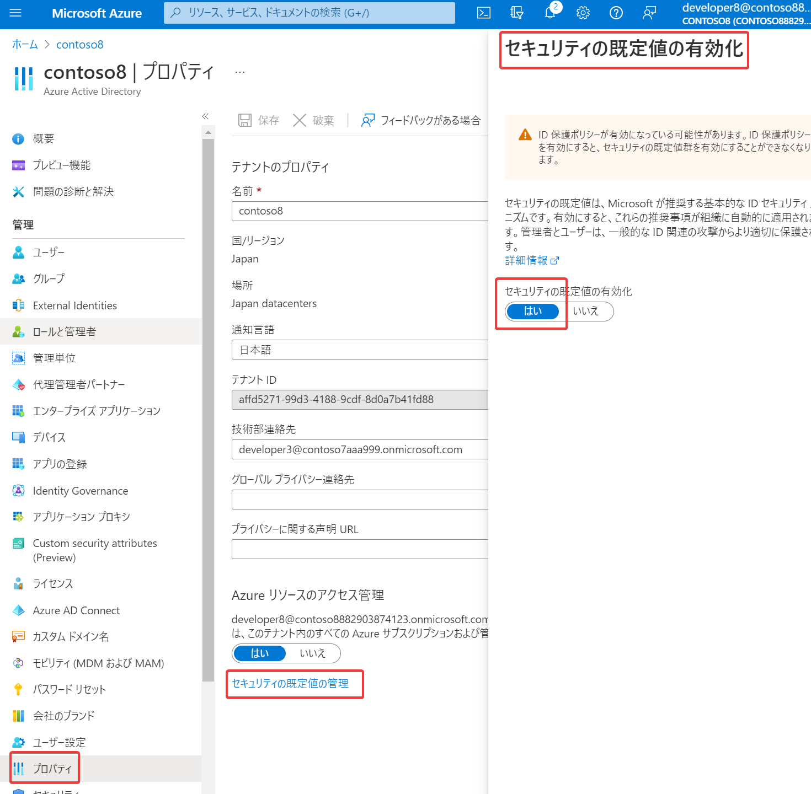
    - または「Entra ID Idenity Protection」の「多要素認証登録ポリシー」をオン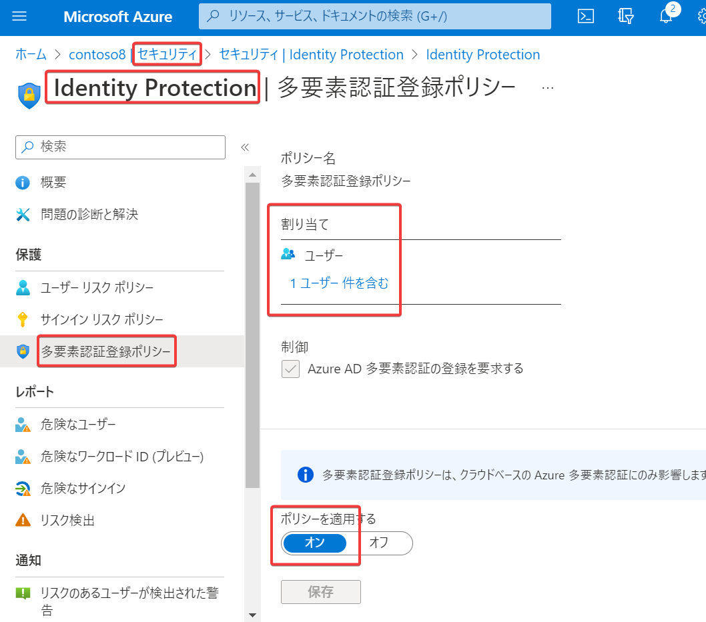
- ユーザーが https://aka.ms/mfasetup にアクセスする
  - Microsoft Authenticatorアプリ and 電話
  - 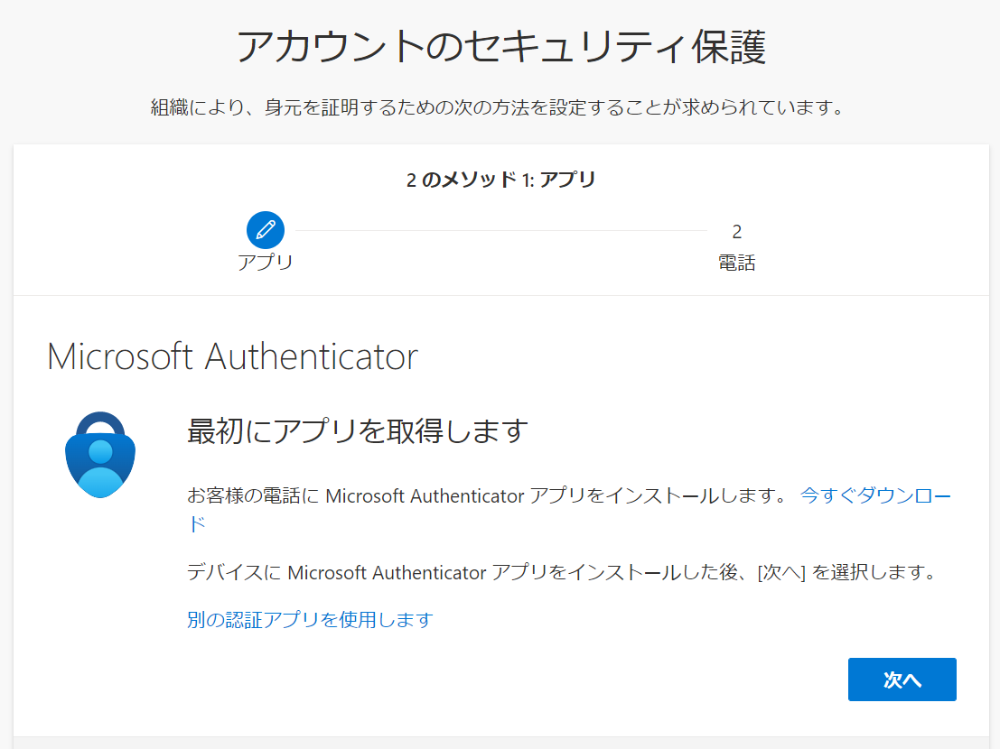
- ユーザーが https://aka.ms/setupsecurityinfo にアクセスする
  - 新しいセキュリティ情報登録エクスペリエンス
  - Microsoft Authenticatorアプリ or 電話 or 電子メール
  - 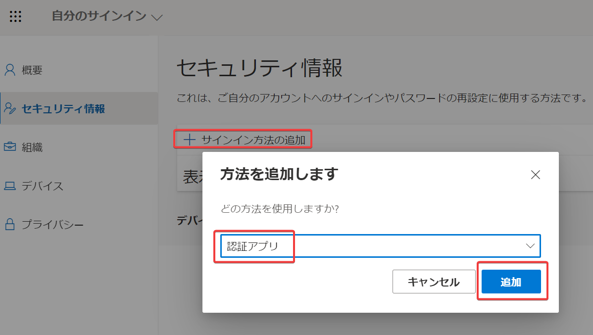

■組織の管理者が、ユーザーのMFA登録を強制するには？

いくつかの有効化方法がある。

- (a)「セキュリティの既定値(群)」を有効化 (無料)
  - 無料でセキュリティを向上させる仕組み
  - 新しく作られたテナントではデフォルトで有効になっている
  - Microsoft Authenticatorアプリ＋電話番号を登録
  - 全ユーザーが、初回サインインから14日以内にMFAを有効化する
  - Entra ID＞プロパティ＞セキュリティの既定値(群)
  - 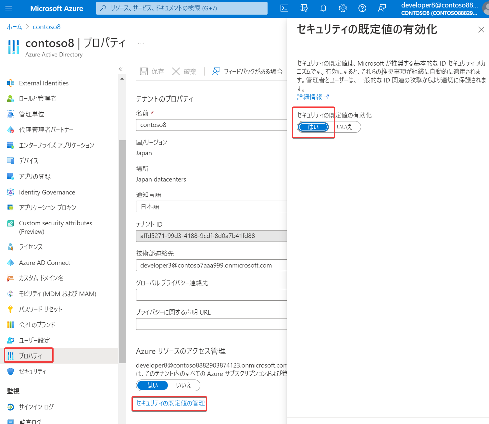
- (b)「条件付きアクセス」(Premium P1)
  - Microsoft Authenticatorアプリ 以外の追加認証が使用できる
  - 利用者にとって、より便利なしくみ
    - 例1
      - 社内ネットワークアクセスの場合はMFAをスキップする
      - インターネットからのアクセスの場合は、MFAを要求する
    - 例2
      - 重要なアプリケーションへのアクセスの場合は、MFAを要求する
      - 重要度が低いアプリケーションへのアクセスの場合は、MFAをスキップする
  - 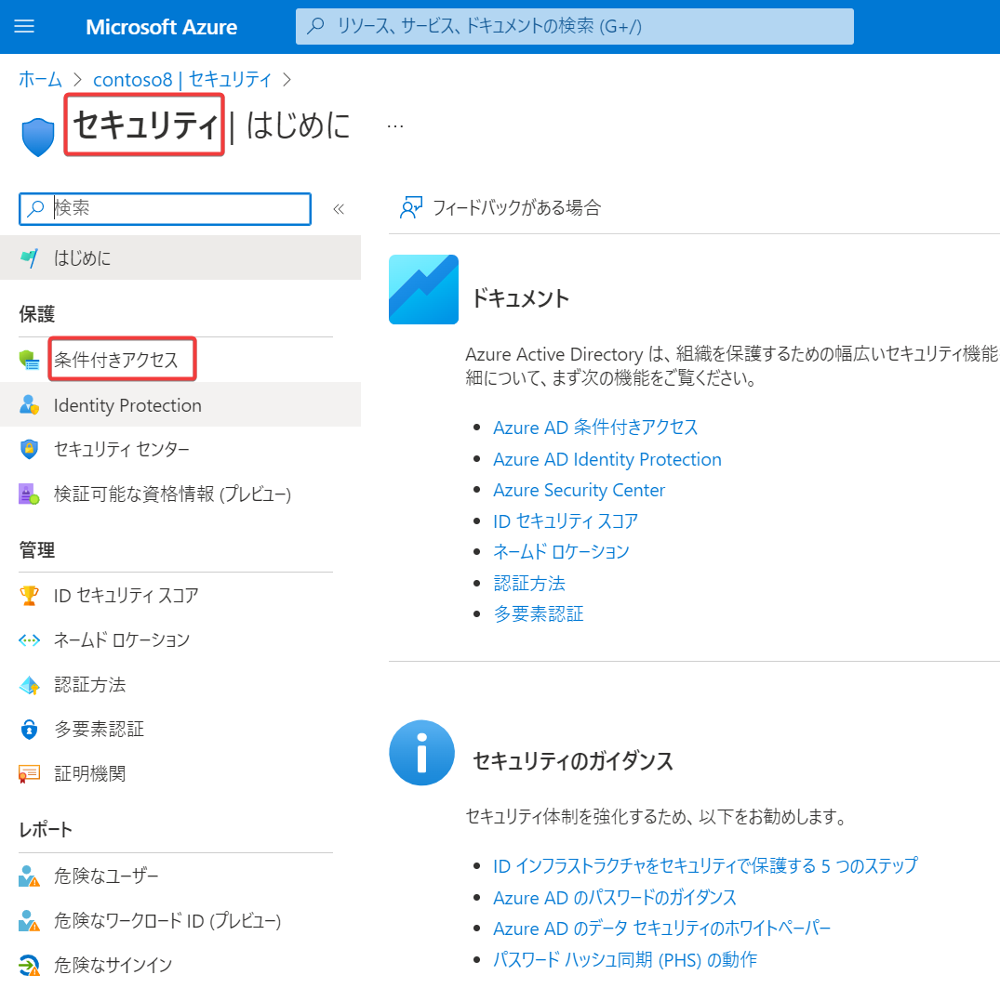
  - 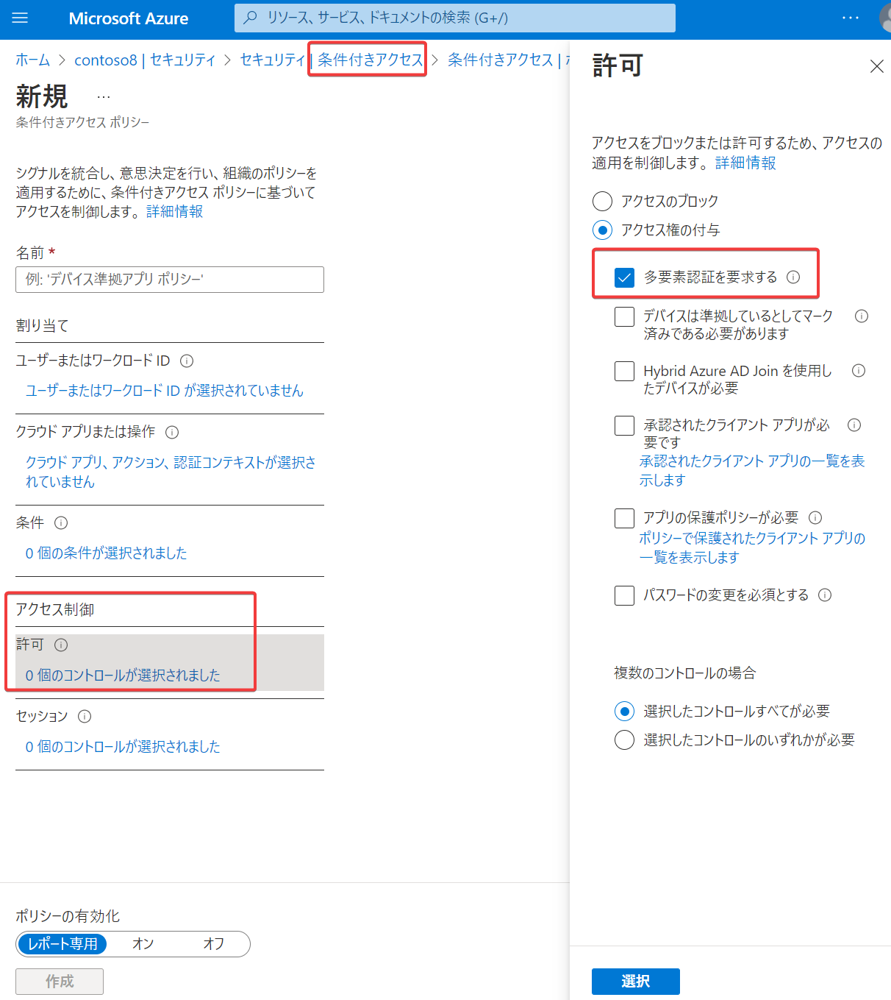
- (c)Entra ID Identity Protectionの「多要素認証登録ポリシー」をオンにする(Premium P2)
  - 対象のユーザーやグループを選択できる
  - 対象となったユーザーは初回サインインから14日以内にMFAを有効化する
  - 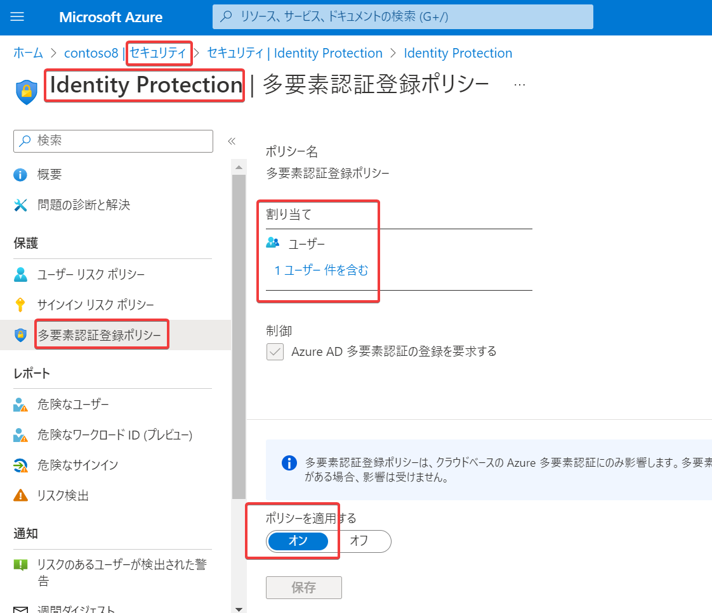
- (d)Azure MFAポータル (無料)
  - 管理者が、ユーザーごとにMFAを有効化する仕組み
  - 推奨されていない
  - アクセス方法（いくつかある）
    - Entra ID＞ユーザー＞ユーザーごとのMFA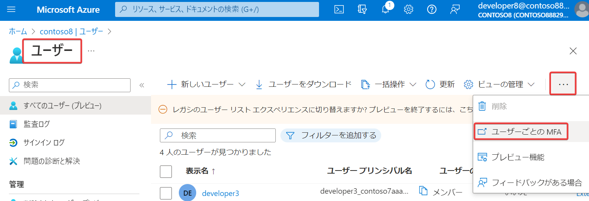
    - Entra ID＞管理＞セキュリティ＞多要素認証＞クラウドベースの多要素認証の追加設定 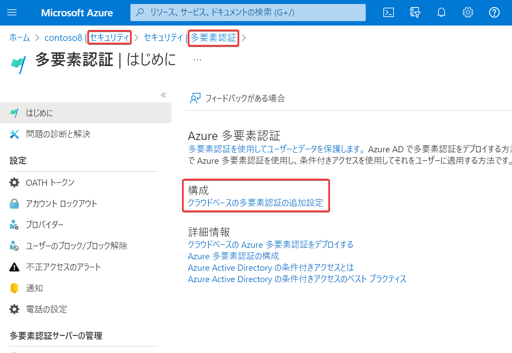
    - https://account.activedirectory.windowsazure.com/usermanagement/multifactorverification.aspx にアクセス
  - 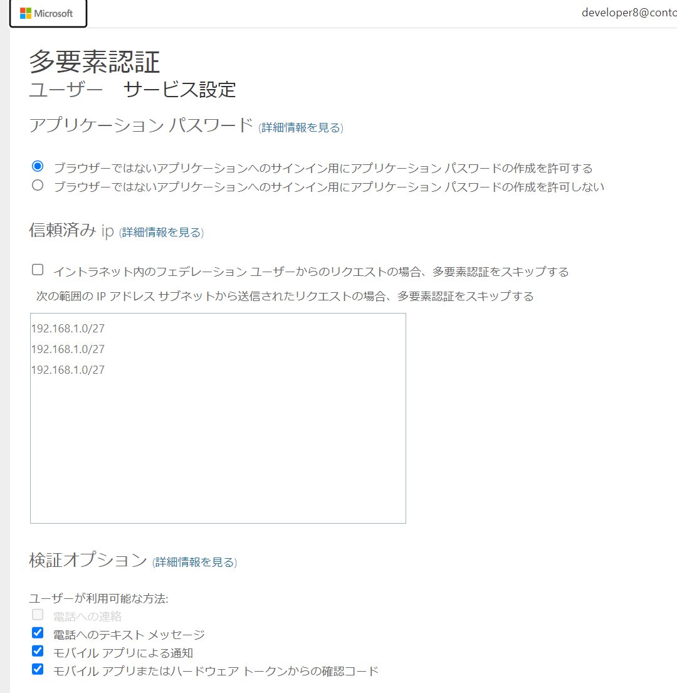

■参考

Entra IDサポートチームによる詳細な解説:
https://jpazureid.github.io/blog/azure-active-directory/MFA_configuration_scenarios/

