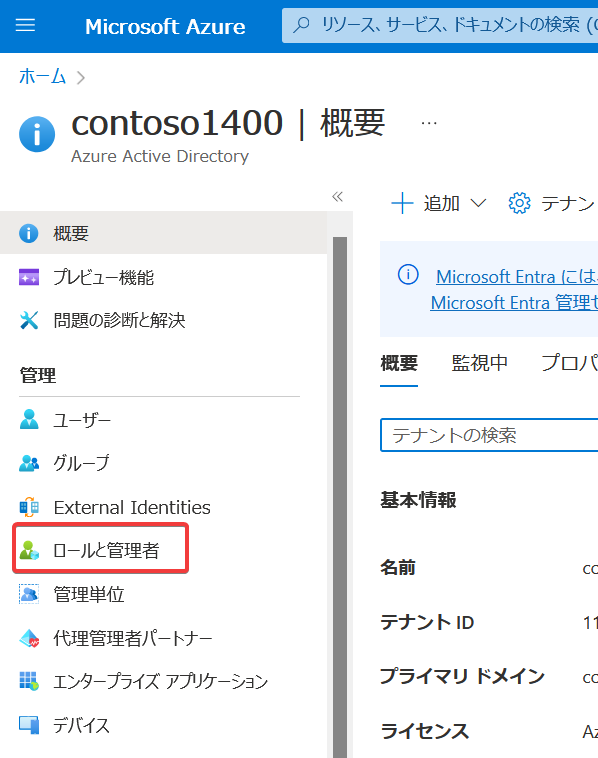
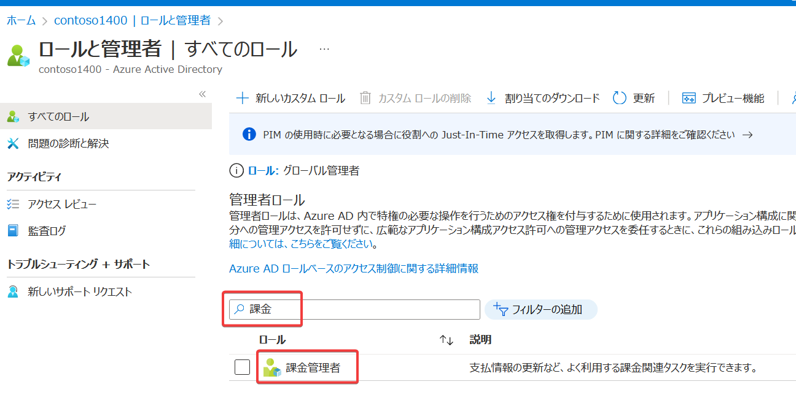
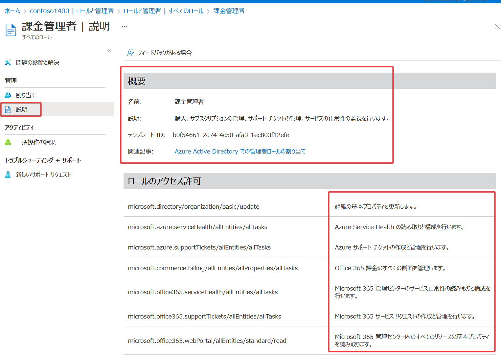

# Entra IDの管理者ロール

ロールのドキュメント:
https://learn.microsoft.com/ja-jp/entra/identity/role-based-access-control/concept-understand-roles

組み込みのロール一覧:
https://learn.microsoft.com/ja-jp/azure/role-based-access-control/rbac-and-directory-admin-roles?toc=%2Fentra%2Fidentity%2Frole-based-access-control%2FTOC.yml&bc=%2Fentra%2Fidentity%2Frole-based-access-control%2Fbreadcrumb%2Ftoc.yml#microsoft-entra-roles

64種類の「Entra ID管理者ロール」が存在する（2024/3現在）

■特に覚えておきたいロール:

- グローバル管理者（全体管理者とも）
  - Entra IDテナントのフルコントロールが可能
  - 組織内の5名未満のユーザーに割り当てることを推奨
  - グローバル管理者が多すぎると責任の所在があいまいになる
- グローバル閲覧者
  - Entra ID テナントの情報の読み取りのみ可能
- ユーザー管理者
  - ユーザーとグループのすべての側面を管理できる
    - ユーザー作成
    - グループ作成
    - パスワードの変更など
  - サポート チケットの管理、サービス正常性の監視
- 課金管理者
  - Microosft 365のサブスクリプションの管理、購入
  - サービスに対する支払い、請求書の受信
- ライセンス管理者
  - ユーザーにライセンスを割り当て/取り消しできる
- パスワード管理者
  - ユーザーのパスワードを管理できる

■ロールの詳細の確認方法

