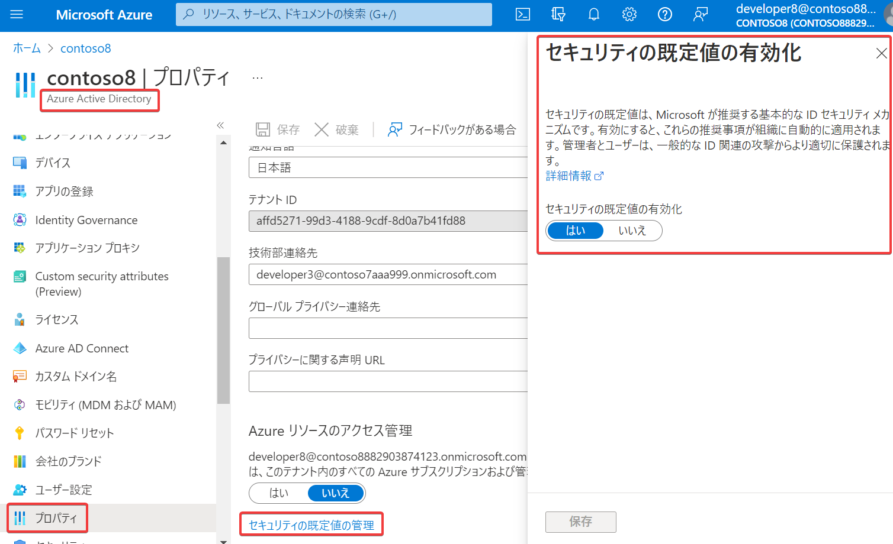
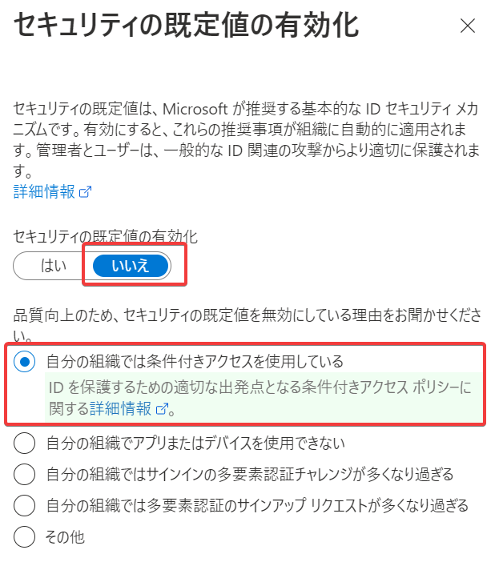

# セキュリティの既定値（群）

※ドキュメントでは「セキュリティの既定値群」、Azure portal上では「セキュリティの既定値」と表記されている

https://learn.microsoft.com/ja-jp/entra/fundamentals/security-defaults

■概要

- Microsoft によって推奨されている基本的な ID セキュリティ機構のセット。
- 有効にすると、これらの推奨事項が組織内で自動的に適用される。
- 管理者とユーザーは、一般的な ID 関連の攻撃からより良く保護されるようになる。
- ライセンス不要(無料)

テナントでの設定方法:

- Entra ID＞プロパティ＞セキュリティの既定値群の管理＞有効化（「はい」「いいえ」）
- [2019 年 10 月 22 日以降に作成されたテナントの場合、セキュリティの既定値群はテナントで有効になっている](https://docs.microsoft.com/ja-jp/azure/active-directory/fundamentals/concept-fundamentals-security-defaults#availability)

■セキュリティの既定値（群）=有効の場合の、MFAの登録

- すべてのユーザーに対して、Entra ID MFA 登録を必須にします。
  - ユーザーは （各ユーザーの対話型サインインが最初に成功した時点から）14 日以内に、Microsoft Authenticator アプリを使用して、Entra ID MFA 登録 を行う必要がある
  - 14 日が経過すると、ユーザーは登録が完了するまでサインインできなくなる

■セキュリティの既定値（群）=有効の場合の、MFA要求の発動条件

- 管理者: サインイン時に常にMFAが要求される
  - 対象: 全体（グローバル）管理者、アプリケーション管理者、認証管理者、課金管理者、クラウド アプリケーション管理者、条件付きアクセス管理者、Exchange 管理者、ヘルプデスク管理者、パスワード管理者、特権認証管理者、セキュリティ管理者、SharePoint 管理者、ユーザー管理者
- その他のユーザー: 場所、デバイス、役割、タスクなどの要因に基づいて、ユーザーに多要素認証の入力を求められるタイミングが決定される

■セキュリティの既定値（群）を無効化する

組織で「[条件付きアクセス](https://learn.microsoft.com/ja-jp/azure/active-directory/conditional-access/overview)」（要 Premium P1ライセンス）を使用するなどの場合には、セキュリティの既定値（群）を無効化する。

「条件付きアクセス」は、ユーザー、グループ、アクセスしようとしているアプリ、アクセスに使用している端末やネットワークなどの条件を組み合わせて、MFAを発動する/しないを柔軟に決定して運用できるので、「セキュリティの既定値（群）」の（ほぼ強制的な）MFA要求発動よりも使い勝手が良い。

